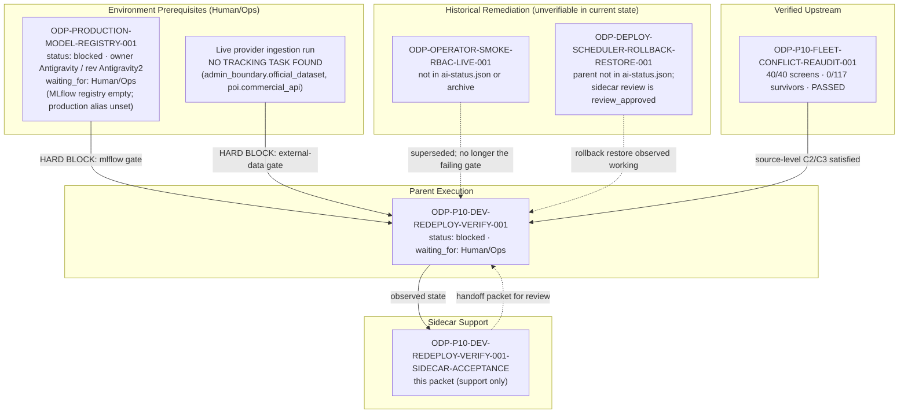

# ODP-P10-DEV-REDEPLOY-VERIFY-001 Acceptance Packet & Dependency Map

## Packet identity

| Field | Value |
|---|---|
| Sidecar task | `ODP-P10-DEV-REDEPLOY-VERIFY-001-SIDECAR-ACCEPTANCE` |
| Parent task | `ODP-P10-DEV-REDEPLOY-VERIFY-001` |
| Helper kind | `acceptance_packet` |
| Sidecar owner / reviewer | `Claude` / `Antigravity3` |
| Current parent owner / reviewer | `Antigravity3` / `Antigravity` |
| Observed parent status | `blocked` (`waiting_for: Human/Ops`) |
| Target branch | `task/ODP-P10-DEV-REDEPLOY-VERIFY-001-SIDECAR-ACCEPTANCE` |
| Packet revision | `r2.5` — `r2` content unchanged; base advanced onto dev tip `7dbe45e9`; adds one first-hand mid-deploy observation and two evidence corrections (see § r2.5) |
| Packet verdict | **Support only; no parent acceptance, merge, or production GO claim** |

This packet is a support-only review aid, acceptance checklist, and dependency map for parent task `ODP-P10-DEV-REDEPLOY-VERIFY-001`. It does not change canonical contracts, L1 architecture truth, or primary runtime/registry/governance implementations. The parent task owner (`Antigravity3`) decides whether to absorb this packet; the parent reviewer (`Antigravity`) retains sole authority over implementation acceptance.

---

## Revision r2.5 — fifth base advance, plus a mid-deploy capture (2026-08-06T04:30Z)

`r2.4` was approved at exact head `297ae48d`. `dev` advanced again before the merge landed — to `7dbe45e9` (`ODP-ORCH-WORKTREE-LEASE-DEADLOCK-001`, PR #660) — putting PR #658 back to `BEHIND`. Merged `origin/dev` cleanly into `task/ODP-P10-DEV-REDEPLOY-VERIFY-001-SIDECAR-ACCEPTANCE`.

| Aspect | r2.4 (approved) | r2.5 |
|---|---|---|
| Base | dev tip `85d60609` | dev tip `7dbe45e9` (merged in, no rebase, no force-push) |
| Packet body | — | **Byte-identical to `297ae48d` apart from this section, the revision row, and the freshness line.** Verify with `git diff 297ae48d HEAD -- support/sidecars/ODP-P10-DEV-REDEPLOY-VERIFY-001/` |
| Merge conflicts | — | None. The incoming commits touch `.orchestrator/supervisor.py` and `.orchestrator/test_supervisor.py` only — both disjoint from this packet's path. |

Unlike § r2.1–§ r2.4, this round is **not** a pure re-stamp. The re-verification probes landed inside the promotion window of Deploy Dev run `31070368670`, so for the first time this packet observed the **dev tip actually serving live traffic**. That capture is recorded below. It changes no Criteria A–E verdict, but it corrects two readings in the r2 body and it is the strongest evidence yet about where the deploy actually stands.

### The mid-deploy capture (04:27:55Z – 04:28:19Z)

Run `31070368670` (dev tip `7dbe45e9`) promoted its candidate at `04:27:25Z`, failed the live E2E gate at `04:28:20Z`, and restored the rollback traffic split by `04:28:25Z`. The probes below were taken inside that ~55-second window:

```bash
curl -sS https://oday-api-7sxbjoeozq-de.a.run.app/platform/version           # 04:27:55Z · 200
curl -sS https://oday-api-7sxbjoeozq-de.a.run.app/platform/health            # 04:27:55Z · 200
curl -sS https://oday-api-7sxbjoeozq-de.a.run.app/release/platform/readiness # 04:28:17Z · 404
```

| Probe | Rollback release `8ec12c02` (all prior revisions) | Dev tip `7dbe45e9` while promoted |
|---|---|---|
| `/platform/version` → `release_sha` | `8ec12c02` | **`7dbe45e91514538544b83f36181f2971454910db`** |
| `/platform/health` | `503` · `status: unhealthy` | **`200` · `status: ok` · `data_mode: live`** |
| `modes.data` | `mode: unavailable` · `liveReady: false` · `blockingReasons: ["PRODUCTION_MODEL_BINDINGS_UNVERIFIED"]` | **`mode: live` · `liveReady: true` · `blockingReasons: []`** |
| `modes.models` | `mlflow-production-unverified` · `productionBindingsReady: false` | `mlflow-production-unverified` · `productionBindingsReady: false` (**unchanged**) |
| `/release/platform/readiness` | `404` | **`404`** |

`/operator/bootstrap` → `401` and web `/operator` → `307` were captured at ~`04:28:18–19Z`, within two seconds of the rollback; treat those two as boundary-timed rather than cleanly attributable to either release.

### Two corrections to the r2 body

1. **`/release/platform/readiness` 404 is not a release marker.** The r2 live-endpoint table reads its `404` as "the endpoint ships in the newer release only; its absence is itself a marker that `8ec12c02` is serving." The capture above returned `404` while `release_sha` was `7dbe45e9`. The endpoint is absent from the dev tip too, so it distinguishes nothing. Use `/platform/version` → `release_sha` as the only reliable release marker.
2. **`modes.data.mode = unavailable` is a property of the rollback release, not of the dev tip.** B1's evidence cell attributes the unavailable/`liveReady: false` data mode to live state generally. On the dev tip the same field reports `live` / `liveReady: true` / no blocking reasons — the newer release does not gate data mode behind model bindings. B1 nevertheless stays `BLOCKED`, for a different reason than r2 recorded: the release does not stay promoted, and the E2E gate's `data:ingestion_runs=0` check is a *persisted ingestion run* check that the health endpoint's readiness fields do not cover.

Neither correction moves a Criteria A–E cell. D4 in particular is unaffected: a `liveReady: true` health verdict and a lineage-complete persisted ingestion run are different assertions, and only the latter is what D4 and the gate require.

### Deploy runs since § r2.4

```bash
gh run view 31070368670 --json jobs   # e2e-operational-evidence success · deploy failure
gh api repos/:owner/:repo/actions/jobs/92517411893/logs
```

| Run | Dev tip | Conclusion |
|---|---|---|
| `31069257955` | `85d60609` | failure (same gate; § r2.4 left this one in progress — this is its recorded conclusion) |
| `31070368670` | `7dbe45e9` | failure (same gate, exact current base, log quoted below) |

```text
Live E2E gate failed. Blocking runtime dependencies:
* external-data: ... the deployed release has no populated, lineage-complete ingestion run to serve.
  - data:ingestion_runs: runs=0
  - data:admin_boundary.official_dataset:run_exists: no persisted ingestion run for a required live provider
  - data:poi.commercial_api:run_exists: no persisted ingestion run for a required live provider
* mlflow: Publish/approve the MLflow model versions and point the 'production' alias at them.
  - runtime:model_capability:forecastops: available=False reasonCode=PRODUCTION_MODEL_REGISTRY_UNAVAILABLE
  - models:registry: versions=0
  - models:forecastops:production_alias: model=forecast_revenue_interval versionsWithProductionAlias=0 (exactly one required)
```

This is the fifth consecutive confirmation of § r2 blocking causes #1 and #3, now measured on the exact current base. The consecutive-failure count in § r2 should be read as *64 of the last 65* `deploy-dev.yml` runs failed, one cancelled, still zero successes (window `2026-07-30T19:41Z .. 2026-08-06T04:07Z`).

The capture sharpens § r2 recommendation 1 rather than softening it. Everything the parent task can influence from `origin/dev` now demonstrably comes up healthy the moment the dev tip is promoted — `/platform/health` returns `200 ok` on the dev tip. The deploy still fails, and it fails on the two environment prerequisites this packet has documented since r2. Re-triggering Deploy Dev remains the wrong move; the build is not what is broken.

No status cell, dependency edge, recommendation, or execution step was re-scoped in r2.5.

---

## Revision r2.4 — fourth base advance only (2026-08-06T03:51Z)

`r2.3` was re-approved at exact head `56103626` with all five PR #658 checks green (`orchestrator`, `product`, `performance-gate`, `product-e2e-gate`, `task-review-gate`). `dev` advanced twice more before the merge landed — through `b507f932` (`ODP-DEPLOY-SCHEDULER-ROLLBACK-RESTORE-001-SIDECAR-REVIEW`, PR #638) to `85d60609` (`ODP-FORECAST-AUTHORITATIVE-HISTORY-BACKFILL-001-SIDECAR-ACCEPTANCE`, PR #654) — putting PR #658 back to `BEHIND`. Merged `origin/dev` cleanly into `task/ODP-P10-DEV-REDEPLOY-VERIFY-001-SIDECAR-ACCEPTANCE`.

| Aspect | r2.3 (approved) | r2.4 |
|---|---|---|
| Base | dev tip `a7fde1a8` | dev tip `85d60609` (merged in, no rebase, no force-push) |
| Packet body | — | **Byte-identical to `56103626` apart from this section, the revision row, and the freshness line.** Verify with `git diff 56103626 HEAD -- support/sidecars/ODP-P10-DEV-REDEPLOY-VERIFY-001/` |
| Merge conflicts | — | None. The two incoming commits add `support/sidecars/ODP-DEPLOY-SCHEDULER-ROLLBACK-RESTORE-001/` and `support/sidecars/ODP-FORECAST-AUTHORITATIVE-HISTORY-BACKFILL-001/` only — both disjoint from this packet's path. |

Re-verification at the new base (2026-08-06T03:50Z) confirms every r2 finding still holds:

```bash
curl -sS https://oday-api-7sxbjoeozq-de.a.run.app/platform/version   # 200 · release_sha 8ec12c02 (unchanged)
curl -sS https://oday-api-7sxbjoeozq-de.a.run.app/platform/health    # 503 · status unhealthy (unchanged)
#   modes.models.mode = mlflow-production-unverified · productionBindingsReady = false
#   modes.data.mode   = unavailable · liveReady = false · operatorRepositoryReady = true
#   modes.data.blockingReasons = [PRODUCTION_MODEL_BINDINGS_UNVERIFIED]
```

Two further `deploy-dev.yml` runs failed since § r2.3, both at the same live E2E acceptance gate with the same two blocking dependencies:

```bash
gh run view 31067707135 --json jobs   # e2e-operational-evidence success · deploy failure
gh api repos/:owner/:repo/actions/jobs/92509324242/logs
```

```text
Live E2E gate failed. Blocking runtime dependencies:
  - data:ingestion_runs: runs=0
  - models:registry: versions=0
  - models:forecastops:production_alias: versionsWithProductionAlias=0 (exactly one required)
  - runtime:model_capability:forecastops: available=False reasonCode=PRODUCTION_MODEL_REGISTRY_UNAVAILABLE
```

| Run | Dev tip | Conclusion |
|---|---|---|
| `31066152606` | `a7fde1a8` | failure (same gate) |
| `31067707135` | `b507f932` | failure (same gate, log quoted above) |
| `31069257955` | `85d60609` | in progress at capture time; expected to fail at the same gate — the parent owner should read its conclusion directly rather than infer it from here |

This is the third consecutive confirmation of § r2 blocking causes #1 (MLflow production alias absent) and #3 (`external-data` / zero ingestion runs), and it re-confirms § r2 recommendation 1: re-triggering Deploy Dev on each new `dev` tip has now added three more failed runs without moving any acceptance cell. The consecutive-failure count in § r2 should be read as *63 of the last 64* `deploy-dev.yml` runs failed, still zero successes.

No status cell, dependency edge, recommendation, or execution step was re-scoped in r2.4.

---

## Revision r2.3 — third base advance only (2026-08-06T02:39Z)

`r2.2` was re-submitted at exact head `3e7d57e2` with PR #658 green. `dev` advanced again before review completion — to `a7fde1a8` (`ODP-ORCH-DETACHED-HEAD-BRANCH-RESOLUTION-001`, PR #616) — putting PR #658 back to `BEHIND`. Merged `origin/dev` cleanly into `task/ODP-P10-DEV-REDEPLOY-VERIFY-001-SIDECAR-ACCEPTANCE`.

| Aspect | r2.2 | r2.3 |
|---|---|---|
| Base | dev tip `bc7366d3` | dev tip `a7fde1a8` (merged in, no rebase, no force-push) |
| Packet body | — | **Byte-identical to `3e7d57e2` apart from this section, the revision row, and the freshness line.** Verify with `git diff 3e7d57e2 HEAD -- support/sidecars/ODP-P10-DEV-REDEPLOY-VERIFY-001/` |
| Merge conflicts | — | None. The incoming commit touches `.orchestrator/github_bus.py` and `.orchestrator/test_github_bus.py` — both disjoint from this packet's path. |

No status cell, dependency edge, recommendation, or execution step was re-scoped in r2.3.

---

## Revision r2.2 — second base advance only (2026-08-06T02:32Z)

`r2.1` was re-approved by `Antigravity3` at exact head `2991e8d9` with all five PR #658 checks green. `dev` advanced again before the merge landed — to `bc7366d3` (`ODP-ORCH-FINALIZE-LANE-REMEDIATION-001`, PR #622) — putting PR #658 back to `BEHIND`. Same mechanism as § r2.1: strict up-to-date `dev` forces the branch to take the new base, which moves the head off the approved SHA and therefore needs another re-stamp.

| Aspect | r2.1 (approved) | r2.2 |
|---|---|---|
| Base | dev tip `c879004a` | dev tip `bc7366d3` (merged in, no rebase, no force-push) |
| Packet body | — | **Byte-identical to `2991e8d9` apart from this section, the revision row, and the freshness line.** Verify with `git diff 2991e8d9 HEAD -- support/sidecars/ODP-P10-DEV-REDEPLOY-VERIFY-001/` |
| Merge conflicts | — | None. The incoming commit touches `scripts/orchestrator/` and the generated `ai-status.json` / `current-work.md` / `docs-site/` state mirrors — all disjoint from this packet's path. |

Re-verification at the new base (2026-08-06T02:30Z) confirms every r2 finding still holds:

```bash
curl -sS https://oday-api-7sxbjoeozq-de.a.run.app/platform/version   # 200 · release_sha 8ec12c02 (unchanged)
curl -sS https://oday-api-7sxbjoeozq-de.a.run.app/platform/health    # 503 · status unhealthy (unchanged)
#   modes.models.mode = mlflow-production-unverified · productionBindingsReady = false
#   modes.data.mode   = unavailable · operatorRepositoryReady = true · blockingReasons = [PRODUCTION_MODEL_BINDINGS_UNVERIFIED]
```

The § r2.1 open observation is now closed, and it resolved the way this packet predicted. Deploy Dev run `31063341577` (dev tip `c879004a`) concluded **failure**, and a further run `31064611330` on the new dev tip `bc7366d3` also failed at 2026-08-06T02:25Z. Both failed at the same live E2E acceptance gate, with the same two blocking dependencies this packet already documents:

```text
Live E2E gate failed. Blocking runtime dependencies:
  - data:ingestion_runs: runs=0
  - runtime:model_capability:forecastops: available=False reasonCode=PRODUCTION_MODEL_REGISTRY_UNAVAILABLE
```

That is direct confirmation of § r2 blocking causes #1 (MLflow production alias absent) and #3 (`external-data` / zero ingestion runs), and it re-confirms that RBAC 403 is not the failing gate. The consecutive-failure count in § r2 should now be read as *61 of the last 62* `deploy-dev.yml` runs failed, still zero successes.

No status cell, dependency edge, recommendation, or execution step was re-scoped in r2.2.

---

## Revision r2.1 — base advance only (2026-08-06T01:47Z)

`r2` was approved by `Antigravity3` at exact head `34bd2dc4`. Before that PR could merge, `dev` advanced to `c879004a` (an unrelated sidecar review packet, PR #642), leaving PR #658 `BEHIND`. `dev` requires strict up-to-date status checks, so the branch had to take the new base — which moves the head and therefore requires a re-stamp rather than a mechanical refresh.

| Aspect | r2 (approved) | r2.1 |
|---|---|---|
| Base | dev tip `a0e4dcf0` | dev tip `c879004a` (merged in, no rebase, no force-push) |
| Packet body | — | **Byte-identical to `34bd2dc4` apart from this section and the two freshness lines.** Verify with `git diff 34bd2dc4 HEAD -- support/sidecars/ODP-P10-DEV-REDEPLOY-VERIFY-001/` |
| Merge conflicts | — | None. The incoming commit touches only `support/sidecars/ODP-ORCH-DONE-DELIVERY-PROVENANCE-001/`, a disjoint path. |

Re-verification at the new base (2026-08-06T01:46–01:47Z) confirms every r2 finding still holds:

```bash
curl -sS https://oday-api-7sxbjoeozq-de.a.run.app/platform/version   # 200 · release_sha 8ec12c02 (unchanged)
curl -sS https://oday-api-7sxbjoeozq-de.a.run.app/platform/health    # 503 · status unhealthy (unchanged)
#   modes.models.mode = mlflow-production-unverified · productionBindingsReady = false
#   modes.data.mode   = unavailable · operatorRepositoryReady = true
```

One new observation, recorded but **not** yet an acceptance input: Deploy Dev run `31063341577` on the new dev tip `c879004a` was still `in_progress` at capture time (`e2e-operational-evidence` succeeded, `deploy` running). Its outcome does not change any Criteria A–E cell in this packet; if it fails, the expected failure point is the same live E2E gate documented below. The parent owner should read its conclusion directly rather than infer it from here.

No status cell, dependency edge, recommendation, or execution step was re-scoped in r2.1.

---

## Revision r2 — what changed versus r1 (2026-08-05)

r1 described the state as of Deploy Dev run `30751698299` (2026-08-02). That snapshot is now three days and dozens of deploy attempts stale. r2 re-derives the state from first-hand observation:

| Field | r1 claim | r2 observation |
|---|---|---|
| Latest Deploy Dev attempt | run `30751698299`, dev SHA `aff272d3`, 2026-08-02 | run `31024471874`, dev SHA `a0e4dcf0`, 2026-08-05T16:16Z |
| Blocking cause #1 | ForecastOps MLflow production alias unavailable | **Unchanged and still primary** — `versionsWithProductionAlias=0`, `models:registry versions=0` |
| Blocking cause #2 | Smoke principal HTTP 403 on `model:view` / `integration:view` | **No longer the failing gate.** The run now fails at the live E2E acceptance gate, not on RBAC; no 403 appears in the failing job log |
| Blocking cause #3 | (not listed) | **New / newly surfaced:** `external-data` gate — `data:ingestion_runs=0`; no persisted ingestion run for `admin_boundary.official_dataset` or `poi.commercial_api` |
| Parent reviewer | `Codex6` | `Antigravity` (reassigned 2026-08-05T11:43Z away from sidecar-only lane) |
| Sidecar owner | `Antigravity` | `Claude` (helper re-claim 2026-08-05T21:58Z; reviewer `Antigravity3` preserved) |
| Deploy failure scope | single failed run | **59 of the last 60 `deploy-dev.yml` runs failed; 1 cancelled; zero successes since at least 2026-07-30T18:49Z** |
| Parent evidence artifact | assumed present | **Absent from `origin/dev`** — see § E1 gap |

---

## Live verification record (this packet's own evidence)

All commands below were executed from the sidecar worktree on 2026-08-06 at ~01:14–01:15Z. They are read-only probes; no product code, deployment script, or canonical file was touched.

### Deploy pipeline

```bash
gh run list --workflow deploy-dev.yml --limit 60 --json databaseId,conclusion,createdAt
# -> Counter({'failure': 59, 'cancelled': 1}); no success in window 2026-07-30T18:49Z .. 2026-08-05T16:16Z

gh run view 31024471874 --json jobs
# -> e2e-operational-evidence: success
# -> deploy: failure at step "Build, push, deploy, and verify Cloud Run"

gh api repos/:owner/:repo/actions/jobs/92370092298/logs
```

Failing gate output from run `31024471874` (dev SHA `a0e4dcf07e41def48b5e6efa61b5c24215b5ce45`):

```text
Running fail-closed live E2E acceptance gate against the promoted release...
Live E2E gate failed. Blocking runtime dependencies:
* external-data: Run a real ingestion for the required providers; the deployed
  release has no populated, lineage-complete ingestion run to serve.
  - data:ingestion_runs: runs=0
  - data:admin_boundary.official_dataset:run_exists: no persisted ingestion run
  - data:poi.commercial_api:run_exists: no persisted ingestion run
* mlflow: Publish/approve the MLflow model versions and point the 'production'
  alias at them (MLFLOW_TRACKING_URI registry).
  - runtime:model_bindings: mode=mlflow-production-unverified ready=False
    autoSeeded=False error=forecastops: PRODUCTION_MODEL_REGISTRY_UNAVAILABLE
  - runtime:model_capability:forecastops: available=False
    reasonCode=PRODUCTION_MODEL_REGISTRY_UNAVAILABLE
  - models:registry: versions=0
  - models:forecastops:production_alias: model=forecast_revenue_interval
    versionsWithProductionAlias=0 (exactly one required)
report=.odp_data/deployment/live-e2e-gate.json
Deployment failed; restoring the recorded API/Web traffic split.
Restoring oday-api traffic to oday-api-00005-gin=100...
Restoring oday-web traffic to oday-web-00008-ws4=100...
```

Everything before that gate passed on the same run: fail-closed preflight, `cosign` signature verification for all four images (`oday-api`, `oday-worker`, `oday-scheduler`, `oday-web`), all three Cloud Run job executions, and release-aware candidate smoke against tagged candidate revisions. The failure is a **runtime data/model readiness failure, not a build, image, migration, scheduler, or worker failure.**

`MLFLOW_TRACKING_URI` in the failing run: `https://oday-mlflow-7sxbjoeozq-de.a.run.app`

### Live public endpoints

```bash
curl -sS https://oday-api-7sxbjoeozq-de.a.run.app/platform/version           # 200
curl -sS https://oday-api-7sxbjoeozq-de.a.run.app/platform/health            # 503
curl -sS https://oday-api-7sxbjoeozq-de.a.run.app/release/platform/readiness # 404
curl -sS https://oday-api-7sxbjoeozq-de.a.run.app/operator/bootstrap         # 401 (unauthenticated)
curl -sS https://oday-web-7sxbjoeozq-de.a.run.app/operator                   # 307
```

| Probe | Result | Reading |
|---|---|---|
| `/platform/version` | `200` · `release_sha: 8ec12c02` | Public traffic still served by the rollback release. The dev tip `a0e4dcf0` is **not** live. |
| `/platform/health` | `503` · `status: unhealthy` | Fails closed as designed. |
| `/platform/health` → `dependencies` | `database: healthy`, `job_queue: healthy`, `external_providers: healthy` (mode `live`; all three required providers probe `reason_code: ok`, HTTP 200) | Infrastructure and provider connectivity are **not** the blocker. |
| `/platform/health` → `modes.models` | `mode: mlflow-production-unverified`, `productionBindingsReady: false`, `forecastops.available: false`, `reasonCode: PRODUCTION_MODEL_REGISTRY_UNAVAILABLE` | Single root cause of the unhealthy verdict. |
| `/platform/health` → `modes.data` | `mode: unavailable`, `liveReady: false`, `blockingReasons: ["PRODUCTION_MODEL_BINDINGS_UNVERIFIED"]`, `operatorRepositoryReady: true` | The Operator repository itself is ready; live data is gated behind model bindings. |
| `/platform/health` → `modes.persistence` | `postgresql`, `durable: true`, `reachable: true` | Persistence contract holds. |
| `/release/platform/readiness` | `404` | Endpoint ships in the newer release only; its absence is itself a marker that `8ec12c02` is serving. |
| `/operator/bootstrap` unauthenticated | `401` | Fail-closed security contract holds on the live release. |

**Net reading:** every dependency the parent task can influence from `origin/dev` is green. The deploy is held by two out-of-scope environment prerequisites — an unpopulated MLflow production alias and a missing real ingestion run. No amount of re-triggering Deploy Dev will clear either.

---

## Task-owned surface map

| Layer | Path / Scope | Intended Responsibility |
|---|---|---|
| Parent Runtime Evidence | `docs/evidence/runtime/ODP-P10-DEV-REDEPLOY-VERIFY-001/**` | Evidence-only output location for parent task redeploy receipts, screenshots, and verifier logs. **Currently absent from `origin/dev`.** |
| Sidecar Acceptance Packet | `support/sidecars/ODP-P10-DEV-REDEPLOY-VERIFY-001/ODP-P10-DEV-REDEPLOY-VERIFY-001-SIDECAR-ACCEPTANCE.md` | Non-canonical support artifact providing acceptance checklist, dependency map, and execution guidance. **The only file this sidecar writes.** |
| Fleet Conflict Audit Source | `docs/evidence/runtime/ODP-P10-FLEET-CONFLICT-REAUDIT-001/audit-report.md` | Authoritative fleet audit confirming 117 retired visual paths have 0 survivors and 40 canonical screens are reachable. Present on `origin/dev`. |
| Canonical Screen Contract | `docs/design/PACKAGE_10_CANONICAL_RUNTIME_EXECUTION_TASKS_2026-07-26.md` | Authoritative definition of 40 Package 10 screen labels and layout requirements. |
| Visual Diff Audit | `docs/evidence/PACKAGE_10_PAGE_BY_PAGE_RUNTIME_DIFF_2026-07-26.md` | Page-by-page visual comparison baseline for Package 10 runtime parity. |

Parent `forbidden_paths` (from `ai-status.json`, unchanged): `apps/**`, `modules/**`, `scripts/**`, `tests/**`, `.orchestrator/**`, `.github/**`, `docs_archive/**`, `docs/design/**`, `docs/evidence/PACKAGE_10_*`. The gate failures above all sit inside forbidden or environment-only territory, which is why they must be remediated by separate tasks rather than patched in the parent scope.

---

## Detailed acceptance matrix (Criteria A–E)

Status vocabulary: `BLOCKED` (proof cannot be produced today), `PASSED` (proof observed), `PENDING REDEPLOY` (proof requires a successful deploy first), `SUPERSEDED` (r1 criterion no longer describes the live failure).

### A. Live Runtime Deployment & Cloud Run SHA Parity

| ID | Required Proof | Reject When | Status (2026-08-06) | Evidence |
|---|---|---|---|---|
| A1 | Deploy Dev succeeds on the exact merged `origin/dev` SHA. | Deployment fails, times out, or runs on an unmerged local branch. | `BLOCKED` | Run `31024471874` on `a0e4dcf0` failed at the live E2E gate; 59/60 recent runs failed, zero successes since 2026-07-30 |
| A2 | Cloud Run API and Web revisions report the deployed release SHA at `/platform/version`. | `/platform/version` reports a stale or rollback release. | `BLOCKED` | `/platform/version` → `release_sha: 8ec12c02`; traffic restored to `oday-api-00005-gin=100` / `oday-web-00008-ws4=100` |
| A3 | Deployment uses WIF authentication without long-lived `GCP_SA_KEY` secrets. | Stored SA keys or unverified WIF credentials are used. | `PASSED` | Deploy job authenticates via WIF; `ODP-DEPLOY-SCRIPT-LOCKED-PYTHON-001` verification |
| A4 *(new)* | Container images for api/worker/scheduler/web pass `cosign` signature verification. | Any image fails signature verification. | `PASSED` | Run `31024471874` verified all four `dev-a0e4dcf07e41…` images |

### B. Operator API & Authentication / RBAC

| ID | Required Proof | Reject When | Status (2026-08-06) | Evidence |
|---|---|---|---|---|
| B1 | Operator bootstrap returns HTTP 200 with `data_mode=live` and a non-placeholder payload. | Mock/synthetic data, auto-seeded rows, or non-200. | `BLOCKED` | Live `modes.data.mode = unavailable`, `liveReady: false`, blocked by `PRODUCTION_MODEL_BINDINGS_UNVERIFIED`. r1 recorded a `data_mode=live` bootstrap 200 on the 08-02 candidate; that no longer reproduces on the serving release |
| B2 | Authenticated smoke principal holds `model:view` and `integration:view`. | Valid smoke credentials return HTTP 403. | `SUPERSEDED` | The 403 that r1 recorded is not present in run `31024471874`; the run now stops earlier, at the live E2E data/model gate. Re-assert only if a future run reproduces it |
| B3 | Operator API fails closed with 401/403 on unauthenticated access. | Protected endpoints leak data or return 200 unauthenticated. | `PASSED` | Live unauthenticated `GET /operator/bootstrap` → `401` |

### C. Package 10 Canonical Visual Shell & Reachability

| ID | Required Proof | Reject When | Status (2026-08-06) | Evidence |
|---|---|---|---|---|
| C1 | `/operator` leaves loading state and renders the canonical Package 10 shell at desktop and mobile sizes. | UI hangs on spinner, renders blank, or breaks responsive boundaries. | `PENDING REDEPLOY` | Web `/operator` → `307` on the rollback release; screenshots cannot represent dev-tip parity until A1/A2 pass |
| C2 | All 40 canonical screen labels are reachable from React router source. | Any of the 40 contracts is unreachable or errors. | `PASSED` (source-level) | `python3 delivery_toolchain/e2e/check_product_grade_ci_gates.py --report` — 40/40 reachable |
| C3 | 117 retired visual paths have exactly zero survivors on `origin/dev`. | Any retired route or obsolete page file remains under `apps/web/src/app`. | `PASSED` | `ODP-P10-FLEET-CONFLICT-REAUDIT-001` audit report — 0/117 survivors |

C2 and C3 are source-level guarantees and are independent of the deploy blockers. They do **not** substitute for C1, which requires a live promoted release.

### D. Production Observability & Model Readiness Gates

| ID | Required Proof | Reject When | Status (2026-08-06) | Evidence |
|---|---|---|---|---|
| D1 | Public `/platform/health` reports healthy across dependencies. | Unhealthy, degraded, or unhandled exceptions. | `BLOCKED` | `/platform/health` → `503 unhealthy`; sole blocking reason is model bindings — DB, job queue, and all three live providers report healthy |
| D2 | MLflow production alias `forecast_revenue_interval` resolves to an approved model version. | Alias missing, unconfigured, or pointing at a placeholder. | `BLOCKED` | `versionsWithProductionAlias=0 (exactly one required)`; `models:registry versions=0` — the registry is empty, not merely mis-aliased |
| D3 | Audit receipts and release lineage durably persisted. | Telemetry missing, incomplete, or untagged by release SHA. | `PASSED` | Durable receipts and per-release candidate revision tagging observed across runs |
| D4 *(new)* | At least one lineage-complete ingestion run exists for every required live provider. | `data:ingestion_runs=0`, or a required provider has no persisted run. | `BLOCKED` | `data:ingestion_runs: runs=0`; no persisted run for `admin_boundary.official_dataset` or `poi.commercial_api`. Note the providers are *reachable* — nothing has been *ingested* |

### E. Verification, Evidence & Independent Handoff

| ID | Required Proof | Reject When | Status (2026-08-06) | Evidence |
|---|---|---|---|---|
| E1 | Complete receipts and screenshots committed to `docs/evidence/runtime/ODP-P10-DEV-REDEPLOY-VERIFY-001/`. | Product code modified to bypass failures, or evidence directory missing. | `BLOCKED` — see gap below | Directory does not exist on `origin/dev` |
| E2 | Independent reviewer completes exact-head evidence review and approves closeout. | Closed without independent signoff or with failing CI. | `PENDING REDEPLOY` | Last review attempt was **rejected** at head `f32723e5` |

#### E1 gap (raised by this packet)

`docs/evidence/runtime/ODP-P10-DEV-REDEPLOY-VERIFY-001/` is listed as the parent's sole artifact and sole writable path, but it is **not present on `origin/dev`**. Every evidence commit lives only on the unmerged parent task branch:

```bash
git ls-tree -r --name-only origin/dev -- docs/evidence/runtime/ | grep REDEPLOY-VERIFY   # (no output)
git log --all --oneline -- docs/evidence/runtime/ODP-P10-DEV-REDEPLOY-VERIFY-001/
#   f32723e5  anchor evidence for Deploy Dev run 30680943677   <- review REJECTED
#   ed1d6b29  record run 30412416116 evidence
#   3cb66cda  record run 30402570022 evidence
#   8396c464  record run 30376737123 evidence
#   43b4ef47  record dev redeploy blocker evidence
git ls-remote --heads origin '*REDEPLOY-VERIFY*'
#   f32723e5…  refs/heads/task/ODP-P10-DEV-REDEPLOY-VERIFY-001
```

`origin/task/ODP-P10-DEV-REDEPLOY-VERIFY-001` still exists at `f32723e5`, which is the head the previous reviewer rejected. Two consequences for the parent owner:

1. The accumulated evidence for runs `30376737123`, `30402570022`, `30412416116`, and `30680943677` is durable but unpublished. It is not discoverable from `dev` and will not survive branch pruning.
2. The branch is stale relative to `dev` and carries a rejected review verdict. The next redeploy attempt should start from a fresh branch off the `dev` tip rather than pushing onto `f32723e5`, and should treat the older receipts as historical rather than as the acceptance record.

This is a recommendation to the parent owner, not a finding this sidecar may act on.

---

## Upstream & downstream dependency map



### Dependency status ledger

| Dependency | Status in `ai-status.json` | Gate impact today | Notes |
|---|---|---|---|
| `ODP-PRODUCTION-MODEL-REGISTRY-001` | `blocked`, owner `Antigravity`, reviewer `Antigravity2`, `waiting_for: Human/Ops`, last update 2026-08-05T11:42Z | **Hard block** on D2, and transitively on D1, B1, A1/A2 | Its own sidecar `ODP-PRODUCTION-MODEL-REGISTRY-001-SIDECAR-ACCEPTANCE` is in `review`. This is the critical path. |
| Live provider ingestion run | **No task found** | **Hard block** on the new D4 | `data:ingestion_runs=0`. The providers themselves probe healthy, so this is a missing *run*, not a broken integration. Recommend opening a tracking task — see § Recommendations. |
| `ODP-OPERATOR-SMOKE-RBAC-LIVE-001` | Not present in `ai-status.json`; not in `ai-task-archive/tasks/`; no entry in the current `ai-activity-log.jsonl` window | None observed | The archive was rotated on 2026-08-05T11:39Z (`ai-task-archive.bak-20260805T113925Z.tgz`) and now holds only 4 records, so terminal state cannot be confirmed either way. Treat r1's dependency on it as unverified rather than satisfied. |
| `ODP-DEPLOY-SCHEDULER-ROLLBACK-RESTORE-001` | Parent not present; `…-SIDECAR-REVIEW` is `review_approved` (owner `Antigravity7`, reviewer `Antigravity6`) | None observed | Run `31024471874` performed a clean armed rollback of both API and Web traffic, which is behavioural evidence that rollback restore works. |
| `ODP-P10-FLEET-CONFLICT-REAUDIT-001` | Not in the active task list; audit report present on `origin/dev` | Satisfies C2/C3 at source level | Report is the durable artifact; it survives the task record. |

---

## Recommendations to the parent owner

Support-only suggestions. The parent owner decides whether to absorb any of them.

1. **Do not re-trigger Deploy Dev yet.** Both remaining gates are environment state that no `origin/dev` commit can change. Re-triggering adds failed runs and orphan candidate revisions without moving acceptance. The 59-failure streak is the cost of that pattern already.
2. **Treat `ODP-PRODUCTION-MODEL-REGISTRY-001` as the single critical path** for D1/D2/B1. Its blocker is `waiting_for: Human/Ops`; nothing in the automated fleet will clear it.
3. **Raise the ingestion gap as its own task.** `data:ingestion_runs=0` for `admin_boundary.official_dataset` and `poi.commercial_api` is a distinct prerequisite from the MLflow alias, it has no tracking record, and it will block the very next deploy even if the alias is fixed first. Per the parent's `conflict_gate`, it belongs in a separate remediation task, not in this scope.
4. **Publish or explicitly retire the parent evidence branch.** See § E1 gap. Recommended: branch fresh from the `dev` tip for the next attempt, and carry forward only the receipts that describe the current failure mode.
5. **Re-verify B2 rather than assuming it.** The RBAC 403 is absent from the current failure, but the run now stops before that check would matter. Confirm on the first run that reaches the smoke stage again.
6. **Prune orphan candidate revisions.** Run `31024471874` enumerated dozens of `oday-api-release-*` / `oday-web-release-*` revisions pinned at 0% traffic — one per failed attempt. This is cleanup, outside the parent's writable scope, and worth its own ops item.

---

## Parent execution guide (for use once prerequisites clear)

### Step 0: Confirm prerequisites are actually resolved

```bash
# MLflow production alias must resolve to exactly one approved version
curl -sS https://oday-api-7sxbjoeozq-de.a.run.app/platform/health \
  | jq '.modes.models | {mode, productionBindingsReady, capabilities}'
# require: mode != "mlflow-production-unverified", productionBindingsReady == true

# A lineage-complete ingestion run must exist for every required provider
curl -sS https://oday-api-7sxbjoeozq-de.a.run.app/platform/health \
  | jq '.modes.data | {mode, liveReady, blockingReasons}'
# require: liveReady == true, blockingReasons == []
```

If either check still fails, stop here. The deploy will fail closed at the same gate.

### Step 1: Pre-deploy verification

```bash
git fetch origin dev --prune
git checkout dev && git pull --ff-only
python3 delivery_toolchain/e2e/check_product_grade_ci_gates.py --report   # expect 40/40 reachable
```

### Step 2: Trigger Deploy Dev on the exact dev SHA

```bash
gh workflow run deploy-dev.yml --ref dev
gh run list --workflow deploy-dev.yml --limit 1 --json databaseId,headSha,status
```

### Step 3: Live inspection of the promoted release

```bash
API=https://oday-api-7sxbjoeozq-de.a.run.app
curl -sS $API/platform/version | jq .     # release_sha must equal the deployed dev SHA prefix
curl -sS $API/platform/health  | jq .     # expect 200 healthy
curl -sS $API/release/platform/readiness | jq .
curl -sS -o /dev/null -w '%{http_code}\n' $API/operator/bootstrap   # expect 401 unauthenticated
curl -sS -H "Authorization: Bearer <SMOKE_TOKEN>" $API/operator/bootstrap | jq '.data_mode'
```

### Step 4: Visual evidence capture

Capture desktop (1920×1080) and mobile (390×844) screenshots of the `/operator` shell, verifying header navigation and Package 10 branding, module tabs and active view state, and zero legacy visual path remnants. Record the release SHA visible in the UI or response headers alongside each screenshot.

### Step 5: Evidence and handoff

Commit all receipts, the `.odp_data/deployment/live-e2e-gate.json` gate report, and screenshots to `docs/evidence/runtime/ODP-P10-DEV-REDEPLOY-VERIFY-001/`, on a branch cut from the current `dev` tip, then hand off to reviewer `Antigravity` for exact-head verification.

---

## Packet boundary

- **Owned by this sidecar:** this file only.
- **Not changed by this sidecar:** canonical truth, contracts, runtime/registry/governance implementation, deployment scripts, workflows, the parent's evidence directory, and `ai-status.json` task semantics beyond this sidecar's own status transitions.
- **Authority:** advisory. Parent acceptance remains with parent owner `Antigravity3` and parent reviewer `Antigravity`.
- **Freshness:** the live probes and run data in the r2 body were captured 2026-08-06T01:14–01:15Z against dev tip `a0e4dcf07e41def48b5e6efa61b5c24215b5ce45`, re-confirmed unchanged at 2026-08-06T01:46–01:47Z against dev tip `c879004a9713dfd4562939accf888e93112ca403` (see § r2.1), re-confirmed unchanged again at 2026-08-06T02:30Z against dev tip `bc7366d31518f9bbd21b3baed64f954d103e31fc` (see § r2.2), re-confirmed unchanged again at 2026-08-06T02:39Z against dev tip `a7fde1a877ff43f3dbd98d249f3aa1fb1616c68e` (see § r2.3), re-confirmed unchanged again at 2026-08-06T03:50Z against dev tip `85d60609a1239f6ae75a010d65299cdabd83efe8` (see § r2.4), and re-probed at 2026-08-06T04:27–04:28Z against dev tip `7dbe45e91514538544b83f36181f2971454910db` — that last probe landed inside a promotion window and observed the dev tip itself serving, which corrects two r2 readings without moving any status cell (see § r2.5). Re-verify before relying on any status cell.
