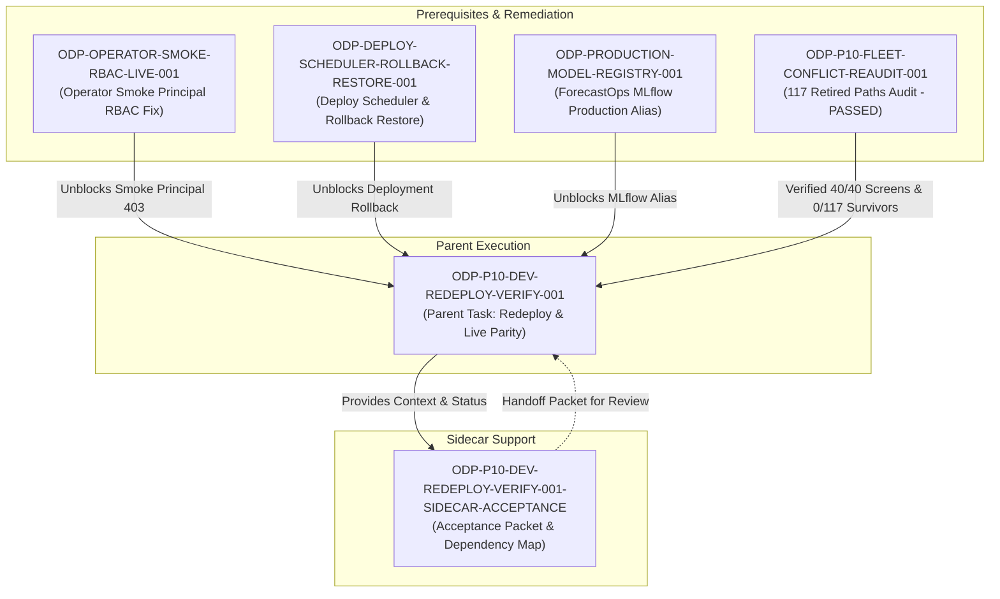

# ODP-P10-DEV-REDEPLOY-VERIFY-001 Acceptance Packet & Dependency Map

## Packet identity

| Field | Value |
|---|---|
| Sidecar task | `ODP-P10-DEV-REDEPLOY-VERIFY-001-SIDECAR-ACCEPTANCE` |
| Parent task | `ODP-P10-DEV-REDEPLOY-VERIFY-001` |
| Helper kind | `acceptance_packet` |
| Sidecar owner / reviewer | `Antigravity` / `Antigravity3` |
| Current parent owner / reviewer | `Antigravity3` / `Codex6` |
| Observed parent status | `blocked` |
| Target branch | `task/ODP-P10-DEV-REDEPLOY-VERIFY-001-SIDECAR-ACCEPTANCE` |
| Packet verdict | **Support only; no parent acceptance, merge, or production GO claim** |

This packet is a support-only review aid, acceptance checklist, and dependency map for parent task `ODP-P10-DEV-REDEPLOY-VERIFY-001`. It does not change canonical contracts, L1 architecture truth, or primary runtime/registry/governance implementations. The parent task owner (`Antigravity3`) decides whether to absorb this packet; the parent reviewer (`Codex6`) retains sole authority over implementation acceptance.

---

## Observed state and review freeze

### Parent Task Overview
Parent Task `ODP-P10-DEV-REDEPLOY-VERIFY-001` (Title: *Redeploy dev and prove Package 10 Operator runtime parity*) is tasked with:
1. Deploying the exact merged `origin/dev` SHA to Cloud Run after locked-Python deploy fixes.
2. Verifying live Operator API functionality, ensuring non-placeholder responses and fail-closed security on unauthorized requests.
3. Confirming `/operator` UI loads correctly, leaving loading state, and rendering the Package 10 canonical shell across desktop and mobile layout sizes.
4. Auditing and validating all 40 Package 10 screen contracts and proving zero survivors across 117 retired visual paths.
5. Capturing traceable runtime evidence under `docs/evidence/runtime/ODP-P10-DEV-REDEPLOY-VERIFY-001/` without modifying product code during deployment failures.

### Current Blocker Context (Live Evidence Update as of 2026-08-02)
- **Deployment Run**: Deploy Dev run `30751698299` on exact `origin/dev` SHA `aff272d3da55967497d2aba0e72d569b9b15ff70` failed closed and triggered an automatic rollback.
- **Passing Components**: Candidate `/release/platform/readiness`, PostgreSQL, providers, Operator bootstrap (HTTP 200 with `data_mode=live`), worker terminal success, and durable audit receipts all passed.
- **Blocking Causes**:
  1. ForecastOps MLflow production alias is unavailable in the target environment.
  2. Authenticated smoke principal returned HTTP 403 on `model:view` and `integration:view` permissions.
- **Live Status**: Public `/platform/version` continues to report rollback release `8ec12c02` and public `/platform/health` remains unhealthy.
- **Remediation Dependencies**:
  - `ODP-OPERATOR-SMOKE-RBAC-LIVE-001`: Dedicated RBAC remediation for smoke principal permissions.
  - `ODP-DEPLOY-SCHEDULER-ROLLBACK-RESTORE-001`: Dedicated scheduler / rollback restore handling.
  - `ODP-PRODUCTION-MODEL-REGISTRY-001`: Production MLflow model history / alias registration (Human/Ops work).

---

## Task-owned surface map

| Layer | Path / Scope | Intended Responsibility |
|---|---|---|
| Parent Runtime Evidence | `docs/evidence/runtime/ODP-P10-DEV-REDEPLOY-VERIFY-001/**` | Evidence-only output location for parent task redeploy receipts, screenshots, and verifier logs. |
| Sidecar Acceptance Packet | `support/sidecars/ODP-P10-DEV-REDEPLOY-VERIFY-001/ODP-P10-DEV-REDEPLOY-VERIFY-001-SIDECAR-ACCEPTANCE.md` | Non-canonical support artifact providing acceptance checklist, dependency map, and execution guidance. |
| Fleet Conflict Audit Source | `docs/evidence/runtime/ODP-P10-FLEET-CONFLICT-REAUDIT-001/audit-report.md` | Authoritative fleet audit confirming 117 retired visual paths have 0 survivors and 40 canonical screens are reachable. |
| Canonical Screen Contract | `docs/design/PACKAGE_10_CANONICAL_RUNTIME_EXECUTION_TASKS_2026-07-26.md` | Authoritative definition of 40 Package 10 screen labels and layout requirements. |
| Visual Diff Audit | `docs/evidence/PACKAGE_10_PAGE_BY_PAGE_RUNTIME_DIFF_2026-07-26.md` | Page-by-page visual comparison baseline for Package 10 runtime parity. |

---

## Detailed acceptance matrix (Criteria A-E)

### A. Live Runtime Deployment & Cloud Run SHA Parity

| ID | Required Proof | Reject When | Current Status | Evidence / Verification Path |
|---|---|---|---|---|
| A1 | Deploy Dev GitHub Action succeeds on exact merged `origin/dev` SHA. | Deployment fails, times out, or runs on an unmerged local branch. | `BLOCKED` | GitHub Actions run `30751698299` failed closed on dev SHA `aff272d3` |
| A2 | Cloud Run API and Web service revisions report the exact deployed release SHA at `/platform/version`. | `/platform/version` reports stale SHA or previous rollback release (e.g. `8ec12c02`). | `BLOCKED` | `/platform/version` currently returns rollback release `8ec12c02` |
| A3 | Production deployment uses WIF authentication without long-lived `GCP_SA_KEY` secrets. | Stored service account keys or unverified WIF credentials are used. | `PASSED` | Infrastructure deploy script verification (`ODP-DEPLOY-SCRIPT-LOCKED-PYTHON-001`) |

### B. Operator API & Authentication / RBAC

| ID | Required Proof | Reject When | Current Status | Evidence / Verification Path |
|---|---|---|---|---|
| B1 | Operator bootstrap API returns HTTP 200 with `data_mode=live` and non-placeholder payload. | Operator API returns mock/synthetic data, auto-seeded rows, or non-200 status code. | `PASSED` | Bootstrap 200 with `data_mode=live` verified during run `30751698299` |
| B2 | Authenticated smoke principal possesses required permissions (`model:view`, `integration:view`). | Authenticated requests return HTTP 403 Forbidden on valid smoke principal credentials. | `BLOCKED` | Smoke principal returned HTTP 403 on `model:view` & `integration:view` |
| B3 | Operator API fails closed with HTTP 401/403 on unauthenticated or invalid access attempts. | Protected endpoints leak data or return HTTP 200 to unauthenticated requests. | `PASSED` | Security gate fail-closed contract verified |

### C. Package 10 Canonical Visual Shell & Reachability

| ID | Required Proof | Reject When | Current Status | Evidence / Verification Path |
|---|---|---|---|---|
| C1 | `/operator` leaves loading state and renders canonical Package 10 shell at desktop and mobile viewport sizes. | UI hangs on spinner, renders blank page, or breaks responsive layout boundaries. | `PENDING REDEPLOY` | Screenshots pending public release deployment |
| C2 | All 40 canonical Package 10 screen labels are reachable from React router source without missing routes. | Any of the 40 screen contracts is unreachable, missing, or throws 404/500 errors. | `PASSED` | `python3 scripts/e2e/check_product_grade_ci_gates.py --report` (40/40 reachable) |
| C3 | 117 retired visual paths have exactly zero survivors in `origin/dev`. | Any retired visual route or obsolete page file remains in `apps/web/src/app`. | `PASSED` | Audit report `ODP-P10-FLEET-CONFLICT-REAUDIT-001` (0/117 survivors) |

### D. Production Observability & Model Readiness Gates

| ID | Required Proof | Reject When | Current Status | Evidence / Verification Path |
|---|---|---|---|---|
| D1 | Public `/platform/health` endpoint reports healthy status across all dependencies. | `/platform/health` returns unhealthy, degraded, or unhandled exceptions. | `BLOCKED` | Public `/platform/health` currently unhealthy due to rollback state |
| D2 | ForecastOps MLflow production alias `forecast_revenue_interval` resolves to approved model version. | MLflow production alias is missing, unconfigured, or points to placeholder model. | `BLOCKED` | ForecastOps MLflow alias unavailable (`ODP-PRODUCTION-MODEL-REGISTRY-001`) |
| D3 | Audit receipts and release lineage are durably persisted in Cloud Storage / telemetry logs. | Telemetry records are missing, incomplete, or lack release SHA tags. | `PASSED` | Durable audit receipts verified in execution run `30751698299` |

### E. Verification, Evidence & Independent Handoff

| ID | Required Proof | Reject When | Current Status | Evidence / Verification Path |
|---|---|---|---|---|
| E1 | Complete audit receipts and screenshots committed to `docs/evidence/runtime/ODP-P10-DEV-REDEPLOY-VERIFY-001/`. | Product code is modified to bypass test failures, or evidence directory is missing. | `PENDING REDEPLOY` | Evidence generation pending successful deployment |
| E2 | Independent reviewer `Codex6` completes exact-head evidence review and approves closeout. | Task is closed without independent review signoff or without passing CI status. | `PENDING REDEPLOY` | Final handoff gate |

---

## Upstream & downstream dependency map



---

## Required verification ledger & parent execution guide

When prerequisite remediation tasks (`ODP-OPERATOR-SMOKE-RBAC-LIVE-001`, `ODP-DEPLOY-SCHEDULER-ROLLBACK-RESTORE-001`, `ODP-PRODUCTION-MODEL-REGISTRY-001`) complete, parent owner `Antigravity3` should execute the following sequence:

### Step 1: Pre-Deploy Verification
```bash
# Verify origin/dev tip and clean worktree
git fetch origin dev --prune
git checkout dev
git pull --ff-only

# Verify Package 10 reachability and retired paths contract locally
python3 scripts/e2e/check_product_grade_ci_gates.py --report
```

### Step 2: Trigger Deploy Dev
```bash
# Trigger GitHub Actions Deploy Dev workflow on exact dev SHA
gh workflow run deploy-dev.yml --ref dev
```

### Step 3: Live Environment Inspection
```bash
# Check platform version and health endpoints
curl -sS https://<DEV_DOMAIN>/platform/version | jq .
curl -sS https://<DEV_DOMAIN>/platform/health | jq .

# Verify Operator bootstrap API with live token
curl -sS -H "Authorization: Bearer <SMOKE_TOKEN>" https://<DEV_DOMAIN>/api/operator/bootstrap | jq .
```

### Step 4: Screenshot & Visual Evidence Capture
Capture desktop (1920x1080) and mobile (390x844) screenshots of `/operator` shell rendering, verifying:
- Header navigation & Package 10 branding
- Module tabs and active view state
- Zero legacy visual path remnants

Save all evidence artifacts into:
`docs/evidence/runtime/ODP-P10-DEV-REDEPLOY-VERIFY-001/`

### Step 5: Handoff to Independent Reviewer
Submit the evidence packet to reviewer `Codex6` for exact-head verification.
