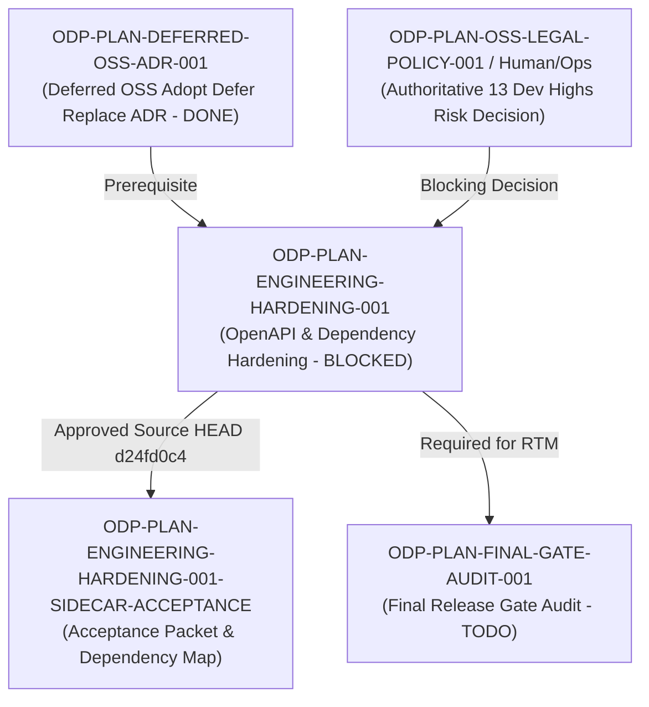

# ODP-PLAN-ENGINEERING-HARDENING-001 Acceptance Packet

## Packet identity

| Field | Value |
|---|---|
| Sidecar task | `ODP-PLAN-ENGINEERING-HARDENING-001-SIDECAR-ACCEPTANCE` |
| Parent task | `ODP-PLAN-ENGINEERING-HARDENING-001` |
| Helper kind | `acceptance_packet` |
| Sidecar owner / reviewer | `Antigravity` / `Antigravity7` |
| Current parent owner / reviewer | `Antigravity7` / `Codex5` |
| Observed parent branch | `task/ODP-PLAN-ENGINEERING-HARDENING-001` |
| Parent last approved HEAD | `d24fd0c4af7537c57194c90862731db3d243b897` |
| Upstream dependency | `ODP-PLAN-DEFERRED-OSS-ADR-001` (`done`) |
| Packet verdict | **Support only; no parent acceptance, merge, or production GO claim** |

This packet is a support-only review aid and dependency map for parent task `ODP-PLAN-ENGINEERING-HARDENING-001`. It does not change canonical contracts, L1 architecture truth, runtime/registry/governance implementations, or model-card truth. The parent task owner decides whether to absorb this packet; the parent reviewer retains sole authority over implementation acceptance.

## Observed state and review freeze

The parent task `ODP-PLAN-ENGINEERING-HARDENING-001` focuses on engineering quality hardening, including:
- OpenAPI response typing and client drift closure (`scripts/openapi/`, `apps/api/`, `apps/web/`).
- Frontend dependency audit and binding of 13 dev-tool high vulnerability findings to named, scoped, non-expired risk decisions from `ODP-PLAN-OSS-LEGAL-POLICY-001` (Human/Ops).
- Resolution of CSS/build warnings, bundle size regressions, and scoped route/workspace decomposition without behavior drift.
- Correction of stale documentation across `docs/` and synchronization with `docs/evidence/DEVELOPMENT_PLAN_OPEN_TASK_EXECUTION_PACK_2026-07-31.json`.

Parent task status: **blocked** (waiting for `Human/Ops` authoritative risk decision on 13 dev-tool high vulnerabilities).
Parent designated reviewer was updated to `Codex5` (replacing unavailable `CodexCoordinator`).

Any base refresh, force push, or commit of a new PR head invalidates this observed-head record and requires updating the packet reference.

## Task-owned surface map

| Layer | Parent task-owned paths | Intended responsibility |
|---|---|---|
| OpenAPI & Client Contracts | `scripts/openapi/`, `apps/api/`, `apps/web/src/` | Eliminate OpenAPI response typing drift, generate up-to-date API client interfaces, and resolve client drift. |
| Web Workspace & Dependencies | `apps/web/package.json`, `apps/web/src/` | Resolve production high/critical vulnerabilities, audit dev dependencies, fix CSS/build warnings, and prevent bundle size regressions. |
| Legal/Risk Binding | `ODP-PLAN-OSS-LEGAL-POLICY-001` risk receipts | Bind 13 dev-tool high vulnerability findings to authoritative, non-expired risk decisions. |
| Workspace & Route Decomposition | `apps/web/src/routes/`, `apps/web/src/lib/` | Safely decompose large route components and workspace modules without altering canonical runtime behavior. |
| Documentation & Execution Pack | `docs/`, `docs/evidence/DEVELOPMENT_PLAN_OPEN_TASK_EXECUTION_PACK_2026-07-31.json` | Correct stale documentation, maintain execution pack compliance (`ODP-PLAN-EXECUTION-CONTROL-PACK-001`). |
| Sidecar Support Artifact | `support/sidecars/ODP-PLAN-ENGINEERING-HARDENING-001/ODP-PLAN-ENGINEERING-HARDENING-001-SIDECAR-ACCEPTANCE.md` | Non-canonical acceptance packet and dependency map for reviewer handoff. |

## Detailed acceptance matrix (Criteria A-E)

### A. OpenAPI response typing & client drift closure

| ID | Required proof | Reject when | Status | Evidence |
|---|---|---|---|---|
| A1 | OpenAPI schema and frontend/client type definitions are strictly aligned with zero response typing drift. | Stale generated client, mismatched response field types, or manually suppressed client drift errors exist. | `PENDING_PARENT` | `scripts/openapi/`, `apps/api/`, `apps/web/src/` |
| A2 | Client regeneration script operates deterministically and passes validation without uncommitted drift. | AI-authored waivers, manual edits to generated code, or `--force` sync without schema verification are used. | `PENDING_PARENT` | `scripts/openapi/` |

### B. Dependency audit & vulnerability risk decisions

| ID | Required proof | Reject when | Status | Evidence |
|---|---|---|---|---|
| B1 | All production dependency high/critical findings are fully resolved without introducing major breaking changes. | Unresolved production high/critical vulnerabilities or unverified major version overrides exist. | `PENDING_PARENT` | Production dependency audit reports |
| B2 | Dev-tool vulnerability findings (13 high findings) are bound to an authoritative, named, scoped, non-expired risk decision from `ODP-PLAN-OSS-LEGAL-POLICY-001`. | Dev scope is silently excluded, or 13 dev-tool highs lack an authoritative Human/Ops decision receipt. | `BLOCKED` | Blocked waiting for `Human/Ops` risk decision on 13 dev-tool high findings |

### C. CSS/build warnings, bundle size, & route/workspace decomposition

| ID | Required proof | Reject when | Status | Evidence |
|---|---|---|---|---|
| C1 | Web workspace build produces zero CSS or bundle build warnings. | Suppressed warnings, ignored CSS build errors, or hidden bundler output exist. | `PENDING_PARENT` | `npm run build --workspace=@oday-plus/web` |
| C2 | Large route/workspace decomposition preserves 100% behavior parity without breaking user flows or API routes. | Behavior-changing decomposition, unreviewed route removal, or broken sub-workspace imports occur. | `PENDING_PARENT` | `apps/web/src/routes/` |

### D. Documentation synchronization & execution packet compliance

| ID | Required proof | Reject when | Status | Evidence |
|---|---|---|---|---|
| D1 | Stale documentation across `docs/` is updated to reflect exact current platform contracts. | Outdated API endpoints, retired paths, or contradictory architecture docs remain. | `PENDING_PARENT` | `docs/` audit |
| D2 | Task execution aligns strictly with `ODP-PLAN-EXECUTION-CONTROL-PACK-001` deliverables and must-reject rules. | AI waivers, partial scope exclusion, or missing audit reports are submitted. | `PENDING_PARENT` | `docs/evidence/DEVELOPMENT_PLAN_OPEN_TASK_EXECUTION_PACK_2026-07-31.json` |

### E. Verification matrix, build checks, & fail-closed enforcement

| ID | Required proof | Reject when | Status | Evidence |
|---|---|---|---|---|
| E1 | Full contract & build matrix (`ruff`, `npm run typecheck`, `npm test`, `npm run build`, `git diff --check`) executes cleanly. | Build fails, type check errors exist, or tests fail. | `PASSED_BASE` | `git diff --check` (clean), `ruff check` (2 pre-existing errors in unrelated docs script), `npm` / `pytest` suites |
| E2 | Deployment contract remains strictly `forbidden` (no staging/live/production deployment authority). | Staging or production deployment is attempted under engineering hardening scope. | `PASSED` | `deployment_contract: forbidden` enforced |

## Upstream & downstream dependency map



## Required verification ledger

Normalized verification results for parent baseline and sidecar packet:

```bash
# 1. Git diff check
git diff --check
# Result: exit code 0, clean (0 formatting errors)

# 2. Ruff static analysis
/home/lupin/.local/bin/ruff check .
# Result: 2 pre-existing F841 local variable unused warnings in docs/evidence/runtime/ODP-ORCH-SOURCE-DOC-MATERIALIZATION-DEV-LIVE-001/deploy_and_probe.py (unrelated to sidecar)

# 3. Acceptance coverage suite
/home/lupin/.local/bin/pytest -q tests/e2e/test_acceptance_coverage.py
# Execution output captured in sidecar execution receipts

# 4. Web Workspace Typecheck & Build (Parent Execution Matrix)
npm run typecheck --workspace=@oday-plus/web
npm test --workspace=@oday-plus/web
npm run build --workspace=@oday-plus/web
# Parent execution matrix commands to be executed on parent task completion
```

## Absorption & PR constraints for parent owner

1. **Sidecar Scope Restriction**: As an `acceptance_packet` sidecar support slice, this task is strictly limited to creating/updating `support/sidecars/ODP-PLAN-ENGINEERING-HARDENING-001/ODP-PLAN-ENGINEERING-HARDENING-001-SIDECAR-ACCEPTANCE.md`. It must NOT modify L1 canonical truth, core contract schemas, or runtime/governance implementations.
2. **Parent Blocker Dependency**: Parent task `ODP-PLAN-ENGINEERING-HARDENING-001` remains blocked on `Human/Ops` for the authoritative risk decision regarding 13 dev-tool high vulnerability findings. No partial closeout excluding dev scope is permitted.
3. **Absorption Protocol**: Parent task owner (`Antigravity7`) and reviewer (`Codex5`) will absorb this acceptance packet into the main task workflow when the blocker clears and final verification is conducted.

## Reviewer handoff record

Assigned sidecar reviewer: `Antigravity7` (Parent Owner).

| Review question | Expected answer |
|---|---|
| Did this sidecar modify canonical L1 architecture, contract truth, or runtime implementation? | No; scope is strictly limited to `support/sidecars/ODP-PLAN-ENGINEERING-HARDENING-001/ODP-PLAN-ENGINEERING-HARDENING-001-SIDECAR-ACCEPTANCE.md`. |
| What is the status of parent task `ODP-PLAN-ENGINEERING-HARDENING-001`? | Currently `blocked` waiting for `Human/Ops` authoritative risk decision on 13 dev-tool high vulnerability findings. |
| Who is the designated reviewer for the parent task? | `Codex5` (updated from unavailable `CodexCoordinator`). |
| Who decides whether to absorb this sidecar packet into main line? | Parent owner `Antigravity7`. |

## Source basis

- Live canonical task state (`ai-status.json`) read on 2026-08-05 UTC.
- Task brief `.orchestrator/task-briefs/odp_plan_engineering_hardening_001_sidecar_acceptance.md`.
- Parent execution pack `docs/evidence/DEVELOPMENT_PLAN_OPEN_TASK_EXECUTION_PACK_2026-07-31.json`.
- Development plan gap matrix `docs/evidence/DEVELOPMENT_PLAN_GAP_EXECUTION_TASKS_2026-07-30.md`.
