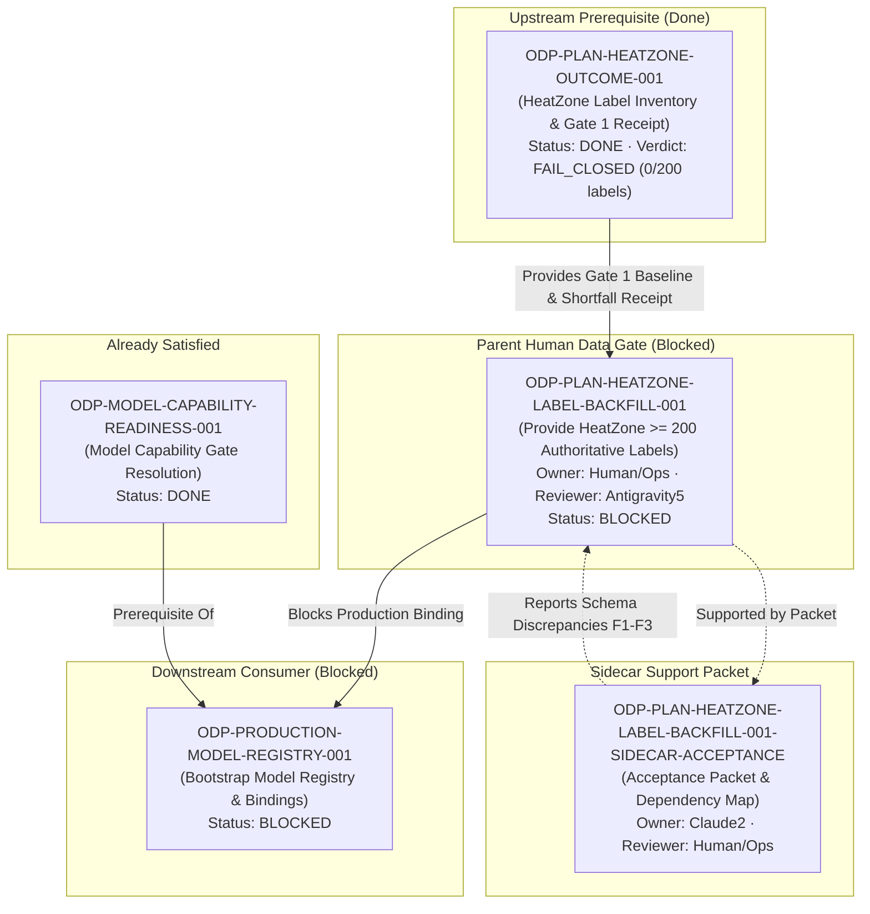

# ODP-PLAN-HEATZONE-LABEL-BACKFILL-001 Acceptance Packet

## Packet identity

| Field | Value |
|---|---|
| Sidecar task | `ODP-PLAN-HEATZONE-LABEL-BACKFILL-001-SIDECAR-ACCEPTANCE` |
| Parent task | `ODP-PLAN-HEATZONE-LABEL-BACKFILL-001` |
| Helper kind | `acceptance_packet` |
| Sidecar owner / reviewer | `Claude2` / `Human/Ops` |
| Current parent owner / reviewer | `Human/Ops` / `Antigravity5` |
| Parent task branch (origin) | `task/ODP-PLAN-HEATZONE-LABEL-BACKFILL-001` @ `923d3f95` |
| Parent dependency | `ODP-PLAN-HEATZONE-OUTCOME-001` (`done` · Gate 1 benchmark receipt `FAIL_CLOSED`) |
| Current binding status | `GOVERNED_DISABLED` (`DATA_CONTRACT_NOT_MATURE`) |
| Observed label count | `0` eligible mature labels observed (shortfall: `200`) |
| Verification base | `origin/dev` @ `529f0a2c`, composed into this branch on 2026-08-11 |
| Packet verdict | **Support only; no canonical contract modification; parent task remains blocked awaiting Human/Ops authoritative label handback, and the readback spec has an unresolved schema mismatch (Section F)** |

This packet is a support-only review aid, acceptance checklist, and dependency map for parent task `ODP-PLAN-HEATZONE-LABEL-BACKFILL-001`. It does not modify L1 canonical contracts, architecture policy, runtime/registry/governance implementations, or model-card truth. The parent task owner (`Human/Ops`) and reviewer (`Antigravity5`) retain authority over implementation acceptance and dataset sign-off.

Every path, command, status, and constant below was re-verified against the composed base `529f0a2c` on 2026-08-11. Section F records discrepancies found during that re-verification; those are reported, not repaired, because the affected files are canonical evidence owned by the parent task.

## Observed state and review freeze

Parent task `ODP-PLAN-HEATZONE-LABEL-BACKFILL-001` is a `P1 Human Data Gate` task owned by `Human/Ops`. Its prerequisite task `ODP-PLAN-HEATZONE-OUTCOME-001` completed Gate 1 benchmark evaluation (`docs/evidence/models/ODP-PLAN-HEATZONE-OUTCOME-001/GATE1_BENCHMARK_RECEIPT.json`, `BENCHMARK_REPORT.md`, `DATA_HANDBACK.json`), which established:

1. **Observed Label Inventory**: `0` eligible mature real labels in `model_ready.heatzone_training_view` (`heatzone-training-view-v2`).
2. **Activation Shortfall**: `200` eligible labels required (shortfall: `200`).
3. **Fail-Closed Governance**: Production binding for `heatzone` model (`heatzone_priority`) is strictly set to `GOVERNED_DISABLED` with canonical reason code `DATA_CONTRACT_NOT_MATURE`.
4. **Zero Synthetic / Auto-Seed Data Policy**: `auto_seeded = false`. Synthetic labels, mock rows, auto-seeded entries, or fabricated opening dates are strictly forbidden.

Until `Human/Ops` provides the required authoritative dataset handback (>= 200 mature eligible labels with complete dataset hash, owner attestation, and query readback), `ODP-PLAN-HEATZONE-LABEL-BACKFILL-001` remains **blocked**.

## Task-owned surface map

| Layer | Surface / Path | Intended responsibility |
|---|---|---|
| Sidecar Support Packet | `support/sidecars/ODP-PLAN-HEATZONE-LABEL-BACKFILL-001/ODP-PLAN-HEATZONE-LABEL-BACKFILL-001-SIDECAR-ACCEPTANCE.md` | Non-canonical acceptance packet, dependency map, and Human/Ops handback guide. |
| Gate 1 Evidence & Data Handback | `docs/evidence/models/ODP-PLAN-HEATZONE-OUTCOME-001/` | Gate 1 benchmark receipt (`GATE1_BENCHMARK_RECEIPT.json`), report (`BENCHMARK_REPORT.md`), and data handback requirements (`DATA_HANDBACK.json`). |
| Human Data Gate Intake | `docs/evidence/models/heatzone/human-data-gate/` | Already populated with `intake_packet.md`, `DATA_HANDBACK.json`, and `AUTHORITATIVE_READBACK_SPEC.json` (generated 2026-08-03). Human/Ops adds the dataset snapshot readback here. |
| Benchmark & Evaluation Script | `scripts/models/heatzone_benchmark.py` | CLI (`generate` \| `verify`) that produces and verifies Gate 1 receipts for HeatZone model inventory. |
| View Installation Script | `scripts/models/install_views.py` | Model-ready view installer (`inventory` \| `install`) creating `model_ready.heatzone_training_view`. Uses package-relative imports — see Section G. |
| Model-Ready View SQL | `scripts/models/sql/model_ready_views.sql` (lines 670–1149) | Canonical `heatzone_training_view` definition; authoritative source for the column set Human/Ops must satisfy. |
| Domain Invariants & Contract | `modules/heatzone/domain/scoring.py` (re-exported by `modules/heatzone/domain/__init__.py`) | Defines `HEATZONE_FEATURE_VERSION = "heatzone-training-view-v2"` and enforces complete-row rejection. |
| Verification & Governance Suite | `tests/models/test_heatzone_benchmark.py`, `tests/integration/test_heatzone_flow.py` | Unit and flow tests verifying fail-closed invariants, benchmark evaluations, and synthetic label rejections. |

## Detailed acceptance matrix (Criteria A–E)

### A. Authoritative label dataset & eligibility criteria

| ID | Criterion | Required proof | Reject when | Status | Evidence |
|---|---|---|---|---|---|
| A1 | **Minimum Label Count** | At least 200 eligible mature real labels present in `model_ready.heatzone_training_view`. | Observed count < 200 (current observed: `0`, shortfall: `200`). | `BLOCKED` | `GATE1_BENCHMARK_RECEIPT.json` |
| A2 | **Required Schema Fields** | Dataset contains the `DATA_HANDBACK.json` mandatory schema: `tenant_id`, `store_id`, `opened_on`, `h3_index`, `h3_resolution`, `origin_date`, `realized_28d_cell_net_revenue`, `label_maturity_time`, `authority_type`, `provenance`. | Any mandatory schema field is missing, null, or improperly typed. | `BLOCKED` — and see **F1**: `authority_type` is not projected by the installed view. | `DATA_HANDBACK.json`, `model_ready_views.sql` |
| A3 | **Temporal Maturity Invariants** | Each H3 cell origin has at least 90 complete prior transaction days and 28 complete forward outcome days relative to store opening date (`opened_on`). | Label maturity time < 28 days or incomplete prior 90-day window. | `BLOCKED` | `heatzone_benchmark.py` |
| A4 | **Dataset Lineage & Hash** | Immutable dataset snapshot hash, named data owner attestation, and source query readback location provided. | Missing dataset SHA-256 hash, ownerless dataset, or unverified source query. | `BLOCKED` | `DATA_HANDBACK.json` |
| A5 | **Join-Key Uniqueness & Confidentiality** | Zero duplicate join-key tuples; masking applied; raw value exposure withheld; access limited to `data_owner`, `expansion_manager`, `platform_admin`. | Duplicate join keys, unmasked raw values, or disclosure outside the allowed roles. | `BLOCKED` — join-key names unresolved, see **F2**. | `AUTHORITATIVE_READBACK_SPEC.json` |

### B. Fail-closed governance & safety invariants

| ID | Criterion | Required proof | Reject when | Status | Evidence |
|---|---|---|---|---|---|
| B1 | **Zero Synthetic Data Policy** | All labels originate from real POS transactions and approved store opening dates. | Synthetic labels, fixture rows, auto-seeded entries, or simulated opening dates are present (`auto_seeded = true`). | `PASSED` | `GATE1_BENCHMARK_RECEIPT.json` (`auto_seeded: false`) |
| B2 | **Governed-Disabled Binding** | HeatZone capability binding remains `GOVERNED_DISABLED` (`DATA_CONTRACT_NOT_MATURE`) until all criteria pass. | Capability promoted to `ACTIVE` or `PASSED` prematurely while label count < 200. | `PASSED` | `modules/heatzone/domain/scoring.py`, `BENCHMARK_REPORT.md` |
| B3 | **No AI-Authored Waiver** | Verification requires authentic production readback; AI agents cannot self-certify data maturity. | AI-authored receipt, hardcoded mock count, or unverified ready claim. | `PASSED` | Task Brief & Governance Rules |
| B4 | **No Row-Generation Constructs in View SQL** | `_validate_sql_contract` rejects `generate_series(`, `random(`, `setseed(`, and `create table as` in the model-ready SQL. | Installer SQL contains any prohibited row-generation construct. | `PASSED` | `scripts/models/install_views.py` |

### C. Gate 1 benchmark evaluation criteria

| ID | Criterion | Required proof | Reject when | Status | Evidence |
|---|---|---|---|---|---|
| C1 | **Population Density Ranking Outperformance** | HeatZone model NDCG > baseline population density ranking NDCG (`baseline_ndcg: 0.50`). | Model ranking fails to outperform simple population density sorting. | `PENDING_DATA` | `heatzone_benchmark.py` |
| C2 | **Top-K Field Survey Efficiency** | HeatZone model field site survey rate > baseline survey rate (`baseline_survey_rate: 0.30`). | Survey efficiency fails to improve over baseline. | `PENDING_DATA` | `heatzone_benchmark.py` |
| C3 | **Receipt Content SHA-256 Integrity** | Immutable receipt payload hash verified against evaluation execution. | Receipt content SHA-256 hash mismatch or tampered payload. | `PASSED` | `GATE1_BENCHMARK_RECEIPT.json` (`content_sha256: 7e903852...`) |
| C4 | **Inventory Lineage Binding** | New receipt binds immutably to the PG16 model-ready inventory receipt lineage (`pg16-production-model-inventory-2026-07-25-v1`, `inventory_sha256: 3f1c8ec4...`). | Receipt is emitted without, or with a mismatched, inventory lineage binding. | `PENDING_DATA` | `GATE1_BENCHMARK_RECEIPT.json`, `AUTHORITATIVE_READBACK_SPEC.json` |

### D. Upstream & downstream dependency map

Statuses below were read from the live status root on 2026-08-11 (`ai-status.json` for active tasks, `ai-task-archive/tasks/` for completed ones).

| Dependency Task | Role / Relationship | Current Status | Impact on Parent Task |
|---|---|---|---|
| `ODP-PLAN-HEATZONE-OUTCOME-001` | **Upstream Prerequisite** | `done` (archived 2026-07-31) | Completed Gate 1 benchmark receipt generation; established baseline shortfall (200 labels required). |
| `ODP-PLAN-HEATZONE-LABEL-BACKFILL-001` | **Parent Mainline Task** | `blocked` (owner `Human/Ops`, reviewer `Antigravity5`) | Awaiting Human/Ops authoritative label dataset handback. |
| `ODP-PLAN-HEATZONE-LABEL-BACKFILL-001-SIDECAR-ACCEPTANCE` | **Support Slice** | `in_progress` (owner `Claude2`, reviewer `Human/Ops`) | Provides acceptance packet, dependency map, and verification ledger (this document). |
| `ODP-PRODUCTION-MODEL-REGISTRY-001` | **Downstream Consumer** | `blocked` (owner `Antigravity`, reviewer `Claude`) | Production model registry bootstrap requires the HeatZone binding to remain governed-disabled until labels are backfilled. |
| `ODP-MODEL-CAPABILITY-READINESS-001` | **Upstream of the registry task** | `done` (archived 2026-07-28) | Already satisfied; it is a `depends_on` of `ODP-PRODUCTION-MODEL-REGISTRY-001`, not a task blocked by this backfill. |
| `ODP-PLAN-UAT-SIGNOFF-001`, `ODP-PLAN-FINAL-GATE-AUDIT-001` | **Downstream Gates** | depend on `ODP-PLAN-HEATZONE-OUTCOME-001` | Consume the HeatZone gate outcome; unaffected while the binding stays fail-closed. |

> Correction against the previous packet revision: `ODP-MODEL-CAPABILITY-READINESS-001` was listed as a blocked downstream task. It is `done` and sits upstream of `ODP-PRODUCTION-MODEL-REGISTRY-001`; it is not blocked by this backfill.

### E. Verification ledger & test matrix

Re-run on composed base `529f0a2c` (2026-08-11), worktree `odp-plan-heatzone-label-backfill-001-sidecar-acceptance`.

| Command | Objective | Result | Status |
|---|---|---|---|
| `python3 -m pytest -q tests/models/test_heatzone_benchmark.py tests/integration/test_heatzone_flow.py` | HeatZone benchmark, Gate 1 receipt, and integration flow suites. | 28 passed | `PASSED` |
| `python3 -m ruff check scripts/models/heatzone_benchmark.py scripts/models/install_views.py tests/models/test_heatzone_benchmark.py tests/integration/test_heatzone_flow.py modules/heatzone/domain/` | Static linting of the benchmark, installer, domain, and test surfaces. | All checks passed | `PASSED` |
| `git diff --check` | Formatting & whitespace check. | Clean | `PASSED` |
| `python3 -m scripts.models.install_views --help` | Confirm installer CLI contract (`inventory` \| `install`). | Subcommands confirmed | `PASSED` |
| `python3 scripts/models/heatzone_benchmark.py --help` | Confirm benchmark CLI contract (`generate` \| `verify`). | Subcommands confirmed | `PASSED` |
| `python3 scripts/models/install_views.py` | Probe the runbook command published in the prior packet revision. | `ImportError: attempted relative import with no known parent package` | `FAILED` — see **G1** |

## F. Schema reconciliation discrepancies (parent-owner decision required)

These are reported, not fixed. `AUTHORITATIVE_READBACK_SPEC.json` and `DATA_HANDBACK.json` are canonical evidence owned by `ODP-PLAN-HEATZONE-LABEL-BACKFILL-001` / `ODP-PLAN-HEATZONE-OUTCOME-001`; a sidecar may not amend them. Each item was confirmed by grepping the `heatzone_training_view` body in `scripts/models/sql/model_ready_views.sql` (lines 670–1149).

| ID | Discrepancy | Observed | Consequence if unresolved |
|---|---|---|---|
| F1 | `AUTHORITATIVE_READBACK_SPEC.json` prescribes the eligibility count query `SELECT COUNT(*) FROM model_ready.heatzone_training_view WHERE is_mature = true AND is_eligible = true AND is_synthetic = false`. | None of `is_mature`, `is_eligible`, `is_synthetic` are projected by the view. The view exposes a single `is_training_eligible` flag, plus `label_maturity_time`. `authority_type` (required by `DATA_HANDBACK.json`) is likewise not projected. | Human/Ops running the prescribed readback verbatim gets a Postgres `column does not exist` error. A1/A2 cannot be evidenced against the installed contract. |
| F2 | `AUTHORITATIVE_READBACK_SPEC.json` declares `required_join_keys` of `cell_id`, `tenant_id`, `observation_period`, `outcome_observed_at`. | Only `tenant_id` exists in the view. The spatial/temporal identity is projected as `h3_index` + `h3_resolution`, `origin_date`, and `label_maturity_time`. | The duplicate-tuple check in A5 has no executable definition; dedup cannot be verified or signed off. |
| F3 | The readback spec names Cloud SQL instance `alfaloop-data-project:asia-east1:oday-dev-sql` as the verification target, while the receipt lineage binds to inventory `pg16-production-model-inventory-2026-07-25-v1`. | Not reconciled in either artifact. | Ambiguity over whether a dev-instance readback can satisfy a production-lineage-bound receipt. |

**Recommended resolution owner**: parent owner `Human/Ops` with reviewer `Antigravity5`, before any dataset handback is attempted — otherwise the handback will be produced against a column set the Gate 1 verifier cannot read.

## G. Runbook corrections

| ID | Issue | Correct form |
|---|---|---|
| G1 | `python3 scripts/models/install_views.py` fails immediately: the module uses package-relative imports (`from .contracts import ...`), and the bare subcommand is also missing. | `python3 -m scripts.models.install_views install` (or `inventory` for a read-only check) |
| G2 | `heatzone_benchmark.py` is invoked correctly as a direct script path and requires an explicit subcommand. | `python3 scripts/models/heatzone_benchmark.py generate` (verified) |

## Dependency diagram



## Actionable handback protocol for Human/Ops

When Expansion Operations / POS Data Platform is ready to hand back the authoritative HeatZone label dataset:

0. **Resolve Section F first**. Do not build the dataset until the parent owner has reconciled the readback-spec column names (`is_mature` / `is_eligible` / `is_synthetic` / `cell_id` / `observation_period` / `outcome_observed_at` / `authority_type`) against the columns `model_ready.heatzone_training_view` actually projects. Building against the spec as written produces a dataset the Gate 1 verifier cannot query.

1. **Prepare Authoritative Dataset**:
   - Ensure the dataset contains **>= 200 eligible mature real labels** (0 synthetic / auto-seeded rows).
   - Satisfy the `DATA_HANDBACK.json` field list: `tenant_id`, `store_id`, `opened_on`, `h3_index`, `h3_resolution`, `origin_date`, `realized_28d_cell_net_revenue`, `label_maturity_time`, `authority_type`, `provenance`.
   - Store the input data / snapshot in the PG16 data plane and place the handback manifest under `docs/evidence/models/heatzone/human-data-gate/`.
   - Apply the spec's confidentiality policy: masking required, no raw value exposure, access limited to `data_owner` / `expansion_manager` / `platform_admin`.

2. **Refresh View & Benchmark**:
   ```bash
   # Read-only inventory check first
   python3 -m scripts.models.install_views inventory

   # Re-install model-ready views (creates model_ready.heatzone_training_view)
   python3 -m scripts.models.install_views install

   # Re-evaluate the Gate 1 benchmark receipt
   python3 scripts/models/heatzone_benchmark.py generate
   ```

3. **Verify Receipt & Hand Back**:
   - Confirm `GATE1_BENCHMARK_RECEIPT.json` reports `evaluated: true`, `governed_disabled: false`, `population_ranking_outperformed: true`, `top_k_survey_rate_improved: true`, and `auto_seeded: false`.
   - Confirm the receipt still binds to the PG16 model-ready inventory lineage (criterion C4).
   - Re-run the verification ledger in Section E and attach the results.
   - Hand off to parent reviewer `Antigravity5` for formal re-evaluation.
