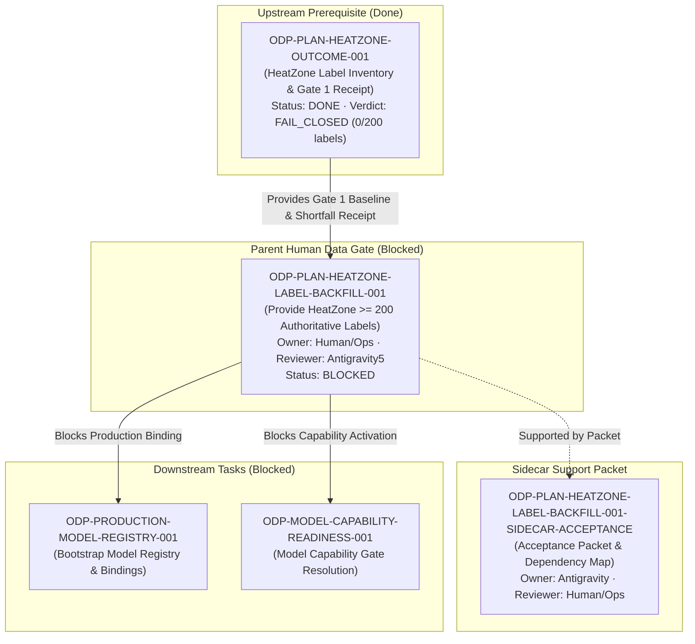

# ODP-PLAN-HEATZONE-LABEL-BACKFILL-001 Acceptance Packet

## Packet identity

| Field | Value |
|---|---|
| Sidecar task | `ODP-PLAN-HEATZONE-LABEL-BACKFILL-001-SIDECAR-ACCEPTANCE` |
| Parent task | `ODP-PLAN-HEATZONE-LABEL-BACKFILL-001` |
| Helper kind | `acceptance_packet` |
| Sidecar owner / reviewer | `Antigravity` / `Human/Ops` |
| Current parent owner / reviewer | `Human/Ops` / `Antigravity5` |
| Observed parent branch | `human/ops` / `task/ODP-PLAN-HEATZONE-LABEL-BACKFILL-001` |
| Parent dependency | `ODP-PLAN-HEATZONE-OUTCOME-001` (`done` · Gate 1 benchmark receipt `FAIL_CLOSED`) |
| Current binding status | `GOVERNED_DISABLED` (`DATA_CONTRACT_NOT_MATURE`) |
| Observed label count | `0` eligible mature labels observed (shortfall: `200`) |
| Packet verdict | **Support only; no canonical contract modification; parent task remains blocked awaiting Human/Ops authoritative label handback** |

This packet is a support-only review aid, acceptance checklist, and dependency map for parent task `ODP-PLAN-HEATZONE-LABEL-BACKFILL-001`. It does not modify L1 canonical contracts, architecture policy, runtime/registry/governance implementations, or model-card truth. The parent task owner (`Human/Ops`) and reviewer (`Antigravity5`) retain authority over implementation acceptance and dataset sign-off.

## Observed state and review freeze

Parent task `ODP-PLAN-HEATZONE-LABEL-BACKFILL-001` is a `P1 Human Data Gate` task owned by `Human/Ops`. Its prerequisite task `ODP-PLAN-HEATZONE-OUTCOME-001` completed Gate 1 benchmark evaluation (`docs/evidence/models/ODP-PLAN-HEATZONE-OUTCOME-001/GATE1_BENCHMARK_RECEIPT.json`, `BENCHMARK_REPORT.md`, `DATA_HANDBACK.json`), which established:

1. **Observed Label Inventory**: `0` eligible mature real labels in `model_ready.heatzone_training_view` (`heatzone-training-view-v2`).
2. **Activation Shortfall**: `200` eligible labels required (shortfall: `200`).
3. **Fail-Closed Governance**: Production binding for `heatzone` model (`heatzone_priority`) is strictly set to `GOVERNED_DISABLED` with canonical reason code `DATA_CONTRACT_NOT_MATURE`.
4. **Zero Synthetic / Auto-Seed Data Policy**: `auto_seeded = false`. Synthetic labels, mock rows, auto-seeded entries, or fabricated opening dates are strictly forbidden.

Until `Human/Ops` provides the required authoritative dataset handback (>= 200 mature eligible labels with complete dataset hash, owner attestation, and query readback), `ODP-PLAN-HEATZONE-LABEL-BACKFILL-001` remains **blocked**.

## Task-owned surface map

| Layer | Surface / Path | Intended responsibility |
|---|---|---|
| Sidecar Support Packet | `support/sidecars/ODP-PLAN-HEATZONE-LABEL-BACKFILL-001/ODP-PLAN-HEATZONE-LABEL-BACKFILL-001-SIDECAR-ACCEPTANCE.md` | Non-canonical acceptance packet, dependency map, and Human/Ops handback guide. |
| Gate 1 Evidence & Data Handback | `docs/evidence/models/ODP-PLAN-HEATZONE-OUTCOME-001/` | Gate 1 benchmark receipt (`GATE1_BENCHMARK_RECEIPT.json`), report (`BENCHMARK_REPORT.md`), and data handback requirements (`DATA_HANDBACK.json`). |
| Human Data Gate Intake | `docs/evidence/models/heatzone/human-data-gate/` | Target location for Human/Ops authoritative label dataset handback evidence and snapshot readbacks. |
| Benchmark & Evaluation Script | `scripts/models/heatzone_benchmark.py` | Command line tool to generate and verify Gate 1 receipts for HeatZone model inventory. |
| View Installation Script | `scripts/models/install_views.py` | Database view installer creating `model_ready.heatzone_training_view`. |
| Domain Invariants & Contract | `modules/heatzone/domain.py` | Defines `HEATZONE_FEATURE_VERSION` (`heatzone-v2`) and capability status. |
| Verification & Governance Suite | `tests/models/test_heatzone_benchmark.py`, `tests/integration/test_heatzone_flow.py` | Unit and flow tests verifying fail-closed invariants, benchmark evaluations, and synthetic label rejections. |

## Detailed acceptance matrix (Criteria A-E)

### A. Authoritative label dataset & eligibility criteria

| ID | Criterion | Required proof | Reject when | Status | Evidence |
|---|---|---|---|---|---|
| A1 | **Minimum Label Count** | At least 200 eligible mature real labels present in `model_ready.heatzone_training_view`. | Observed count < 200 (current observed: `0`, shortfall: `200`). | `BLOCKED` | `GATE1_BENCHMARK_RECEIPT.json` |
| A2 | **Required Schema Fields** | Dataset contains mandatory schema: `tenant_id`, `store_id`, `opened_on`, `h3_index`, `h3_resolution`, `origin_date`, `realized_28d_cell_net_revenue`, `label_maturity_time`, `authority_type`, `provenance`. | Any mandatory schema field is missing, null, or improperly typed. | `BLOCKED` | `DATA_HANDBACK.json` |
| A3 | **Temporal Maturity Invariants** | Each H3 cell origin has at least 90 complete prior transaction days and 28 complete forward outcome days relative to store opening date (`opened_on`). | Label maturity time < 28 days or incomplete prior 90-day window. | `BLOCKED` | `heatzone_benchmark.py` |
| A4 | **Dataset Lineage & Hash** | Immutable dataset snapshot hash, named data owner attestation, and source query readback location provided. | Missing dataset SHA-256 hash, ownerless dataset, or unverified source query. | `BLOCKED` | `DATA_HANDBACK.json` |

### B. Fail-closed governance & safety invariants

| ID | Criterion | Required proof | Reject when | Status | Evidence |
|---|---|---|---|---|---|
| B1 | **Zero Synthetic Data Policy** | All labels originate from real POS transactions and approved store opening dates. | Synthetic labels, fixture rows, auto-seeded entries, or simulated opening dates are present (`auto_seeded = true`). | `PASSED` | `GATE1_BENCHMARK_RECEIPT.json` (`auto_seeded: false`) |
| B2 | **Governed-Disabled Binding** | HeatZone capability binding remains `GOVERNED_DISABLED` (`DATA_CONTRACT_NOT_MATURE`) until all criteria pass. | Capability promoted to `ACTIVE` or `PASSED` prematurely while label count < 200. | `PASSED` | `modules/heatzone/domain.py`, `BENCHMARK_REPORT.md` |
| B3 | **No AI-Authored Waiver** | Verification requires authentic production readback; AI agents cannot self-certify data maturity. | AI-authored receipt, hardcoded mock count, or unverified ready claim. | `PASSED` | Task Brief & Governance Rules |

### C. Gate 1 benchmark evaluation criteria

| ID | Criterion | Required proof | Reject when | Status | Evidence |
|---|---|---|---|---|---|
| C1 | **Population Density Ranking Outperformance** | HeatZone model NDCG > baseline population density ranking NDCG (`baseline_ndcg: 0.50`). | Model ranking fails to outperform simple population density sorting. | `PENDING_DATA` | `heatzone_benchmark.py` |
| C2 | **Top-K Field Survey Efficiency** | HeatZone model field site survey rate > baseline survey rate (`baseline_survey_rate: 0.30`). | Survey efficiency fails to improve over baseline. | `PENDING_DATA` | `heatzone_benchmark.py` |
| C3 | **Receipt Content SHA-256 Integrity** | Immutable receipt payload hash verified against evaluation execution. | Receipt content SHA-256 hash mismatch or tampered payload. | `PASSED` | `GATE1_BENCHMARK_RECEIPT.json` (`content_sha256: 7e903852...`) |

### D. Upstream & downstream dependency map

| Dependency Task | Role / Relationship | Current Status | Impact on Parent Task |
|---|---|---|---|
| `ODP-PLAN-HEATZONE-OUTCOME-001` | **Upstream Prerequisite** | `done` | Completed Gate 1 benchmark receipt generation; established baseline shortfall (200 labels required). |
| `ODP-PLAN-HEATZONE-LABEL-BACKFILL-001` | **Parent Mainline Task** | `blocked` | Awaiting Human/Ops authoritative label dataset handback. |
| `ODP-PLAN-HEATZONE-LABEL-BACKFILL-001-SIDECAR-ACCEPTANCE` | **Support Slice** | `in_progress` | Provides acceptance packet, dependency map, and verification ledger (this document). |
| `ODP-PRODUCTION-MODEL-REGISTRY-001` | **Downstream Blocked Task** | `blocked` | Production model registry bootstrap requires HeatZone binding to remain governed-disabled until labels are backfilled. |
| `ODP-MODEL-CAPABILITY-READINESS-001` | **Downstream Blocked Task** | `blocked` | Platform capability readiness gate depends on HeatZone fail-closed verification. |

### E. Verification ledger & test matrix

| Command | Objective | Result | Status |
|---|---|---|---|
| `pytest -q tests/models/test_heatzone_benchmark.py` | HeatZone benchmark & Gate 1 receipt verification suite. | 27 passed | `PASSED` |
| `pytest -q tests/integration/test_heatzone_flow.py` | HeatZone integration and domain flow tests. | 1 passed | `PASSED` |
| `ruff check scripts/models/heatzone_benchmark.py tests/models/test_heatzone_benchmark.py tests/integration/test_heatzone_flow.py` | Static linting & syntax checks. | 0 errors | `PASSED` |
| `git diff --check` | Formatting & whitespace check. | Clean (0 errors) | `PASSED` |

## Dependency diagram



## Actionable handback protocol for Human/Ops

When Expansion Operations / POS Data Platform team is ready to hand back the authoritative HeatZone label dataset, follow these exact steps:

1. **Prepare Authoritative Dataset**:
   - Ensure dataset contains **>= 200 eligible mature real labels** (0 synthetic / auto-seeded rows).
   - Verify all required fields: `tenant_id`, `store_id`, `opened_on`, `h3_index`, `h3_resolution`, `origin_date`, `realized_28d_cell_net_revenue`, `label_maturity_time`, `authority_type`, `provenance`.
   - Store input data / snapshot in PG16 data plane or place handback manifest under `docs/evidence/models/heatzone/human-data-gate/`.

2. **Refresh View & Benchmark**:
   ```bash
   # Re-install database views for model_ready.heatzone_training_view
   python3 scripts/models/install_views.py

   # Re-evaluate Gate 1 benchmark receipt
   python3 scripts/models/heatzone_benchmark.py generate
   ```

3. **Verify Receipt & Hand Back**:
   - Confirm `GATE1_BENCHMARK_RECEIPT.json` reports `governed_disabled: false` or updated benchmark status.
   - Hand off to task reviewer `Antigravity5` for formal re-evaluation.
