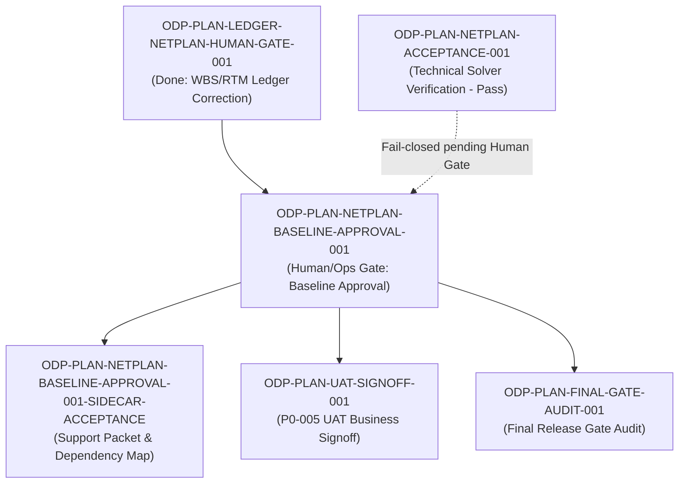

# ODP-PLAN-NETPLAN-BASELINE-APPROVAL-001 Acceptance Packet

## Packet identity

| Field | Value |
|---|---|
| Sidecar task | `ODP-PLAN-NETPLAN-BASELINE-APPROVAL-001-SIDECAR-ACCEPTANCE` |
| Parent task | `ODP-PLAN-NETPLAN-BASELINE-APPROVAL-001` |
| Helper kind | `acceptance_packet` |
| Sidecar owner / reviewer | `Antigravity` / `Human/Ops` |
| Current parent owner / reviewer | `Human/Ops` / `Codex` |
| Observed parent status | `blocked` (`BUSINESS_UAT_UNVERIFIED` / `GOVERNED_DISABLED`) |
| Primary upstream dependency | `ODP-PLAN-LEDGER-NETPLAN-HUMAN-GATE-001` (`done`) |
| Key technical counterpart | `ODP-PLAN-NETPLAN-ACCEPTANCE-001` (`TECHNICAL PASS` / `BUSINESS_UAT_UNVERIFIED`) |
| Key downstream dependencies | `ODP-PLAN-UAT-SIGNOFF-001`, `ODP-PLAN-FINAL-GATE-AUDIT-001` |
| Packet verdict | **Support only; acceptance packet & dependency map prepared; fail-closed pending authentic Human/Ops approval receipt** |

This packet is a support-only review aid, acceptance checklist, and dependency map for parent task `ODP-PLAN-NETPLAN-BASELINE-APPROVAL-001`. It does not modify L1 canonical truth, platform architecture contracts, core solver implementation, or governance ledgers. The parent owner (`Human/Ops`) retains sole authority over business approval and governance activation.

## Observed state and review freeze

Parent task `ODP-PLAN-NETPLAN-BASELINE-APPROVAL-001` was introduced by `ODP-PLAN-LEDGER-NETPLAN-HUMAN-GATE-001` to separate technical solver correctness from authentic management baseline approval (`GAP-P1-006`).

Key observed conditions:
1. **Technical Solver Readiness**: Task `ODP-PLAN-NETPLAN-ACCEPTANCE-001` has achieved technical pass, verifying hard constraint enforcement, infeasibility diagnosis, alternative enumeration, and exact SHA-256 immutable bindings for scenario, baseline content, solver problem, and approval receipts.
2. **Fixed Verifier Architecture**: The technical solver engine contains `FixedManagementApprovalReceiptVerifier`, which requires a fixed approval lookup map injected at application composition. It explicitly rejects wildcard IDs, `ANY`, `UNVERIFIED`, and caller-supplied unverified hashes.
3. **Governance Gate Status**: Because authentic management baseline approval, source snapshots, and approval-system readback remain unprovided by a named Human/Ops principal, NetPlan capability status is correctly retained in `BUSINESS_UAT_UNVERIFIED` and `GOVERNED_DISABLED`.
4. **AI Non-Delegation Policy**: AI agents (Antigravity, Codex, Claude, etc.) and arbitrary actor strings (e.g. `startswith("Human/Ops")`) are strictly forbidden from acting as named human approvers or generating auto-signed receipts.

## Task-owned surface map

| Layer | Surface / File Path | Intended Responsibility |
|---|---|---|
| Parent Governance Task | `ODP-PLAN-NETPLAN-BASELINE-APPROVAL-001` | Human/Ops gate for named management owner approval of immutable baseline, scenario domain, constraint policy, objective penalties, and source snapshots. |
| Upstream Ledger | `docs/evidence/DEVELOPMENT_PLAN_GAP_EXECUTION_TASKS_2026-07-30.md` | Defines 26-task WBS ledger, explicit separation of technical vs. human gates, and UAT/final dependencies. |
| Gap Matrix | `docs/evidence/DEVELOPMENT_PLAN_IMPLEMENTATION_GAP_MATRIX_2026-07-30.md` | `GAP-P1-006`: Requires named Human/Ops receipt before claiming superiority over approved baseline. |
| Technical Integration | `docs/evidence/models/ODP-PLAN-NETPLAN-ACCEPTANCE-001.md` | Documents technical verifier contract, trust boundary, and fail-closed behavior when approval is missing. |
| Contract Tests | `tests/contract/test_netplan_human_gate_ledger.py` | Enforces 84 RTM rows, 26 ledger tasks, distinct technical vs. human gates, and UAT/final gate dependencies. |
| Execution Pack Validator | `tests/contract/test_plan_execution_pack.py` | Validates task relationships and execution pack structure for `ODP-PLAN-NETPLAN-BASELINE-APPROVAL-001`. |
| Sidecar Support Packet | `support/sidecars/ODP-PLAN-NETPLAN-BASELINE-APPROVAL-001/ODP-PLAN-NETPLAN-BASELINE-APPROVAL-001-SIDECAR-ACCEPTANCE.md` | Non-canonical acceptance packet and dependency map for reviewer handoff. |

## Detailed acceptance matrix (Criteria A-E)

### A. Named Approver & Immutable Baseline Approval Requirements

| ID | Required Proof | Reject When | Status | Evidence / Location |
|---|---|---|---|---|
| A1 | Immutable baseline, scenario domain, constraint policy, objective/risk penalties, and source data snapshots are approved by a named, accountable human management owner (`Human/Ops`). | Approver is anonymous, missing, or an AI agent attempting auto-signoff. | `PENDING_HUMAN_GATE` | `ODP-PLAN-NETPLAN-BASELINE-APPROVAL-001` task brief & brief notes |
| A2 | Approval receipt contains explicit `receipt_id`, `source_system`, `principal`, `principal_role`, `decision` (`active`), UTC `issued_at` / `expires_at`, `approval_ref`, and `scope`. | Missing required receipt fields, expired timestamps, or inactive decision status. | `FAIL_CLOSED_VERIFIED` | `docs/evidence/models/ODP-PLAN-NETPLAN-ACCEPTANCE-001.md:26` |
| A3 | Immutable content hashes (`baseline_hash`, `solver_problem_hash`) in the resolved receipt match independently recomputed SHA-256 digests. | Hash mismatch between caller baseline/problem and receipt assertions occurs. | `FAIL_CLOSED_VERIFIED` | `docs/evidence/models/ODP-PLAN-NETPLAN-ACCEPTANCE-001.md:36-43` |

### B. Fixed Verifier Readback & Cryptographic Binding

| ID | Required Proof | Reject When | Status | Evidence / Location |
|---|---|---|---|---|
| B1 | Verifier `FixedManagementApprovalReceiptVerifier` resolves immutable receipt via application composition boundary using injected readback map. | Verifier accepts caller-controlled receipt hash or validates caller data by hashing caller data. | `PASSED` | `docs/evidence/models/ODP-PLAN-NETPLAN-ACCEPTANCE-001.md:33-45` |
| B2 | Verifier rejects wildcard/blank IDs, `ANY`, `UNVERIFIED`, and unconfigured authority maps. | Wildcard lookup or fallback mock approval is accepted in production composition. | `PASSED` | `docs/evidence/models/ODP-PLAN-NETPLAN-ACCEPTANCE-001.md:38-40` |
| B3 | Verifier evaluation clock is decoupled from caller timestamps to prevent backdating of expired receipts. | Caller-supplied `decided_at` timestamp can bypass receipt expiration. | `PASSED` | `docs/evidence/models/ODP-PLAN-NETPLAN-ACCEPTANCE-001.md:40-42` |

### C. Technical Superiority Fail-Closed & Business UAT Gate

| ID | Required Proof | Reject When | Status | Evidence / Location |
|---|---|---|---|---|
| C1 | Superiority comparison emits `superior_or_equal=false`, `BUSINESS_UAT_UNVERIFIED`, and `GOVERNED_DISABLED` whenever approval receipt is missing or invalid. | Superiority is claimed without an active, verified human baseline approval receipt. | `PASSED` | `docs/evidence/models/ODP-PLAN-NETPLAN-ACCEPTANCE-001.md:28-29` |
| C2 | Technical solver pass is explicitly separated from business UAT signoff in task ledgers and status records. | Technical pass alone promotes NetPlan capability to `ACTIVE` or `APPROVED`. | `PASSED` | `docs/evidence/DEVELOPMENT_PLAN_GAP_EXECUTION_TASKS_2026-07-30.md:246` |
| C3 | Downstream tasks `ODP-PLAN-UAT-SIGNOFF-001` and `ODP-PLAN-FINAL-GATE-AUDIT-001` retain explicit dependency on `ODP-PLAN-NETPLAN-BASELINE-APPROVAL-001`. | UAT or final release audit proceeds without authentic NetPlan baseline approval receipt. | `PASSED` | `tests/contract/test_netplan_human_gate_ledger.py:45-62` |

### D. Security, Actor-String Trust & AI Non-Delegation Policies

| ID | Required Proof | Reject When | Status | Evidence / Location |
|---|---|---|---|---|
| D1 | Actor identity strings (e.g. `startswith("Human/Ops")`) are treated purely as audit identity and cannot bypass verifier readback. | Simple string prefix matching or actor allow-lists grant approval. | `PASSED` | `docs/evidence/models/ODP-PLAN-NETPLAN-ACCEPTANCE-001.md:27` |
| D2 | AI worker agents (Antigravity, Codex, Claude, etc.) strictly refuse to sign or generate fake human approval receipts. | AI agent generates synthetic or fixture human approval receipt for task completion. | `PASSED` | `docs/evidence/DEVELOPMENT_PLAN_GAP_EXECUTION_TASKS_2026-07-30.md:258` |
| D3 | Unconfigured verifier in production maintains fail-closed state without application crash. | Unconfigured verifier causes unhandled exception or defaults to permissive pass. | `PASSED` | `docs/evidence/models/ODP-PLAN-NETPLAN-ACCEPTANCE-001.md:65-68` |

### E. Verification Suite & Contract Test Provenance

| ID | Required Proof | Reject When | Status | Evidence / Location |
|---|---|---|---|---|
| E1 | `tests/contract/test_netplan_human_gate_ledger.py` passes cleanly (3/3 passed), verifying 84 RTM rows, 26 ledger tasks, and UAT/final dependencies. | RTM rows drop below 84, ledger tasks drop below 26, or gate separation fails. | `PASSED` | `python3 -m pytest -q tests/contract/test_netplan_human_gate_ledger.py` |
| E2 | `tests/contract/test_plan_execution_pack.py` passes cleanly (30/30 passed), verifying open task execution pack consistency. | Execution pack validation fails or task brief properties drift. | `PASSED` | `python3 -m pytest -q tests/contract/test_plan_execution_pack.py` |
| E3 | `git diff --check` and formatting checks remain clean across all support artifacts. | Whitespace errors, uncommitted code diffs in L1 canonical files, or syntax errors present. | `PASSED` | `git diff --check` |

## Upstream & downstream dependency map



## Verification ledger

The following contract verification suite commands were executed in the current worktree:

1. **NetPlan Human Gate Ledger Test**:
   ```bash
   python3 -m pytest -q tests/contract/test_netplan_human_gate_ledger.py
   ```
   - **Result**: `3 passed in 0.28s`
   - **Coverage**: Verified 84 RTM rows, 26 governance tasks, strict separation of technical vs. human approval gates, and explicit dependencies in UAT (`ODP-PLAN-UAT-SIGNOFF-001`) and Final Gate (`ODP-PLAN-FINAL-GATE-AUDIT-001`).

2. **Plan Execution Pack Validator Test**:
   ```bash
   python3 -m pytest -q tests/contract/test_plan_execution_pack.py
   ```
   - **Result**: `30 passed in 0.35s`
   - **Coverage**: Verified execution pack integrity, task ID mappings, and dependency graph consistency across plan tasks.

3. **Repository Workspace Cleanliness**:
   ```bash
   git status --short
   git diff --check
   ```
   - **Result**: Clean worktree (prior to sidecar packet commitment); zero formatting errors.

## Handoff & Next Steps

1. **For Designated Reviewer (`Human/Ops`)**:
   - Review this sidecar acceptance packet (`support/sidecars/ODP-PLAN-NETPLAN-BASELINE-APPROVAL-001/ODP-PLAN-NETPLAN-BASELINE-APPROVAL-001-SIDECAR-ACCEPTANCE.md`).
   - When authentic management baseline approval, approved scenario scope, constraint policies, and source data snapshots are ready, issue the authentic approval receipt and configure the fixed verifier map for parent task `ODP-PLAN-NETPLAN-BASELINE-APPROVAL-001`.
2. **For Parent Task Owner (`Human/Ops`)**:
   - Absorbing this packet into parent task tracking provides complete auditability without altering L1 canonical contracts.
