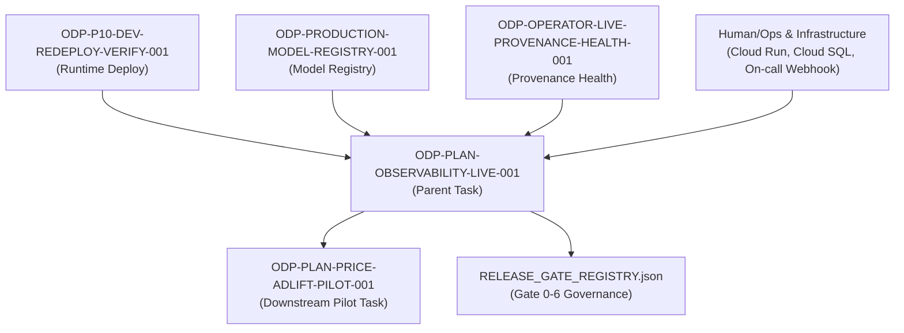

# Sidecar Acceptance Packet & Dependency Map: ODP-PLAN-OBSERVABILITY-LIVE-001

- **Task ID**: `ODP-PLAN-OBSERVABILITY-LIVE-001-SIDECAR-ACCEPTANCE`
- **Parent Task ID**: `ODP-PLAN-OBSERVABILITY-LIVE-001`
- **Gap ID**: `GAP-P1-008` (Observability production wiring)
- **Helper Kind**: `acceptance_packet`
- **Task Class**: `sidecar`
- **Owner**: `Antigravity5`
- **Reviewer / Parent Owner**: `Antigravity7`
- **Target Release Claim**: `no-go-until-final-gate-audit`
- **Program ID**: `ODP-PLAN-GAP-CLOSEOUT-2026-07-30`
- **Execution Packet ID**: `ODP-PLAN-EXECUTION-CONTROL-PACK-001`

---

## 1. Executive Summary & Scope Boundary

This document serves as the sidecar support packet and acceptance specification for parent task `ODP-PLAN-OBSERVABILITY-LIVE-001` ("接通 production observability 與 on-call route"). 

### Scope Boundaries
- **Support Only**: This packet is a support artifact. It does **not** mutate L1 canonical architecture documents, core runtime contracts, or production code implementations directly.
- **Purpose**: Establishes the authoritative acceptance checklist, dependency map, fail-closed verification rules, signal inventory requirements, and handoff criteria required before parent task `ODP-PLAN-OBSERVABILITY-LIVE-001` can be submitted for canonical review and closeout.

---

## 2. Signal Inventory & Production Wiring Specification

To satisfy `GAP-P1-008`, the parent implementation must expose, wire, and record receipts for **6 distinct signal families**:

| Signal Family | Scope & Required Metrics | Target Exporter / Provider | Runbook / SLO Owner Requirement |
| :--- | :--- | :--- | :--- |
| **1. API Signals** | Request rate, latency (p50/p95/p99), HTTP 4xx/5xx error rates, route-level metrics | Prometheus / OpenTelemetry API exporter | SLO Owner assigned; On-call runbook linked |
| **2. Worker Signals** | Background job queue depth, execution duration, task completion/failure rate, retry count | Worker Telemetry / Celery / Queue exporter | SLO Owner assigned; Queue lag runbook linked |
| **3. Event / DLQ Signals** | Pub/Sub event publish/consume rates, Dead Letter Queue (DLQ) depth, unhandled event count | Cloud PubSub / Event Bus exporter | DLQ threshold runbook linked; Instant alert on depth > 0 |
| **4. Model Signals** | Inference throughput, prediction latency, fallback rate, governed-disabled status rate | MLflow / Model Serving exporter | Model governance owner assigned; Fallback runbook linked |
| **5. Solver Signals** | Optimization solve time, infeasibility rate, constraint violation count, memory consumption | Solver Engine exporter | Solver failure runbook linked; Resource limit alert |
| **6. Business KPI Signals**| GMV / revenue interval processing status, active tenant metrics, site score execution receipts | Business Metrics exporter | Product Ops owner assigned; Anomaly alert linked |

### Watch-Window & Provider Readback Requirements
1. **Watch-Window Receipt**: Must cover the full required watch-window per signal category without gaps or truncated periods.
2. **Provider Readback**: Provider project/resource/metric identities and query response hashes must match the exact release SHA.
3. **Alert Route Verification**: Test alerts must be proven to reach the real configured on-call destination (e.g. PagerDuty / Opsgenie / Slack on-call channel) with redacted destination evidence and zero secret leaks.

---

## 3. Comprehensive Dependency Map



### Upstream & External Dependencies
- **Runtime Deployment (`ODP-P10-DEV-REDEPLOY-VERIFY-001`)**: Provides the live Cloud Run / GCP runtime environment for telemetry collection.
- **Model Registry (`ODP-PRODUCTION-MODEL-REGISTRY-001`)**: Provides model capability status and governed-disabled bindings monitored by model signals.
- **Provenance Health (`ODP-OPERATOR-LIVE-PROVENANCE-HEALTH-001`)**: Provides runtime provenance and health checks for telemetry baseline.
- **Infrastructure & On-Call Route**: GCP Cloud Monitoring / Prometheus / OpenTelemetry collector and configured alert destination (PagerDuty/Opsgenie webhook).

### Downstream Dependencies
- **Price / AdLift Pilot (`ODP-PLAN-PRICE-ADLIFT-PILOT-001`)**: Explicitly depends on `ODP-PLAN-OBSERVABILITY-LIVE-001` for production observability during pilot execution.
- **Final Gate Audit (`ODP-PLAN-FINAL-GATE-AUDIT-001`)**: Requires `ODP-PLAN-OBSERVABILITY-LIVE-001` completion before final platform release signoff.

---

## 4. Fail-Closed Acceptance Checklist Matrix

The parent task `ODP-PLAN-OBSERVABILITY-LIVE-001` must strictly satisfy all fail-closed criteria below. Any violation requires an immediate fail-closed state.

| Criterion | Rule Description | Fail-Closed Trigger (Must Reject) | Verification & Audit Evidence |
| :--- | :--- | :--- | :--- |
| **Criterion A** | **Pooled-Coverage & Window Rule** | Timestamp pooling across unrelated signals, single-point evidence, or partial watch-window coverage. | Separate per-signal timestamp arrays covering full watch-window. |
| **Criterion B** | **Metric Integrity & Safety Rule** | Negative values, NaN / non-finite values, wrong units, out-of-window timestamps, wrong GCP project ID, or wrong release SHA. | Strict schema and value boundary checks on all metric points. |
| **Criterion C** | **Route Delivery & Payload Safety** | Locally fabricated provider payloads, missing alert route, missing SLO owner, missing runbook link, or undelivered alert. | End-to-end alert delivery receipt with redacted destination identity. |
| **Criterion D** | **Health Claim Integrity Rule** | Inferring healthy system state solely from request volume or an incomplete signal set. | Full 6-signal family joint health evaluation receipt. |
| **Criterion E** | **Batch Verification & Handoff Gate** | Attempting handoff after fixing only a single metric family or reviewer example without re-auditing all criteria. | Complete re-audit pass across all criteria A-D simultaneously. |

---

## 5. Verification Suite & Baseline Checks

### Required Parent Verification Commands
1. **Focused Test Suite**:
   ```bash
   /home/lupin/oday-plus/.venv/bin/pytest -q tests -k "observability or telemetry or alert or dlq"
   ```
2. **Linting & Code Integrity**:
   ```bash
   ruff check shared/observability tests/reliability scripts/deployment
   git diff --check
   ```
3. **Negative Matrix Mutations**:
   - Test pooled-coverage rejection
   - Test negative / non-finite metric value rejection
   - Test wrong-release / wrong-project rejection
   - Test missing-route fail-closed gate
   - Test receipt-tamper detection

---

## 6. Handoff & Closeout Instructions for Parent Owner

- **Assigned Reviewer / Parent Owner**: `Antigravity7`
- **Handoff Instructions**:
  1. Review this support packet for alignment with `ODP-PLAN-OBSERVABILITY-LIVE-001` execution plan.
  2. Ensure all 6 signal families (API, Worker, Event/DLQ, Model, Solver, Business KPI) are implemented according to Section 2.
  3. Validate all fail-closed rules (Section 4) in the parent implementation evidence prior to submitting `ODP-PLAN-OBSERVABILITY-LIVE-001` for review.
