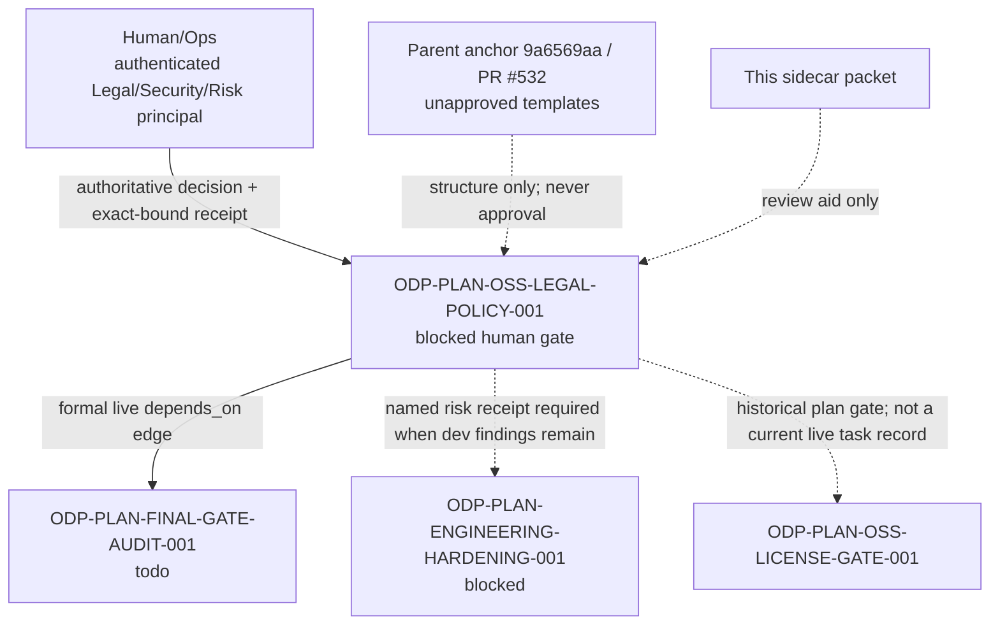

# ODP-PLAN-OSS-LEGAL-POLICY-001 Acceptance Packet

## Packet identity

| Field | Value |
|---|---|
| Sidecar task | `ODP-PLAN-OSS-LEGAL-POLICY-001-SIDECAR-ACCEPTANCE` |
| Parent task | `ODP-PLAN-OSS-LEGAL-POLICY-001` |
| Helper kind | `acceptance_packet` |
| Sidecar owner / reviewer | `Codex` / `Human/Ops` |
| Live parent owner / reviewer | `Human/Ops` / `Antigravity` |
| Parent task class / state | `human_gate` / `blocked` (`waiting_for: Human/Ops`) |
| Parent template anchor | `9a6569aabab00bd7c7eaeb58478496888695808d` |
| Decision-template PR | [#532](https://github.com/alfloop-dev/odayplus/pull/532), open and unmerged when checked on 2026-08-11 UTC |
| Sidecar PR / review freeze | [#799](https://github.com/alfloop-dev/odayplus/pull/799); Human/Ops accepted `a326363b1f2fae4fdaaf644c0a71789ad9f2948b`, before the required current-base composition |
| Sidecar base-advance commit | `2c34f79f7c632afce4d0189b64e475ada399229d` (composes `origin/dev` `494bc7e74cd6fb74a54044f29d14b8a9523f595a`) |
| Packet verdict | **Support ready; parent legal acceptance remains pending and release remains NO-GO** |

This is a support-only review aid. It does not approve a license policy, create
an exemption, authenticate a principal, change canonical architecture or
governance truth, or authorize release/deployment. Only the named and
authenticated `Legal/Security/Risk` principal can supply the authoritative
decision required by the parent task.

## Review freeze and provenance

The live canonical task record read on 2026-08-11 UTC says:

- `ODP-PLAN-OSS-LEGAL-POLICY-001` is owned by `Human/Ops`, reviewed by
  `Antigravity`, and blocked waiting for `Human/Ops`.
- The required deliverables are a named policy/LGPL/exemption decision and an
  authoritative signed/readback receipt bound to the exact policy, release,
  source, SBOM, lockfile, and evidence hashes.
- AI or repository-author approval, unauthenticated role text, local JSON
  without authoritative readback, missing or mismatched bindings, and expired
  decisions must fail closed.
- PR #532 is only a decision template. A documentation PR is not legal
  approval.

The parent anchor `9a6569aa` contains these **unapproved templates**:

| Anchor path | What it supplies | What it does not supply |
|---|---|---|
| `docs/evidence/oss-legal-policy/README.md` | Human-gate rules and receipt-field expectations | An authenticated external receipt |
| `docs/security/license_policy.json` | `1.0.0-template`, `pending_human_decision`, and `unapproved_fail_closed` policy proposal | Human approval of any allow/deny/review classification |
| `docs/security/license_exemptions.json` | Empty exemption list and required exemption-field template | A granted exemption or approval receipt |

As observed after the required base advance, `9a6569aa` is **not** an ancestor
of `origin/dev`; the three paths above are absent from `origin/dev` at
`494bc7e7`. The parent task branch ref was also absent from the remote branch
listing. Reviewers must therefore inspect the immutable anchor or PR #532 and
must not infer that these templates are deployed, merged, or canonical.

## Parent acceptance checklist

`PENDING` means Human/Ops evidence is still required. `TEMPLATE` means the
unmerged parent anchor defines a proposed structure only; it is not a legal
decision.

| ID | Required acceptance proof | Reject when | State / evidence locus |
|---|---|---|---|
| A1 | Named, authenticated `Legal/Security/Risk` principal decides the license allow/deny/review policy, LGPL handling, exemption format/scope, and review cadence. | Approver is an AI/repository author, is anonymous, or is represented only by role text. | `PENDING`; authoritative policy-system readback required. |
| A2 | Explicit decision is returned with principal identity/role and authoritative source system. | Documentation, a PR, a local JSON file, or an AI-authored statement is treated as approval. | `PENDING`; PR #532 is template-only. |
| B1 | Receipt binds policy name/version/hash and exact release/source/SBOM/lockfile/evidence hashes. | Any binding is absent, mutable, stale, or mismatched. | `PENDING`; field expectations exist at `9a6569aa:docs/evidence/oss-legal-policy/README.md`. |
| B2 | Receipt includes decision, `issued_at`, `reviewed_at`, `expires_at`, and canonical receipt integrity/signature. | Decision is expired, unscoped, unsigned, or cannot be read back from the authoritative system. | `PENDING`; receipt is absent. |
| C1 | Policy classification proposal, including LGPL rules and review cadence, is reviewed as one complete batch. | A subset is accepted while another criterion is unresolved, or the template is mistaken for a final policy. | `TEMPLATE`; proposed values exist only in `license_policy.json` at `9a6569aa`. |
| C2 | Every exemption is individually scoped and bound to the approved policy and SBOM with a signed receipt hash. | Empty/default data, a blanket waiver, an expired exemption, or an AI auto-waiver is accepted. | `TEMPLATE`; empty schema exists only in `license_exemptions.json` at `9a6569aa`. |
| D1 | Reviewer runs the configured authoritative verifier against the returned exact-version receipt. | Verification is replaced by visual review or local schema validation alone. | `PENDING`; verifier execution requires the real receipt. |
| D2 | Reviewer replays principal, time, scope, release, policy, SBOM, lockfile, evidence-hash, and integrity mismatch/expiry negative cases. | Any mutated or mismatched case passes. | `PENDING`; no authoritative receipt exists to test. |
| E1 | Parent task reaches accepted/done only after every receipt and negative-case criterion passes. | Partial repair, template publication, or sidecar approval advances the parent task. | `BLOCKED`; live parent state remains `blocked`. |
| E2 | Release remains NO-GO until this gate and the final audit are satisfied. | Legal acceptance or release GO is inferred from this packet. | `ENFORCED BY HANDOFF`; no GO claim is made here. |

## Dependency map

### Dependency classification

| Consumer | Relationship | Current meaning |
|---|---|---|
| `ODP-PLAN-FINAL-GATE-AUDIT-001` | Formal live `depends_on` edge | Final audit cannot complete while the legal-policy task is not done. |
| `ODP-PLAN-ENGINEERING-HARDENING-001` | Evidence/decision linkage, not a live `depends_on` edge | Its execution pack requires unresolved dev-tool findings to be bound to a named, scoped, non-expired authoritative risk decision from this parent task. |
| `ODP-PLAN-OSS-LICENSE-GATE-001` | Historical planning relationship | The gap execution document requires legal judgments/exemptions to remain `review_required`; this ID is not present as a current live task record and must not be presented as a live edge. |

## Reviewer handoff packet

Human/Ops should return an authoritative readback that permits the reviewer to
answer every item below without inference:

1. Who is the authenticated principal, what is the principal's accountable
   role, and which authoritative source system issued the decision?
2. What exact policy name, version, hash, decision, rationale, scope, and
   review cadence were approved?
3. Which exact release/source SHA, SBOM hash, lockfile hashes, and evidence
   hashes are bound to the decision?
4. What are the issue, review, and expiry timestamps, and what canonical
   receipt hash/signature protects integrity?
5. For each exemption, what component/version/license/scope/justification and
   policy/SBOM/receipt bindings apply?
6. Does the authoritative verifier reject wrong principal, expiry, scope,
   release, policy, SBOM, lockfile, evidence, and integrity values?

If any answer is missing or cannot be independently read back, the correct
result is `BLOCKED` / `NO-GO`. This packet cannot be substituted for the
receipt.

## Sidecar acceptance and absorption constraints

| Sidecar criterion | Result |
|---|---|
| Create support artifacts only | Satisfied: only this task-scoped support packet is changed. |
| Do not edit canonical truth | Satisfied: no L1, planning truth, runtime, registry, governance implementation, or parent template is changed. |
| Provide acceptance checklist and dependency map | Satisfied by the checklist, classified dependency table, and graph above. |
| Hand off to assigned reviewer | PR #799 was submitted to `Human/Ops`; because the mandatory current-base composition advances its exact head beyond the accepted `a326363b`, the refreshed head must pass the repository's immutable review gate before closeout. |
| Make no parent acceptance/release claim | Satisfied: parent remains `blocked`; release remains `NO-GO`. |

The parent owner may absorb the checklist or dependency distinctions, but must
refresh volatile state (task owner/status, PR state, branch reachability, and
artifact hashes) at the actual review time. Absorption must not copy `PENDING`
or `TEMPLATE` into an accepted result.

## Verification ledger

The final sidecar commit records the exact commands and observed results after
the required 2026-08-11 base advance. These checks validate packet/repository
integrity only; they do not validate a legal decision:

- `python3 scripts/ops/validate_plan_execution_pack.py` — passed: 84 RTM rows,
  26 governance tasks, and 19 granular open-task packets valid.
- `python3 -m pytest -q tests/contract/test_plan_execution_pack.py` — passed:
  30 tests.
- `git diff --check` — passed with no whitespace errors.
- `git diff --name-only origin/dev...HEAD` plus the final commit scope check —
  only this sidecar artifact.

## Source basis

- Live canonical task records in
  `$PANTHEON_STATUS_ROOT/ai-status.json`, read 2026-08-11 UTC.
- Task brief
  `.orchestrator/task-briefs/odp_plan_oss_legal_policy_001_sidecar_acceptance.md`.
- Parent template anchor `9a6569aabab00bd7c7eaeb58478496888695808d`.
- `docs/evidence/DEVELOPMENT_PLAN_GAP_EXECUTION_TASKS_2026-07-30.md`.
- `docs/evidence/DEVELOPMENT_PLAN_OPEN_TASK_EXECUTION_PACK_2026-07-31.md`.
- `docs/evidence/DEVELOPMENT_PLAN_OPEN_TASK_EXECUTION_PACK_2026-07-31.json`.
- GitHub PR #532 readback, checked 2026-08-11 UTC.
