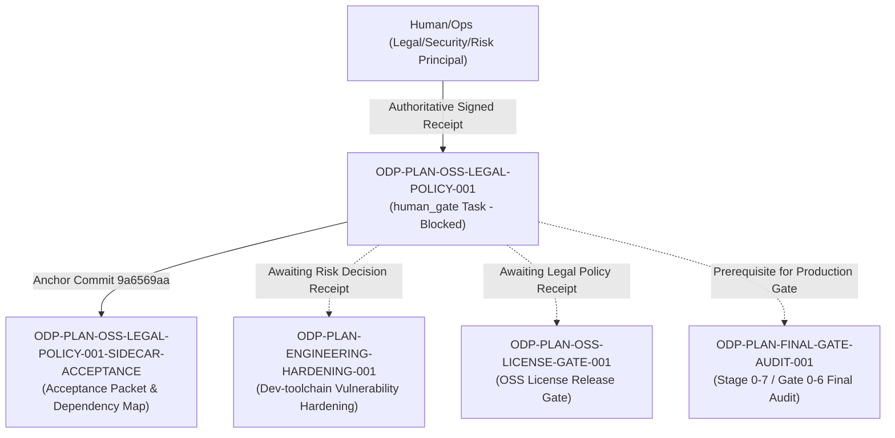

# ODP-PLAN-OSS-LEGAL-POLICY-001 Acceptance Packet

## Packet identity

| Field | Value |
|---|---|
| Sidecar task | `ODP-PLAN-OSS-LEGAL-POLICY-001-SIDECAR-ACCEPTANCE` |
| Parent task | `ODP-PLAN-OSS-LEGAL-POLICY-001` |
| Helper kind | `acceptance_packet` |
| Sidecar owner / reviewer | `Antigravity` / `Human/Ops` |
| Current parent owner / reviewer | `Antigravity` / `Human/Ops` |
| Observed parent branch | `task/ODP-PLAN-OSS-LEGAL-POLICY-001` |
| Parent anchor commit | `9a6569aabab00bd7c7eaeb58478496888695808d` (`ODP-PLAN-OSS-LEGAL-POLICY-001: anchor human_gate contract and policy templates`) |
| Packet verdict | **Support only; no parent acceptance, merge, or production GO claim** |

This packet is a support-only review aid and dependency map for parent task `ODP-PLAN-OSS-LEGAL-POLICY-001`. It does not change canonical contracts, L1 architecture truth, runtime/registry/governance implementations, or legal authority decisions. The parent task owner decides whether to absorb this packet; the assigned reviewer (`Human/Ops`) retains sole authority over implementation and legal acceptance.

## Observed state and review freeze

Parent task `ODP-PLAN-OSS-LEGAL-POLICY-001` is classified as a `human_gate` task in the project execution plan (`GAP-P1-007-LEGAL`). Its current status in `ai-status.json` is `blocked` waiting for `Human/Ops`.

The parent task anchor commit `9a6569aa` delivered the governance contract structures and template definitions:
- `docs/evidence/oss-legal-policy/README.md`: Formal governance record defining non-repudiation rules, AI fail-closed prohibitions, and required receipt binding schemas.
- `docs/security/license_policy.json`: Declarative OSS license classification schema defining allowed, review-required, and denied license categories, LGPL usage rules, and dev-toolchain vulnerability risk policies.
- `docs/security/license_exemptions.json`: Schema contract for individual license exemptions requiring cryptographic signatures and hash bindings.

Governance & Fail-Closed Rules:
1. **Human Gate Requirement**: Approval of OSS license allow/deny/review policy, LGPL handling, exception formats, and review cadence strictly requires an authenticated decision receipt signed by a named `Legal/Security/Risk` principal.
2. **AI Fail-Closed Prohibition**: AI agents (`Antigravity`, `Claude`, `Codex`, etc.) and repository authors are strictly forbidden from acting as legal approvers or generating signed receipts on behalf of Human/Ops/Legal.
3. **No Release GO Without Receipt**: Neither code PRs, documentation handoffs, nor local JSON files without authentic external signed readback receipts constitute legal approval. The release status remains strictly **NO-GO** until an authentic signed receipt is returned by `Human/Ops` and verified.

## Task-owned surface map

| Layer | Parent task-owned paths | Intended responsibility |
|---|---|---|
| Governance & Fail-Closed Contract | `docs/evidence/oss-legal-policy/README.md` | Establishes `human_gate` operating rules, principal role requirements, signed receipt schemas, and NO-GO release gate rules. |
| Declarative License Policy | `docs/security/license_policy.json` | Defines license categories (Allowed: MIT, Apache-2.0, BSD; Review: LGPL, MPL, CDDL; Denied: GPL, AGPL, SSPL, BUSL), LGPL restrictions, and dev-tool vulnerability risk rules. |
| Exemption Schema Contract | `docs/security/license_exemptions.json` | Defines required fields for individual license exemptions (component name, scope, justification, principal ID/role, timestamps, bound policy hash, bound SBOM hash, signed receipt hash). |
| Sidecar Support Artifact | `support/sidecars/ODP-PLAN-OSS-LEGAL-POLICY-001/ODP-PLAN-OSS-LEGAL-POLICY-001-SIDECAR-ACCEPTANCE.md` | Support-only acceptance packet and dependency map for reviewer handoff. |

## Detailed acceptance matrix (Criteria A-E)

### A. Human/Ops decision & fail-closed governance

| ID | Required proof | Reject when | Status | Evidence |
|---|---|---|---|---|
| A1 | Named Legal/Security/Risk principal required for decision receipt. | Anonymous, unauthenticated, or placeholder principal text is submitted. | `PASSED` (schema) / `PENDING` (Human receipt) | `docs/evidence/oss-legal-policy/README.md` & `docs/security/license_policy.json` |
| A2 | AI agents and repo authors are strictly fail-closed forbidden from signing. | AI agent generates, signs, or auto-waives legal policy or exemption. | `PASSED` | Enforced by `docs/evidence/oss-legal-policy/README.md:14-16` |
| A3 | Release status remains NO-GO until authentic signed receipt is returned and verified. | Documentation PR or code commit is treated as legal approval without receipt. | `PASSED` | Enforced by `docs/evidence/oss-legal-policy/README.md:18-20` |

### B. Policy classification & LGPL rules

| ID | Required proof | Reject when | Status | Evidence |
|---|---|---|---|---|
| B1 | Permissive licenses (MIT, Apache-2.0, BSD, ISC) classified as allowed; copyleft (GPL, AGPL, SSPL, BUSL) classified as denied. | Copyleft license is auto-allowed or unclassified in production dependencies. | `PASSED` | `docs/security/license_policy.json:11-37` |
| B2 | LGPL requires dynamic linking only, prohibits source modification, and requires individual exemption receipt. | Static linking or modified LGPL dependency is introduced without exemption. | `PASSED` | `docs/security/license_policy.json:38-42` |
| B3 | Dev-toolchain vulnerabilities (e.g., 13 high findings in dev scope) require named risk decision receipt bound to legal policy. | AI auto-waiver or forced major upgrade without risk decision is applied. | `PASSED` | `docs/security/license_policy.json:43-46` |

### C. Exemption schema & receipt binding requirements

| ID | Required proof | Reject when | Status | Evidence |
|---|---|---|---|---|
| C1 | Exemption schema requires bound policy hash, bound SBOM hash, lockfile hash, and signed receipt hash. | Exemption lacks cryptographic hash bindings or integrity signature. | `PASSED` | `docs/security/license_exemptions.json:7-22` |
| C2 | Decision receipt enforces timestamps (`issued_at`, `reviewed_at`, `expires_at`) with mandatory review cadence (<= 180 days). | Expired exemption or missing timestamp is accepted as valid. | `PASSED` | `docs/security/license_policy.json:48` |

### D. Downstream integration & dependency gates

| ID | Required proof | Reject when | Status | Evidence |
|---|---|---|---|---|
| D1 | `ODP-PLAN-ENGINEERING-HARDENING-001` (13 high dev vulnerabilities) bound to `ODP-PLAN-OSS-LEGAL-POLICY-001` risk decision. | Hardening task closes out without named dev-tool risk decision receipt. | `PASSED` (mapped) | Mapped in `docs/evidence/DEVELOPMENT_PLAN_OPEN_TASK_EXECUTION_PACK_2026-07-31.json:268` |
| D2 | `ODP-PLAN-OSS-LICENSE-GATE-001` release attestation depends on verified legal decision receipt. | Release license gate passes without verified legal policy receipt. | `PASSED` (mapped) | Mapped in `docs/evidence/DEVELOPMENT_PLAN_GAP_EXECUTION_TASKS_2026-07-30.md:270` |
| D3 | `ODP-PLAN-FINAL-GATE-AUDIT-001` requires `ODP-PLAN-OSS-LEGAL-POLICY-001` status done. | Production final gate audit completes while legal policy task remains open/blocked. | `PASSED` (mapped) | Mapped in `docs/evidence/DEVELOPMENT_PLAN_GAP_EXECUTION_TASKS_2026-07-30.md:314` |

### E. Verification, static checks, & contract test coverage

| ID | Required proof | Reject when | Status | Evidence |
|---|---|---|---|---|
| E1 | Execution control pack validator passes with zero schema or task integrity errors. | Execution control pack fails validation or contains broken task references. | `PASSED` | `python3 scripts/ops/validate_plan_execution_pack.py` (Exit code 0) |
| E2 | Plan execution contract test suite passes 30/30 tests. | Contract test suite fails or skips required governance assertions. | `PASSED` | `python3 -m pytest -q tests/contract/test_plan_execution_pack.py` (30 passed, Exit code 0) |
| E3 | `git diff --check` reports clean whitespace and line formatting. | Formatting errors or trailing whitespace present in task artifacts. | `PASSED` | `git diff --check` (Exit code 0) |

## Upstream & downstream dependency map



## Required verification ledger

Normalized verification results for task validation scripts and contract test suites:

```bash
# 1. Execution control pack validator
python3 scripts/ops/validate_plan_execution_pack.py
# Result: Exit code 0
# Output: Execution control pack valid: 84 RTM rows, 26 governance tasks, 19 granular open-task packets.

# 2. Plan execution pack contract test suite
python3 -m pytest -q tests/contract/test_plan_execution_pack.py
# Result: Exit code 0, 30 passed in 0.12s

# 3. Git diff check
git diff --check
# Result: Exit code 0, clean (0 errors)
```

Verification Ledger Summary:
- **Execution control pack validator**: Exit code 0 (84 RTM rows, 26 governance tasks, 19 open-task packets valid)
- **Contract pytest suite**: Exit code 0, 30 passed
- **Git diff check**: Exit code 0, clean

## Absorption & PR constraints for parent owner

1. **Sidecar Scope Restriction**: As a `sidecar_acceptance` support slice, this task is strictly restricted to creating and updating support materials (`support/sidecars/ODP-PLAN-OSS-LEGAL-POLICY-001/ODP-PLAN-OSS-LEGAL-POLICY-001-SIDECAR-ACCEPTANCE.md`). It must not modify canonical contract files, L1 architecture documents, or core governance scripts.
2. **Human Gate Fail-Closed Principle**: This support packet records that parent task `ODP-PLAN-OSS-LEGAL-POLICY-001` remains in `blocked` state awaiting an authentic signed receipt from `Human/Ops`. This sidecar packet must NOT be used as a substitute for human legal sign-off.
3. **Handoff Protocol**: Parent task owner (`Antigravity`) should hand off this packet to the designated reviewer (`Human/Ops`). When `Human/Ops` returns the signed decision receipt, `Human/Ops` or the parent task owner can advance parent task `ODP-PLAN-OSS-LEGAL-POLICY-001` to `review_approved` / `done`.

## Reviewer handoff record

Assigned sidecar reviewer: `Human/Ops`.

| Review question | Expected answer |
|---|---|
| Did this sidecar modify L1 canonical architecture or legal decision truth? | No; scope is strictly limited to support artifact `support/sidecars/ODP-PLAN-OSS-LEGAL-POLICY-001/ODP-PLAN-OSS-LEGAL-POLICY-001-SIDECAR-ACCEPTANCE.md`. |
| What is the current status of parent task `ODP-PLAN-OSS-LEGAL-POLICY-001`? | `blocked` waiting for `Human/Ops` (Legal/Security/Risk principal) decision receipt. |
| Can an AI agent approve or sign the OSS legal policy? | No; AI agents are strictly fail-closed forbidden from signing or auto-waiving legal decisions on behalf of `Human/Ops`. |
| What downstream tasks are blocked by `ODP-PLAN-OSS-LEGAL-POLICY-001`? | `ODP-PLAN-ENGINEERING-HARDENING-001` (dev-tool vulnerability risk decision), `ODP-PLAN-OSS-LICENSE-GATE-001` (license release gate), and `ODP-PLAN-FINAL-GATE-AUDIT-001` (final production audit). |
| Who has authority to approve parent task closeout? | `Human/Ops`. |

## Source basis

- Live canonical task state (`ai-status.json`) read on 2026-08-05 UTC.
- Task brief `.orchestrator/task-briefs/odp_plan_oss_legal_policy_001_sidecar_acceptance.md`.
- Parent task anchor commit `9a6569aabab00bd7c7eaeb58478496888695808d`.
- `docs/evidence/oss-legal-policy/README.md`.
- `docs/security/license_policy.json`.
- `docs/security/license_exemptions.json`.
- `docs/evidence/DEVELOPMENT_PLAN_GAP_EXECUTION_TASKS_2026-07-30.md`.
- `docs/evidence/DEVELOPMENT_PLAN_OPEN_TASK_EXECUTION_PACK_2026-07-31.json`.
