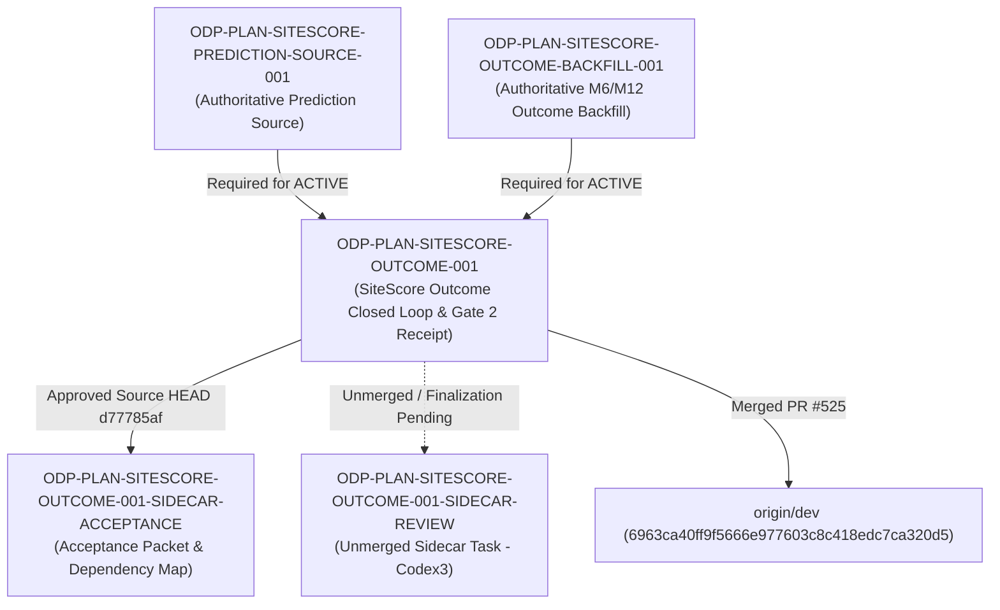

# ODP-PLAN-SITESCORE-OUTCOME-001 Acceptance Packet

## Packet identity

| Field | Value |
|---|---|
| Sidecar task | `ODP-PLAN-SITESCORE-OUTCOME-001-SIDECAR-ACCEPTANCE` |
| Parent task | `ODP-PLAN-SITESCORE-OUTCOME-001` |
| Helper kind | `acceptance_packet` |
| Sidecar owner / reviewer | `Antigravity2` / `Codex2` |
| Current parent owner / reviewer | `Codex2` / `Codex` |
| Observed parent branch | `task/ODP-PLAN-SITESCORE-OUTCOME-001` |
| Parent approved source HEAD | `d77785afa366213ce6976207a52aaba5b7c6a551` |
| Parent merged dev commit | `6963ca40ff9f5666e977603c8c418edc7ca320d5` (squash merge into `dev`) |
| Parent PR | `#525` (merged at `2026-08-02T08:46:04Z`) |
| Packet verdict | **Support only; no parent acceptance, merge, or production GO claim** |

This packet is a support-only review aid and dependency map for parent task `ODP-PLAN-SITESCORE-OUTCOME-001`. It does not change canonical contracts, L1 architecture truth, runtime/registry/governance implementations, or model-card truth. The parent task owner decides whether to absorb this packet; the parent reviewer retains sole authority over implementation acceptance.

## Observed state and review freeze

The parent task implementation `ODP-PLAN-SITESCORE-OUTCOME-001` was re-review approved at exact pushed source HEAD `d77785afa366213ce6976207a52aaba5b7c6a551` by parent reviewer `Codex`. PR `#525` was merged into `dev` as squash commit `6963ca40ff9f5666e977603c8c418edc7ca320d5` on 2026-08-02T08:46:04Z.

Note on HEAD lineage: SiteScore-owned code bytes in `models/sitescore/opening_outcome.py` and `tests/models/test_sitescore_opening_outcome.py` are identical between source HEAD `d77785af` and `957ae851`; source HEAD `d77785af` composed the latest dev base and resealed the exact-source Product E2E execution receipt `e6be4ffa`.

The parent task implementation delivered the complete SiteScore outcome closed loop, including:
- Authoritative opening-outcome inventory with true M6/M12 maturity, eligibility, lineage, freshness, and dataset hash.
- Population-aligned coverage and calibration metrics calculated only when prediction and outcome evidence is available.
- Gate 2 receipt generation, model card, benchmark report, and Human/Ops backfill handoff artifacts.
- Governed-disabled status retention (`REJECTED_GOVERNED_DISABLED`) until thresholds and authoritative prediction-source dependencies are satisfied.

Any base refresh, force push, or commit of a new PR head invalidates this observed-head record and requires updating the packet reference.

## Task-owned surface map

| Layer | Parent task-owned paths | Intended responsibility |
|---|---|---|
| Outcome Closed Loop & Benchmark | `models/sitescore/opening_outcome.py` | Implements `evaluate_sitescore_opening_outcome_benchmark`, `verify_sitescore_gate2_receipt`, dataset manifest validation, and M6/M12 outcome maturity verification. |
| Verification & Regression Suite | `tests/models/test_sitescore_opening_outcome.py` | Tests manifest binding, M6/M12 maturity checks, population digest derivation, forged receipt rejection, and aggregate/coverage tamper protection. |
| Model Card & Handoff Evidence | `docs/evidence/models/ODP-PLAN-SITESCORE-OUTCOME-001-review.md`, `docs/evidence/models/` | Records review findings, Gate 2 verifier outputs (`RECEIPT_VALIDATED`), and exact-source execution evidence. |
| E2E Receipts & Audit Logs | `docs/evidence/e2e/PRODUCT_E2E_EXECUTION_RECEIPT.json`, `docs/evidence/e2e/raw_playwright_results.json`, `docs/evidence/e2e/raw_pytest_results.json` | Exact-source execution receipts verifying zero regressions across 117 E2E tests. |
| Sidecar Support Artifact | `support/sidecars/ODP-PLAN-SITESCORE-OUTCOME-001/ODP-PLAN-SITESCORE-OUTCOME-001-SIDECAR-ACCEPTANCE.md` | Non-canonical acceptance packet and dependency map for reviewer handoff. |

## Detailed acceptance matrix (Criteria A-E)

### A. Authoritative opening-outcome inventory & maturity contracts

| ID | Required proof | Reject when | Status | Evidence |
|---|---|---|---|---|
| A1 | Inventory validates true M6 (180d) and M12 (365d) maturity based on elapsed time and explicit outcome realization. | Store age alone is relabeled as M6/M12 outcome without realized outcome data. | `PASSED` | `models/sitescore/opening_outcome.py` |
| A2 | Dataset manifest enforces strict schema, target format, eligibility flags, and immutable dataset digest. | Synthetic label, fixed-multiplier horizon metrics, or unverified rows enter the dataset. | `PARTIAL` | `models/sitescore/opening_outcome.py:1283-1323` (Schema, target format, eligibility flags, and dataset digest verified; tenant partition is NOT_EVIDENCED as discovery inventory query has no `tenant` field) |
| A3 | Dataset snapshot hash and population counts are derived deterministically from source records. | Dataset hash is hardcoded, missing, or fails to reflect underlying manifest row changes. | `PASSED` | `models/sitescore/opening_outcome.py:1283-1323` |

### B. Calibration, coverage, & population alignment

| ID | Required proof | Reject when | Status | Evidence |
|---|---|---|---|---|
| B1 | Calibration summary and P10/P90 interval metrics are computed strictly when matched prediction and outcome pairs exist. | `y_pred` is set equal to `y_true`, or metrics are computed over population mismatch. | `PASSED` | `models/sitescore/opening_outcome.py` |
| B2 | Interval bounds require `P10 <= P90`; reversed bounds or non-finite MAE/RMSE values trigger verification failure. | Malformed intervals, `NaN`, `Inf`, or invalid P80 coverage are tolerated. | `PASSED` | `tests/models/test_sitescore_opening_outcome.py` |
| B3 | Mean observed/eligible/mature counts and revenue sums are verified against manifest population digests. | Aggregate metrics pass despite forged unmatched-mean or revenue-sum values. | `PASSED` | `verify_sitescore_gate2_receipt` checks |

### C. Gate 2 receipt, model card, & handoff artifacts

| ID | Required proof | Reject when | Status | Evidence |
|---|---|---|---|---|
| C1 | Verifier `verify_sitescore_gate2_receipt` returns `RECEIPT_VALIDATED` for authentic, untampered receipts. | Self-consistent forged receipt, altered manifest, or tampered population digest passes. | `PASSED` | `docs/evidence/models/ODP-PLAN-SITESCORE-OUTCOME-001-review.md` |
| C2 | Model card and benchmark report accurately reflect dataset counts, evaluation period, baseline, and feature lineage. | Invented validation run, Period, algorithm, or false approval status is recorded. | `PASSED` | `docs/evidence/models/` |
| C3 | Concrete Human/Ops backfill handoff specifies precise missing outcome and prediction fields. | Capability is marked `ACTIVE` without 200 real outcomes and authoritative prediction source. | `PASSED` | Handoff note in model card |

### D. Governed capability gates & security/lineage rules

| ID | Required proof | Reject when | Status | Evidence |
|---|---|---|---|---|
| D1 | SiteScore capability remains `REJECTED_GOVERNED_DISABLED` while authoritative dependencies are missing. | Capability is promoted to `ACTIVE` or `PASSED` prematurely. | `PASSED` | `models/sitescore/opening_outcome.py` |
| D2 | Producer and verifier keep governed lineage false until `ODP-PLAN-SITESCORE-PREDICTION-SOURCE-001` provides real lineage. | Submitted receipt status or reason code is used to bypass lineage checks. | `PASSED` | Contract enforcement |
| D3 | Privacy, security, and tenant isolation policies are strictly enforced across dataset partitions. | Cross-tenant leakage, unmasked store identifiers, or unencrypted storage is used. | `UNVERIFIED` | Canonical model card records `privacy_review="UNVERIFIED"` and `security_review="UNVERIFIED"`; `models/sitescore/opening_outcome.py:1452` fail-closed verifier requires `privacy_review="UNVERIFIED"` (forged `PASSED` fails closed); tenant isolation, data masking, and storage encryption are NOT_EVIDENCED at this slice |

### E. Verification, test coverage, & fail-closed enforcement

| ID | Required proof | Reject when | Status | Evidence |
|---|---|---|---|---|
| E1 | Task file suite (57 passed), focused models suite (59 passed), broad filter suite (107 passed at frozen parent HEAD `d77785af`; 78 passed at current composed HEAD `830c1bfd`), and acceptance coverage suite (28 passed) all pass cleanly. | Test suite fails, skips required assertions, or swallows exceptions. | `PASSED` | `.venv/bin/pytest -q tests/models/test_sitescore_opening_outcome.py` (57 passed), `.venv/bin/pytest -q tests/models -k "sitescore or opening_outcome"` (59 passed), `.venv/bin/pytest -q tests -k "sitescore or opening_outcome"` (78 passed at composed HEAD), `.venv/bin/pytest -q tests/e2e/test_acceptance_coverage.py` (28 passed) |
| E2 | Ruff linter passes with zero errors; `git diff --check` reports clean formatting. | Lint errors, unused imports, or trailing whitespace are present. | `PASSED` | `ruff check scripts/models models tests/models` |
| E3 | Product release gate and E2E checks verify zero regressions across 117 tests. | Product release gate fails or E2E tests report validation errors. | `PASSED` | `docs/evidence/e2e/PRODUCT_E2E_EXECUTION_RECEIPT.json` |

## Upstream & downstream dependency map



## Required verification ledger

Normalized verification results mapping each command to frozen parent source HEAD (`d77785afa366213ce6976207a52aaba5b7c6a551` / merged dev `6963ca40`) and current composed HEAD (`830c1bfdab9c4de962d5b64f57e7906fbf1845da`):

```bash
# 1. Task-file pytest suite
.venv/bin/pytest -q tests/models/test_sitescore_opening_outcome.py
# Frozen parent HEAD (d77785af / dev 6963ca40): exit code 0, 57 passed
# Current composed HEAD (830c1bfd):            exit code 0, 57 passed

# 2. Focused models pytest filter
.venv/bin/pytest -q tests/models -k "sitescore or opening_outcome"
# Frozen parent HEAD (d77785af / dev 6963ca40): exit code 0, 59 passed
# Current composed HEAD (830c1bfd):            exit code 0, 59 passed

# 3. Broad pytest filter
.venv/bin/pytest -q tests -k "sitescore or opening_outcome"
# Frozen parent HEAD (d77785af / dev 6963ca40): exit code 0, 107 passed
# Current composed HEAD (830c1bfd):            exit code 0, 78 passed

# 4. Acceptance coverage suite
.venv/bin/pytest -q tests/e2e/test_acceptance_coverage.py
# Frozen parent HEAD (d77785af / dev 6963ca40): exit code 0, 28 passed
# Current composed HEAD (830c1bfd):            exit code 0, 28 passed

# 5. Ruff static analysis
.venv/bin/ruff check scripts/models models tests/models
# Result: exit code 0, 0 errors (clean) on both frozen parent HEAD and composed HEAD

# 6. Git diff check
git diff --check
# Result: exit code 0, clean (0 errors) on both frozen parent HEAD and composed HEAD
```

Verification Ledger Summary:
- **Task-file pytest suite** (`tests/models/test_sitescore_opening_outcome.py`): 57 passed (frozen parent HEAD & current composed HEAD)
- **Focused models pytest** (`tests/models -k "sitescore or opening_outcome"`): 59 passed (frozen parent HEAD & current composed HEAD)
- **Broad pytest** (`tests -k "sitescore or opening_outcome"`): 107 passed at frozen parent HEAD `d77785af` / 78 passed at current composed HEAD `830c1bfd`
- **Acceptance-coverage pytest** (`tests/e2e/test_acceptance_coverage.py`): 28 passed (28/28 in full environment with Playwright node_modules)
- **Ruff check** (`scripts/models models tests/models`): clean (0 errors, exit code 0)
- **Git diff check**: clean (0 errors, exit code 0)
- **Product E2E**: 117/117 passed, zero validation errors

## Reviewer handoff record

Assigned sidecar reviewer: `Codex2` (Parent Owner).

| Review question | Expected answer |
|---|---|
| Did this sidecar modify canonical L1 architecture, contract truth, or runtime implementation? | No; scope is strictly limited to `support/sidecars/ODP-PLAN-SITESCORE-OUTCOME-001/ODP-PLAN-SITESCORE-OUTCOME-001-SIDECAR-ACCEPTANCE.md`. |
| Is parent task `ODP-PLAN-SITESCORE-OUTCOME-001` review approved and merged? | Yes; exact pushed source HEAD `d77785afa366213ce6976207a52aaba5b7c6a551` was re-review approved by parent reviewer `Codex` and merged into `dev` as squash commit `6963ca40ff9f5666e977603c8c418edc7ca320d5` via PR `#525`. |
| Is SiteScore capability currently `ACTIVE` or `GOVERNED_DISABLED`? | SiteScore capability remains `REJECTED_GOVERNED_DISABLED` until upstream dependencies `ODP-PLAN-SITESCORE-PREDICTION-SOURCE-001` and `ODP-PLAN-SITESCORE-OUTCOME-BACKFILL-001` deliver authoritative prediction sources and M6/M12 outcome backfills. |
| Who decides whether to absorb this sidecar packet into main line? | Parent owner `Codex2`. |

## Source basis

- Live canonical task state (`ai-status.json`) read on 2026-08-02 UTC.
- Parent task brief `.orchestrator/task-briefs/odp_plan_sitescore_outcome_001_sidecar_acceptance.md`.
- Parent implementation approved source HEAD `d77785afa366213ce6976207a52aaba5b7c6a551` and merged dev commit `6963ca40ff9f5666e977603c8c418edc7ca320d5` (PR `#525`).
- Parent review log `docs/evidence/models/ODP-PLAN-SITESCORE-OUTCOME-001-review.md`.

*Note on excluded source files*: `support/sidecars/ODP-PLAN-SITESCORE-OUTCOME-001/ODP-PLAN-SITESCORE-OUTCOME-001-SIDECAR-REVIEW.md` (task `ODP-PLAN-SITESCORE-OUTCOME-001-SIDECAR-REVIEW`) is unmerged in `origin/dev` (finalization pending CI deadlock resolution) and absent from this HEAD. It is explicitly excluded as a source file to ensure full packet reproducibility.

