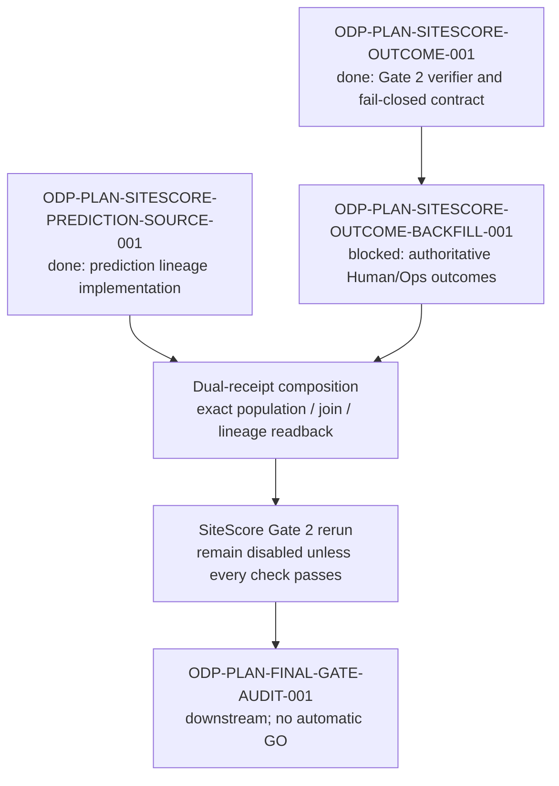

# ODP-PLAN-SITESCORE-OUTCOME-BACKFILL-001 Acceptance Packet

## Packet identity

| Field | Value |
|---|---|
| Sidecar task | `ODP-PLAN-SITESCORE-OUTCOME-BACKFILL-001-SIDECAR-ACCEPTANCE` |
| Parent task | `ODP-PLAN-SITESCORE-OUTCOME-BACKFILL-001` |
| Gap / phase | `GAP-P1-002-DATA` / `P1 Human Data Gate` |
| Helper kind | `acceptance_packet` |
| Sidecar owner / reviewer | `Codex2` / `Antigravity5` |
| Parent owner / reviewer | `Antigravity5` / `Human/Ops` |
| State observed | Parent `blocked`, waiting for `Human/Ops`, at `2026-08-11T05:45:03Z` |
| Release effect | No deployment authority; retain NO-GO until the final gate audit |
| Packet verdict | **Support only; no data receipt, Human/Ops approval, Gate 2 PASS, or release GO claim** |

This packet is a support-only review aid for the parent Human Data Gate. It does not
change L1 canonical truth, the SiteScore runtime contract, registry/governance code,
the execution-control pack, or any Human/Ops evidence. The parent owner decides
whether to absorb it. Only an accountable Human/Ops data owner can provide and attest
the authoritative source evidence described below.

## Current fail-closed state

The live task registry reports the parent as `blocked`, waiting for `Human/Ops`.
The committed intake artifacts still describe a zero-source state:

| Signal | Current committed value | Required disposition |
|---|---:|---|
| Eligible count | `0` | At least `200` strictly eligible, authoritative outcome rows |
| Mature label count | `0` | At least `200` valid realized outcome labels |
| M6 / M12 mature count | `0` / `0` | Recompute from elapsed maturity **and** explicit realized M6/M12 values |
| M6 / M12 coverage | `0.0` / `0.0` | Each must meet the governed `0.70` minimum |
| Matched predictions | `0` | Must be non-zero and population-aligned |
| Interval bounds | `0` | Must be non-zero, finite, ordered `p10 <= p90` |
| Dataset snapshot hash | `UNVERIFIED` | Reproducible SHA-256 over the accepted snapshot |
| Mature population digest | `UNAVAILABLE` | Reproducible from the complete evidence-bearing rows |
| Evidence owner | `UNVERIFIED` | Named Human/Ops accountable owner |
| SiteScore status | `GOVERNED_DISABLED` | Must remain disabled while any required proof is absent |

The files under `docs/evidence/models/sitescore/human-data-gate/` are intake
templates and a readback specification. Their presence is not evidence that the
database was queried, that a dataset exists, or that Human/Ops approved it.

## Dependency map

Dependency lifecycle status is necessary but not sufficient. The archived `done`
state for `ODP-PLAN-SITESCORE-PREDICTION-SOURCE-001` does not by itself prove that
the returned Human/Ops outcome snapshot joins to the governed prediction snapshot.
The reviewer must validate the two exact receipts against the same population.

## Acceptance matrix

All rows are required. `BLOCKED` means that this sidecar found no authoritative
Human/Ops readback in scope; it does not mean that a template or synthetic fixture
may be substituted.

| ID | Acceptance requirement | Required evidence | Reject when | Current |
|---|---|---|---|---|
| A1 | The source is an authoritative opening-outcome ledger controlled by a named Human/Ops owner. | Source identity, readback location, query id, owner identity, access-controlled query receipt. | The source is a fixture, local file created by AI, auto-seed, unverifiable export, or ownerless view. | `BLOCKED` |
| A2 | The accepted snapshot has stable entity and as-of semantics. | `entity_id`, `store_id`, `target_format_code`, `opened_on`, explicit prediction/outcome as-of mapping, duplicate policy. | Keys are missing, mutable, ambiguous, or one source row can multiply during the prediction join. | `BLOCKED` |
| A3 | At least 200 rows are strictly eligible and carry valid realized opening outcomes. | Canonical eligibility query, observed/eligible/excluded counts, row-level reason counts, source readback. | Eligibility uses truthiness instead of boolean `TRUE`, counts are hard-coded, or invalid/negative/non-finite outcomes enter the accepted population. | `BLOCKED` |
| A4 | M6 and M12 are true outcomes, not store-age aliases. | Explicit `realized_180d_net_revenue` and `realized_365d_net_revenue` values plus elapsed 180/365-day maturity evidence. | Store age, 90-day revenue, a fixed multiplier, or a copied prediction is presented as M6/M12 outcome evidence. | `BLOCKED` |
| A5 | M6 and M12 coverage are independently derived from the accepted population and each meet `0.70`. | M6/M12 numerators, denominator, coverage ratios, boundary samples immediately below/at 180 and 365 days. | A ratio is self-declared, uses a different denominator, accepts immature rows, or lacks explicit realized values. | `BLOCKED` |
| A6 | The snapshot is immutable and reproducible. | Dataset snapshot id, SHA-256, query text/version, cutoff/freshness timestamp, row count, ordered canonicalization procedure. | Hash omits evidence-bearing columns, cannot be independently recomputed, or refers to a different cutoff/query. | `BLOCKED` |
| A7 | The complete mature population is digest-bound. | `mature_population_digest` and `population_aggregate_digest` recomputed from eligibility, maturity, outcomes, keys, predictions, intervals, and segment identity. | A digest merely binds submitted aggregate scalars or remains unchanged after row-level M6/M12/eligibility mutation. | `BLOCKED` |
| A8 | Prediction and outcome evidence compose without leakage or fallback. | Exact prediction receipt, join counts, unmatched/duplicate ledger, model version, horizon, dataset/artifact lineage. | `y_pred = y_true`, cross-snapshot join, duplicate fan-out, missing lineage, or unmatched populations are accepted. | `BLOCKED` |
| A9 | Calibration inputs are finite and population-aligned. | `predicted_revenue`, finite ordered `p10/p90`, matched count, interval count, in-P80 count, independently recomputed metrics. | Missing/reversed/non-finite bounds, invented calibration, or metrics over a population different from the snapshot are accepted. | `BLOCKED` |
| A10 | Human/Ops attests source ownership and freshness without granting deployment authority. | Named owner, timestamp, source-system receipt, freshness/cutoff, reviewer readback, explicit signoff scope. | An AI signs for the owner, a receipt is unavailable for readback, or the signoff is treated as release GO. | `BLOCKED` |
| A11 | The Gate 2 verifier is rerun against the exact returned artifacts and fails closed on mutations. | Exact commands, exit codes, source/evidence hashes, verifier result, negative mutation results. | Only a happy-path count is checked, hashes are rebound around forged data, or missing evidence is converted to PASS. | `BLOCKED` |
| A12 | The delivered batch is complete before review handoff. | One internally consistent packet covering A1-A11 and all parent execution-packet clauses. | Only the latest example is fixed or evidence is split across irreconcilable snapshots. | `BLOCKED` |

## Authoritative receipt contract

The parent handback should return one requestable, hash-bound receipt with the
following minimum sections. Field aliases may be used internally only if the
receipt documents a deterministic, lossless mapping to the canonical fields.

### Source and ownership

- `task_id = ODP-PLAN-SITESCORE-OUTCOME-BACKFILL-001`
- `authoritative_source_identity = authoritative_opening_outcome_m6_m12_store_ledger`
- `query_id = sitescore_authoritative_m6_m12_outcome_query_v1`
- exact readback location and query text/version
- named `evidence_owner = Human/Ops`
- `source_freshness_timestamp` and dataset cutoff
- confidentiality-safe reviewer access path; no raw confidential values need to
  be copied into this support packet

### Row and join schema

- stable `entity_id`, `store_id`, `target_format_code`, and `opened_on`
- explicit outcome/prediction as-of mapping (`prediction_as_of` or a documented
  equivalent) and governed `model_version` / horizon identity
- strict boolean eligibility (`is_training_eligible IS TRUE OR eligible IS TRUE`)
- finite, non-negative `realized_90d_net_revenue`
- finite, non-negative `realized_180d_net_revenue`
- finite, non-negative `realized_365d_net_revenue`
- elapsed maturity evidence supporting 180-day and 365-day eligibility
- governed prediction fields `predicted_revenue`, `p10`, and `p90` from the paired
  prediction-source receipt, not generated by the outcome provider
- dataset snapshot and artifact lineage identifiers

### Counts, hashes, and derived checks

- `observed_count`, `eligible_count`, and `mature_count`
- `m6_mature_count`, `m12_mature_count`, and their exact denominators
- `matched_prediction_count`, `interval_bounds_count`, and `in_p80_count`
- duplicate, unmatched, immature, synthetic, invalid, and excluded-row counts
- `dataset_snapshot_id` and `dataset_snapshot_hash`
- `mature_population_digest` and `population_aggregate_digest`
- exact canonicalization/hash procedure and independent recomputation result

## Preflight gaps in the current intake templates

These are composition warnings for the parent owner. This sidecar intentionally
does not edit the underlying Human Data Gate artifacts.

1. `DATA_HANDBACK.json` and `intake_packet.md` expose a discovery query that reads
   `realized_90d_net_revenue` and `store_age_days` only. That query is useful for
   discovery, but it cannot satisfy the authoritative M6/M12 receipt.
2. `AUTHORITATIVE_READBACK_SPEC.json` names `realized_m6_net_revenue` and
   `realized_m12_net_revenue`, while the Gate 2 handback pins canonical receipt
   fields `realized_180d_net_revenue` and `realized_365d_net_revenue`. The parent
   must publish the canonical names or an explicit lossless mapping before review.
3. The same readback spec names `interval_lower_bound` / `interval_upper_bound`,
   while the composed prediction contract and verifier consume `p10` / `p90`.
   Interval evidence belongs to the governed prediction receipt and must be joined,
   not invented by the outcome backfill.
4. The task requires stable entity/as-of keys, but the current readback spec lists
   `entity_id`, `store_id`, `target_format_code`, and `opened_on` without an explicit
   as-of field or mapping rule. The parent must pin that mapping and prove join
   cardinality.
5. A maturity query that counts `store_age_days >= 180/365` alone is insufficient.
   Each count must also require the corresponding explicit realized outcome value.
6. The committed templates record `generated_at = 2026-08-03`; this is not source
   freshness and must not be reused as the Human/Ops data cutoff.

Any unresolved item above keeps the parent blocked. Resolving it may require a
parent-owned evidence/template update; it does not authorize this sidecar to alter
the canonical contract or Human/Ops record.

## Reviewer execution checklist

The assigned sidecar reviewer should first verify that this packet stays within
support scope. When Human/Ops later supplies the parent evidence, the parent
reviewer should execute the substantive data checks below against the exact receipt:

1. Resolve the source identity, query id, snapshot id, cutoff, owner, and readback
   location; confirm the receipt is requestable and not AI-authored.
2. Rerun the authoritative inventory query and reconcile observed, eligible,
   excluded, duplicate, mature, M6, and M12 counts.
3. Probe maturity boundaries at 179/180 and 364/365 elapsed days and require the
   matching explicit realized outcome for each passing row.
4. Recompute the snapshot SHA-256 and both population digests using the declared
   canonical ordering and complete evidence-bearing schema.
5. Join the exact governed prediction snapshot on the pinned keys; reconcile
   matched, unmatched, and duplicate counts and prove no fan-out.
6. Recompute coverage, interval, P80, and calibration metrics from the joined
   population. Explicitly probe `y_pred = y_true`, non-finite values, reversed
   bounds, and population mismatch.
7. Run the repository's SiteScore Gate 2 producer/verifier on the exact supplied
   artifacts and preserve commands, exit codes, source SHA, artifact hashes, and
   verifier reason code.
8. Confirm the final result remains `GOVERNED_DISABLED` unless every data,
   prediction, lineage, threshold, integrity, privacy/access, and approval check
   passes. A data-gate PASS still does not imply deployment or release GO.

## Handoff questions for Antigravity5

| Question | Expected answer |
|---|---|
| Did the sidecar modify canonical truth, runtime, registry, governance, or Human/Ops evidence? | No. Only this support artifact is in scope. |
| Does the current repository contain an authoritative Human/Ops dataset receipt? | No evidence was found in the declared parent artifacts; current templates remain fail-closed with zero/unverified values. |
| Can the 90-day discovery query prove M6/M12 outcomes? | No. Store age and 90-day revenue are discovery inputs only. |
| Is the archived `done` prediction-source task sufficient to pass the parent? | No. Its exact governed receipt must join and reconcile with the Human/Ops outcome snapshot. |
| Who can satisfy the blocked input? | A named Human/Ops data owner, with independently requestable source-system evidence. |
| Does satisfying this data gate authorize deployment or GO? | No. Final release authority remains downstream and fail-closed. |

## Absorption boundary

The parent owner may absorb the checklist and preflight warnings into the parent
work. Absorption must not treat this packet as source evidence or approval. If the
parent changes field names, query identity, maturity definitions, hash procedure,
or join semantics, those changes belong to the parent/canonical layer and require
their own review and exact evidence refresh.

## Closeout verification

At owner closeout on `2026-08-11` UTC, the approved support-only scope was
rechecked after composing `origin/dev` at `1b431dd4` into the task branch. The
four evidence files cited below retained their recorded SHA-256 values,
`git diff --check origin/dev...HEAD` passed, and the task-to-base diff remained
limited to this packet. No canonical, runtime, registry, governance, or Human/Ops
evidence file was changed by the sidecar.

## Source basis

- Live canonical task reads on 2026-08-11 UTC for the sidecar, parent,
  `ODP-PLAN-SITESCORE-OUTCOME-001`,
  `ODP-PLAN-SITESCORE-PREDICTION-SOURCE-001`, and final gate task.
- `docs/evidence/DEVELOPMENT_PLAN_OPEN_TASK_EXECUTION_PACK_2026-07-31.json`
  (parent Human Data Gate execution packet).
- `docs/evidence/models/sitescore/human-data-gate/AUTHORITATIVE_READBACK_SPEC.json`
  (SHA-256 `93bbb00aec040a1956883aef16e23023fcfda12decf9c56bf462babd1c2c47d3`).
- `docs/evidence/models/sitescore/human-data-gate/DATA_HANDBACK.json`
  (SHA-256 `5790a1a78579cf95b74e6ab44925e831562cc031102b56a563ca337818ce6051`).
- `docs/evidence/models/sitescore/human-data-gate/intake_packet.md`
  (SHA-256 `1b62d2d9f430580d4f60e819dcc307e5aa3e466e0c7b4c317e0f616b78997e7b`).
- `docs/evidence/models/sitescore_gate2_receipt.json`
  (SHA-256 `b51799ad71e3595abbcecc408ba68765ec6a13f7f8c4da13a44ab2f6dec375c4`).
- `models/sitescore/opening_outcome.py` and the approved parent implementation
  review addendum in `docs/evidence/models/ODP-PLAN-SITESCORE-OUTCOME-001-review.md`.

Preparation baseline: `529f0a2c8a722bb27430fb0d614229ef1ea6c127`, equal
to the observed `origin/dev` tip when this packet was prepared. Closeout base:
`1b431dd47296f2d444394b9c463be06868e92930`, composed before finalization.
