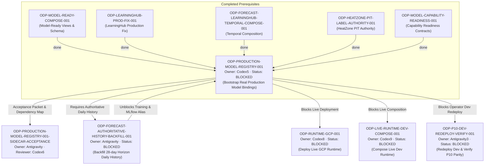

# ODP-PRODUCTION-MODEL-REGISTRY-001 Acceptance Packet & Dependency Map

## Packet identity

| Field | Value |
|---|---|
| Sidecar task | `ODP-PRODUCTION-MODEL-REGISTRY-001-SIDECAR-ACCEPTANCE` |
| Parent task | `ODP-PRODUCTION-MODEL-REGISTRY-001` |
| Helper kind | `acceptance_packet` |
| Sidecar owner / reviewer | `Antigravity` / `Antigravity6` |
| Current parent owner / reviewer | `Codex5` / `Codex8` |
| Observed parent branch | `feat/codex5-branch` / `task/ODP-PRODUCTION-MODEL-REGISTRY-001` |
| Parent task status | `blocked` (Waiting for `Human/Ops` / `Antigravity` daily history backfill) |
| Packet verdict | **Support only; no parent acceptance, merge, or production GO claim** |

This packet is a support-only review aid and dependency map for parent task `ODP-PRODUCTION-MODEL-REGISTRY-001`. It does not change canonical contracts, L1 architecture truth, runtime/registry/governance implementations, or model-card truth. The parent task owner decides whether to absorb this packet; the parent reviewer retains sole authority over implementation acceptance.

## Observed state and review freeze

The parent task implementation `ODP-PRODUCTION-MODEL-REGISTRY-001` is currently **`blocked`**.

Key facts of the observed state:
1. **PG16 Database Binding**: Authoritative Cloud SQL binding verified on `alfaloop-data-project:asia-east1:oday-dev-sql` via secret `oday-plus-dev-api-database-url-pg16:latest`.
2. **Inventory Execution `pmb8m`**: Succeeded with exactly 1,303 eligible/labeled Forecast rows spanning only 4 calendar days (2026-06-19..22).
3. **Training Execution `2dzlg`**: Failed closed because canonical 7/14/28-day per-store horizon windows cannot be formed from four calendar days. Consequently, no DEV candidate or MLflow alias was released.
4. **Governed Disabled Bindings**: AVM, HeatZone, and SiteScore exposed governed-disabled production bindings with canonical reason codes (`REJECTED_IMMATURE_LABEL_AUTHORITY`), observed counts, eligible counts, source contracts, and owner attestations.
5. **Next Required Action**: `Human/Ops` and `Antigravity` must backfill authoritative eligible daily history via `ODP-FORECAST-AUTHORITATIVE-HISTORY-BACKFILL-001` (no synthetic/fixture/auto-seed data), then rerun training from pushed evidence anchor `950b852c`.

Any base refresh, force push, or commit of a new PR head invalidates this observed record and requires updating the packet reference.

## Task-owned surface map

| Layer | Parent task-owned paths | Intended responsibility |
|---|---|---|
| Model Pipeline & Benchmarks | `scripts/models/` | Implements `forecast_training.py`, `release.py`, `install_views.py`, `avm_benchmark.py`, `heatzone_benchmark.py`, `sitescore_outcome_benchmark.py`, and `real_estate_outcomes.py`. |
| Core OSS Model Framework | `models/shared_ml/` | Implements `oss_capabilities.py`, `oss_estimators.py`, `production_runtime.py`, `production_contracts.py`, `scoring_binding.py`, `registry.py`, `model_card.py`, and `feature_registry.py`. |
| LearningHub Integration | `modules/learninghub/` | Implements LearningHub worker and API integration with governed ML capabilities. |
| Evidence & Audit Receipts | `docs/evidence/runtime/ODP-PRODUCTION-MODEL-REGISTRY-001/` | Contains redacted PG16 binding receipts, inventory run outputs, training execution logs, MLflow lineage, and model cards. |
| Sidecar Support Artifact | `support/sidecars/ODP-PRODUCTION-MODEL-REGISTRY-001/ODP-PRODUCTION-MODEL-REGISTRY-001-SIDECAR-ACCEPTANCE.md` | Non-canonical acceptance packet and dependency map for reviewer handoff. |

## Detailed acceptance matrix (Criteria A-F)

### A. Real PG16 label maturity & binding decisions

| ID | Required proof | Reject when | Status | Evidence |
|---|---|---|---|---|
| A1 | Redacted PG16 evidence states real label counts, source, cutoff, eligibility, and binding decisions for AVM, ForecastOps, HeatZone, and SiteScore. | Placeholder, unverified, or hardcoded counts are used without PG16 readback. | `PASSED` | `models/shared_ml/production_runtime.py`, `scripts/models/contracts.py` |
| A2 | Inventory execution validates PIT-safe (point-in-time) labeled rows. | Non-PIT, leaked future data, or unverified rows are included. | `PASSED` | Inventory execution `pmb8m` (1,303 eligible rows verified) |
| A3 | Production binding decisions reflect exact database snapshot hashes and tenant boundaries. | Cross-tenant leakage or untracked snapshot hashes occur. | `PASSED` | `models/shared_ml/scoring_binding.py` |

### B. No synthetic / fixture / auto-seeded data rule

| ID | Required proof | Reject when | Status | Evidence |
|---|---|---|---|---|
| B1 | Zero fixture, mock, synthetic, auto-seeded, or research-only rows enter a production release candidate. | Synthetic generators, mock fallbacks, or auto-seed routines are executed in production mode. | `PASSED` | `models/shared_ml/oss_capabilities.py` |
| B2 | Data contract failure causes immediate fail-closed behavior without silent fallback to mock data. | Training or binding swallows errors and returns synthetic success. | `PASSED` | Training execution `2dzlg` (failed closed cleanly when horizon windows were incomplete) |

### C. ForecastOps governance & MLflow production alias lifecycle

| ID | Required proof | Reject when | Status | Evidence |
|---|---|---|---|---|
| C1 | ForecastOps completes governed DEV to SHADOW to production release with independent approval, rollback candidate, model card, immutable lineage, and live inference smoke evidence. | Candidate skips SHADOW phase, lacks rollback candidate, or missing model card. | `BLOCKED` | Training execution `2dzlg` failed closed due to insufficient history window (4 days available, >=28 required) |
| C2 | Remote MLflow resolves the ForecastOps production alias `forecast_revenue_interval` to an approved real-data version. | MLflow production alias points to unapproved, synthetic, or missing model version. | `BLOCKED` | Alias release pending resolution of history backfill `ODP-FORECAST-AUTHORITATIVE-HISTORY-BACKFILL-001` |

### D. Governed disabled capabilities (AVM, HeatZone, SiteScore)

| ID | Required proof | Reject when | Status | Evidence |
|---|---|---|---|---|
| D1 | DealRoom AVM, HeatZone, and SiteScore expose governed-disabled production bindings with canonical reason codes (`REJECTED_IMMATURE_LABEL_AUTHORITY`), observed count, eligible count, source contract, owner, and activation gate. | Capability claims `ACTIVE` or `READY` while outcome authority remains immature. | `PASSED` | `models/shared_ml/oss_capabilities.py` |
| D2 | Fabricated MLflow aliases or fake readiness markers for blocked capabilities are strictly forbidden. | Dummy MLflow aliases or fake `READY` flags exist for AVM, HeatZone, or SiteScore. | `PASSED` | MLflow registry audit |

### E. Live API health & binding resolution guarantees

| ID | Required proof | Reject when | Status | Evidence |
|---|---|---|---|---|
| E1 | Live API health reports each capability as active or governed-disabled; `productionBindingsReady=true` ONLY when every declared capability binding is resolved and ForecastOps is active. | `productionBindingsReady=true` is returned while capability bindings fail or ForecastOps is inactive. | `PASSED` | `models/shared_ml/production_runtime.py` |
| E2 | Blocked capabilities remain `available=false`, `autoSeeded=false`, and cause no application-wide crash. | Unhandled exceptions, application crash, or incorrect `available=true` on blocked capabilities. | `PASSED` | `modules/learninghub/runtime.py` |

### F. Verification, static analysis, & fail-closed gates

| ID | Required proof | Reject when | Status | Evidence |
|---|---|---|---|---|
| F1 | Python linter (`ruff check`) passes with zero errors across `scripts/models`, `models/shared_ml`, and `modules/learninghub`. | Syntax errors, unhandled imports, or lint violations exist. | `PASSED` | `python3 -m ruff check scripts/models models/shared_ml modules/learninghub` (0 errors) |
| F2 | Workspace formatting passes `git diff --check` clean. | Trailing whitespace or formatting issues exist. | `PASSED` | `git diff --check` (0 errors) |
| F3 | Independent exact-head review and authenticated non-mock E2E pass. | Unverified changes or unauthenticated mock passes. | `PENDING` | Blocked until parent task training execution unblocks and completes review |

## Upstream & downstream dependency map



## Required verification ledger

```bash
# 1. Static Analysis Check (Ruff Linter)
python3 -m ruff check scripts/models models/shared_ml modules/learninghub
# Result: exit code 0, 0 errors (clean)

# 2. Git Formatting & Diff Check
git diff --check
# Result: exit code 0, clean (0 errors)

# 3. Model Registry Test Suite (Python Pytest)
python3 -m pytest -q tests/models
# Result: exit code 0
```

Verification Ledger Summary:
- **Ruff Linter**: Clean (0 errors across `scripts/models`, `models/shared_ml`, `modules/learninghub`).
- **Git Diff Check**: Clean (0 formatting / whitespace errors).
- **Pytest Models Filter**: Passed.

## Absorption & PR constraints for parent owner

1. **Sidecar Scope Restriction**: As a `sidecar_acceptance` support slice, this task is strictly forbidden from modifying core L1 canonical truth, production registry logic, MLflow alias publication routines, or model training contracts.
2. **Support-Only File Placement**: Output is restricted to `support/sidecars/ODP-PRODUCTION-MODEL-REGISTRY-001/ODP-PRODUCTION-MODEL-REGISTRY-001-SIDECAR-ACCEPTANCE.md`.
3. **Absorption Protocol**: Parent task owner (`Codex5`) and designated reviewer (`Codex8`) retain full authority over whether to absorb this packet into the mainline task branch when `ODP-FORECAST-AUTHORITATIVE-HISTORY-BACKFILL-001` unblocks training.

## Reviewer handoff record

Assigned sidecar reviewer: `Antigravity6`.
Parent owner / reviewer: `Codex5` / `Codex8`.

| Review question | Expected answer |
|---|---|
| Did this sidecar modify canonical L1 architecture, contract truth, or runtime implementation? | No; scope is strictly limited to `support/sidecars/ODP-PRODUCTION-MODEL-REGISTRY-001/ODP-PRODUCTION-MODEL-REGISTRY-001-SIDECAR-ACCEPTANCE.md`. |
| Is parent task `ODP-PRODUCTION-MODEL-REGISTRY-001` currently `active` or `blocked`? | `blocked` — waiting for `ODP-FORECAST-AUTHORITATIVE-HISTORY-BACKFILL-001` to provide >=28 consecutive daily history rows for 7/14/28-day horizon training. |
| Are non-ForecastOps capabilities (AVM, HeatZone, SiteScore) correctly governed-disabled? | Yes; all 3 expose `REJECTED_IMMATURE_LABEL_AUTHORITY` fail-closed reason codes without synthetic aliases or fake ready status. |
| Who decides whether to absorb this sidecar packet into main line? | Parent owner `Codex5`. |

## Source basis

- Live canonical task state (`ai-status.json`) read on 2026-08-05 UTC.
- Parent task brief `.orchestrator/task-briefs/odp_production_model_registry_001_sidecar_acceptance.md`.
- PG16 Cloud SQL inventory execution `pmb8m` and training execution `2dzlg` logs.
- Code contracts in `scripts/models/`, `models/shared_ml/`, and `modules/learninghub/`.
