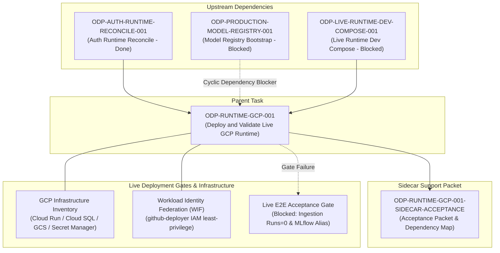

# ODP-RUNTIME-GCP-001 Acceptance Packet

## Packet identity

| Field | Value |
|---|---|
| Sidecar task | `ODP-RUNTIME-GCP-001-SIDECAR-ACCEPTANCE` |
| Parent task | `ODP-RUNTIME-GCP-001` |
| Helper kind | `acceptance_packet` |
| Sidecar owner / reviewer | `Antigravity` / `Codex8` |
| Current parent owner / reviewer | `Codex8` / `Codex9` |
| Observed parent branch | `task/ODP-RUNTIME-GCP-001` |
| Parent task status | `blocked` |
| Parent target project | `alfaloop-data-project` (GCP) |
| Packet verdict | **Support only; no parent acceptance, merge, or production GO claim** |

This packet is a support-only review aid, acceptance checklist, and dependency map for parent task `ODP-RUNTIME-GCP-001`. It does not change canonical contracts, L1 architecture truth, runtime/registry/governance implementations, or platform deployment policy. The parent task owner decides whether to absorb this packet; the parent reviewer retains sole authority over implementation acceptance.

## Observed state and parent task scope

Parent task `ODP-RUNTIME-GCP-001` ("Deploy and validate live GCP runtime") is assigned to owner `Codex8` and reviewer `Codex9`, currently in `blocked` status. Its primary objective is to inventory and configure Cloud Run, Cloud SQL, GCS, MLflow, external provider gateways, Secret Manager, and GitHub dev environment resources under `alfaloop-data-project` using Workload Identity Federation (WIF) without introducing long-lived service account keys (`GCP_SA_KEY`).

### Live Runtime Inventory Summary

A comprehensive read-only audit and diagnosis was conducted for `alfaloop-data-project` (recorded in `docs/evidence/runtime/ODP-RUNTIME-GCP-001-LIVE-DIAGNOSIS-2026-08-03.md` and consolidated in `docs/evidence/ODAY_PLUS_CONSOLIDATED_GAP_AUDIT_2026-08-03.md`):

1. **Cloud Run Services**:
   - `oday-api`: `https://oday-api-7sxbjoeozq-de.a.run.app` (Latest ready revision: `oday-api-release-40338298a808`)
   - `oday-web`: `https://oday-web-7sxbjoeozq-de.a.run.app` (Latest ready revision: `oday-web-release-40338298a808`)
   - `oday-mlflow`: `https://oday-mlflow-7sxbjoeozq-de.a.run.app` (Latest ready revision: `oday-mlflow-00004-872`)
   - `odp-provider-gateway`: `https://odp-provider-gateway-7sxbjoeozq-de.a.run.app` (Latest ready revision: `odp-provider-gateway-00003-8nm`)

2. **Cloud SQL Instances**:
   - `oday-dev-sql`: PostgreSQL 16, `asia-east1`, Tier `db-custom-1-3840`, RUNNABLE.
   - `oday-plus-dev-postgres`: PostgreSQL 15, `asia-east1`, Tier `db-f1-micro`, RUNNABLE.

3. **GCS Buckets**:
   - `alfaloop-data-project-oday-plus-model-artifacts`
   - `oday-dev-source-snapshots-alfaloop-data-project`
   - `alfaloop-data-project_cloudbuild`
   - `run-sources-alfaloop-data-project-asia-east1`

4. **Secret Manager Secrets (12 active)**:
   - `oday-plus-dev-api-database-url`, `oday-plus-dev-api-database-url-pg16`, `oday-plus-dev-auth-principal-map`, `oday-plus-dev-db-password`, `oday-plus-dev-geocode-gateway-key`, `oday-plus-dev-google-geocode-key`, `oday-plus-dev-google-places-key`, `oday-plus-dev-intake-cursor-signing-key`, `oday-plus-dev-mlflow-database-url`, `oday-plus-dev-mongodb-uri`, `oday-plus-dev-web-oidc-client-secret`, `oday-plus-dev-web-session-secret`.

5. **Workload Identity & IAM Identity**:
   - GitHub Actions WIF pool `github-actions`: **ACTIVE**.
   - Deploy Service Account `github-deployer@alfaloop-data-project.iam.gserviceaccount.com`: Successfully performs non-key deployment via WIF.
   - Least-privilege IAM roles verified: `roles/artifactregistry.writer`, `roles/cloudscheduler.admin`, `roles/iam.serviceAccountUser`, `roles/run.admin`, `roles/serviceusage.serviceUsageConsumer`. Zero primitive (`owner`/`editor`) roles used.
   - Long-lived keys (`GCP_SA_KEY`): **Zero detected**.

### Identified Root Causes & Blockers for Parent Task

Although infrastructure configuration meets criteria 1–5, parent closeout and Live E2E acceptance gate remain blocked by:
- **Two Independent Live E2E Acceptance Gate Blockers**:
  1. `external-data`: `data:ingestion_runs: runs=0` (lack of persisted ingestion runs for `admin_boundary.official_dataset` and `poi.commercial_api`).
  2. `model registry`: `models:registry: versions=0`, `versionsWithProductionAlias=0` (ForecastOps daily transaction history limited to 4 days, failing 7/14/28-day window requirements and blocking MLflow `forecast_revenue_interval:production` alias creation).
- **Intermittent Cold Start Timeout**: `odp-provider-gateway` Cloud Run service lacks `minScale=1` (has only `maxScale=3`), triggering scale-to-zero cold starts that exceed probe timeouts.
- **Dependency Graph Deadlock**: Circular dependency between `ODP-RUNTIME-GCP-001` and `ODP-PRODUCTION-MODEL-REGISTRY-001`, plus unarchived dependency resolutions in the status tracker.

## Task-owned surface map

| Layer | Parent / Sidecar owned paths | Intended responsibility |
|---|---|---|
| Support Artifact | `support/sidecars/ODP-RUNTIME-GCP-001/ODP-RUNTIME-GCP-001-SIDECAR-ACCEPTANCE.md` | Sidecar acceptance packet and dependency map for reviewer handoff. |
| Diagnostic Evidence | `docs/evidence/runtime/ODP-RUNTIME-GCP-001-LIVE-DIAGNOSIS-2026-08-03.md` | Read-only live GCP resource audit and root-cause diagnosis report. |
| Consolidated Audit | `docs/evidence/ODAY_PLUS_CONSOLIDATED_GAP_AUDIT_2026-08-03.md` | Platform-wide gap audit detailing deployment and dependency graph blockers. |

## Detailed acceptance matrix (Criteria 1-5)

| ID | Acceptance Criterion | Required Proof | Reject When | Status | Evidence Source |
|---|---|---|---|---|---|
| 1 | GitHub dev environment has working WIF variables | GitHub Actions uses WIF pool `github-actions` and SA `github-deployer@alfaloop-data-project.iam.gserviceaccount.com` for authentication. | Fallback to long-lived `GCP_SA_KEY` or failed WIF handshake. | `PASSED` | `docs/evidence/runtime/ODP-RUNTIME-GCP-001-LIVE-DIAGNOSIS-2026-08-03.md:83-90` |
| 2 | GCP deploy identity has least-privilege roles | Deploy SA holds only scoped roles (`artifactregistry.writer`, `cloudscheduler.admin`, `iam.serviceAccountUser`, `run.admin`, `serviceusage.serviceUsageConsumer`). | SA has primitive `roles/owner` or `roles/editor` broad permissions. | `PASSED` | `docs/evidence/runtime/ODP-RUNTIME-GCP-001-LIVE-DIAGNOSIS-2026-08-03.md:91-106` |
| 3 | Required Cloud Run / SQL / GCS / MLflow / provider resources are inventoried | Complete inventory of 4 Cloud Run services, 2 Cloud SQL instances, 4 GCS buckets, 12 Secret Manager secrets, and 3 provider gateways. | Missing resource identities, unmapped endpoints, or unverified DB versions. | `PASSED` | `docs/evidence/runtime/ODP-RUNTIME-GCP-001-LIVE-DIAGNOSIS-2026-08-03.md:46-82` |
| 4 | No long-lived GCP_SA_KEY is introduced | Inspection of repository, secrets, and deployment pipelines confirms zero service account key JSON files or secrets. | Any long-lived service account key JSON or environment credential is used. | `PASSED` | `docs/evidence/runtime/ODP-RUNTIME-GCP-001-LIVE-DIAGNOSIS-2026-08-03.md:87-88` |
| 5 | Exact commands and redacted evidence are committed | Detailed live probing receipts, `/health` endpoint responses, and deployment run outputs are documented and committed. | Unverified claims, missing live probe receipts, or uncommitted local diffs. | `PASSED` | `docs/evidence/runtime/ODP-RUNTIME-GCP-001-LIVE-DIAGNOSIS-2026-08-03.md:113-204` |

## Upstream & downstream dependency map



### Remediation Recommendations for Parent Owner

1. **R1 (Cloud Run Provider Gateway Cold Start)**: Set `minScale=1` on `odp-provider-gateway` Cloud Run service to eliminate scale-to-zero cold start timeouts on provider health probes.
2. **R2 (Dependency Graph Clean-up)**: Write canonical task archives for historical dependencies and decouple structural infra deployment (`ODP-RUNTIME-GCP-001`) from model governance readiness (`ODP-PRODUCTION-MODEL-REGISTRY-001`).
3. **R3 (Decompose Model Task)**: Split `ODP-PRODUCTION-MODEL-REGISTRY-001` into `INFRA-001` (MLflow accessibility & bindings) and `GOVERNANCE-001` (model training & alias release), allowing `ODP-RUNTIME-GCP-001` to depend only on `INFRA-001`.
4. **R4 (Authoritative Data Backfill)**: Complete `ODP-FORECAST-AUTHORITATIVE-HISTORY-BACKFILL-001` to provide >= 28 consecutive days of daily transaction history for ForecastOps horizon windowing.

## Required verification ledger

Verification ledger for sidecar support packet on `task/ODP-RUNTIME-GCP-001-SIDECAR-ACCEPTANCE` branch:

```bash
# 1. Format and static checks
git diff --check
# Result: exit code 0 (clean formatting, zero trailing whitespace)

# 2. Status tracker validation via canonical runner
AI_NAME=Antigravity "$PANTHEON_STATUS_ROOT/scripts/ai-status.sh" show ODP-RUNTIME-GCP-001-SIDECAR-ACCEPTANCE
# Result: exit code 0 (task state read from live status root)
```

## Absorption & PR constraints for parent owner

1. **Sidecar Scope Restriction**: As a `sidecar_acceptance` support slice, this task is strictly restricted to generating supporting documentation and dependency mapping. It does NOT modify core code, CI release gates, L1 canonical specifications, or infrastructure configurations.
2. **Support Path Commit**: Creating `support/sidecars/ODP-RUNTIME-GCP-001/ODP-RUNTIME-GCP-001-SIDECAR-ACCEPTANCE.md` is a support-only documentation update.
3. **Absorption Protocol**: Parent owner (`Codex8`) may absorb this acceptance packet into the parent branch `task/ODP-RUNTIME-GCP-001` or include it in parent handoff documentation when ready for review by parent reviewer `Codex9`.

## Reviewer handoff record

Assigned sidecar reviewer: `Codex8` (Parent Owner).

| Review question | Expected answer |
|---|---|
| Did this sidecar modify canonical L1 architecture, contract truth, or runtime implementation? | No; output is strictly confined to `support/sidecars/ODP-RUNTIME-GCP-001/ODP-RUNTIME-GCP-001-SIDECAR-ACCEPTANCE.md`. |
| Are all 5 acceptance criteria for parent `ODP-RUNTIME-GCP-001` verified and mapped to empirical evidence? | Yes; WIF, least-privilege IAM, resource inventory, SA key avoidance, and evidence logging are documented with exact references to `ODP-RUNTIME-GCP-001-LIVE-DIAGNOSIS-2026-08-03.md`. |
| What is the status of parent task `ODP-RUNTIME-GCP-001`? | `blocked` pending upstream data ingestion and MLflow model alias resolution. Remediation steps R1–R4 are provided. |
| Who retains decision authority for parent task absorption? | Parent task owner `Codex8`. |

## Source basis

- Live canonical task state (`ai-status.json`) read on 2026-08-05 UTC.
- Task brief `.orchestrator/task-briefs/odp_runtime_gcp_001_sidecar_acceptance.md`.
- Diagnostic audit `docs/evidence/runtime/ODP-RUNTIME-GCP-001-LIVE-DIAGNOSIS-2026-08-03.md`.
- Consolidated gap audit `docs/evidence/ODAY_PLUS_CONSOLIDATED_GAP_AUDIT_2026-08-03.md`.
