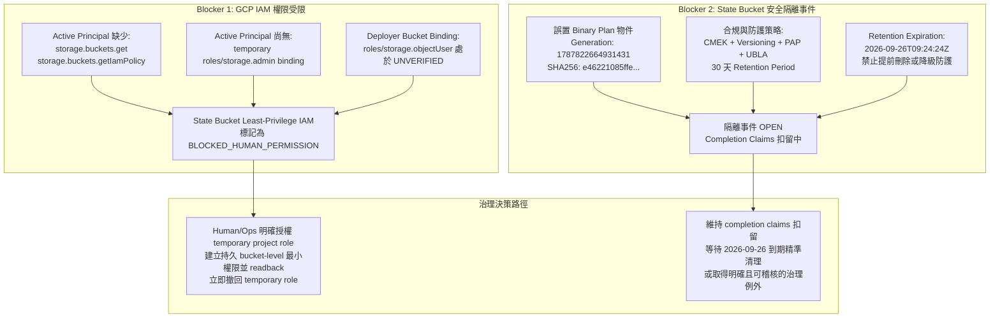
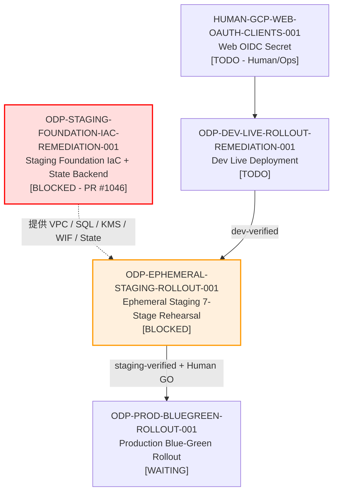

# ODP-STAGING-FOUNDATION-IAC-REMEDIATION-001 阻塞診斷與驗證交接包

## 1. 身分、範圍與治理資訊

| 欄位 | 值 |
|---|---|
| **Sidecar Task ID** | `ODP-STAGING-FOUNDATION-IAC-REME-SIDECAR-D7ED3693` |
| **Parent Task ID** | `ODP-STAGING-FOUNDATION-IAC-REMEDIATION-001` |
| **Parent Task Title** | 補齊 ephemeral staging 的受治理 foundation 與 durable state |
| **Helper Kind** | `blocked_task_diagnostics` |
| **Sidecar Owner / Reviewer** | `Antigravity4` / `claude_slot_1` |
| **Parent Owner / Reviewer** | `Antigravity2` / `Codex2` |
| **Target Branch / Task Branch** | `dev` / `task/ODP-STAGING-FOUNDATION-IAC-REME-SIDECAR-D7ED3693` |
| **Parent Task Status** | `blocked`（`waiting_for: Human/Ops`） |
| **Parent Task Phase** | `Wave 1 remediation - staging foundation` |
| **Parent Active PR / Exact Head** | PR #1046（Exact Head: `8b90e0c823812e4c6d7021e2c6f44a02ac96c075`） |
| **診斷日期** | `2026-08-28` |
| **範圍界線** | 僅限 `support/sidecars/ODP-STAGING-FOUNDATION-IAC-REMEDIATION-001/` 下的唯讀支援材料；不修改 L1 canonical platform documents、核心 contract 真相、runtime table 或主要 governance policy。 |

本交接包（packet）依據 live task board、PR #1046 提交內容、Live GCP readback receipts 與歷次審查紀錄（Reviews #1–#8）進行結構化診斷，旨在為 Parent Owner、Reviewer 及 Governance/Ops 提供完整、可核對的 blocker 證據分析，作為解除阻塞或推進治理決策的支援性材料。

---

## 2. 結論摘要

`ODP-STAGING-FOUNDATION-IAC-REMEDIATION-001` 目前處於正確的 **`blocked`**（`waiting_for: Human/Ops`）狀態，應繼續維持 fail-closed。

### 核心診斷結論：
1. **候選實作已完成程式層收斂，但 live acceptance 尚未完成**：
   - 抽取唯一可重用模組 `infra/terraform/modules/runtime_foundation`。
   - 建立 17 個 `moved` blocks 達成零替換（Zero-Replacement）平滑遷移。
   - Live Cloud SQL 實例 `oday-staging-foundation-sql`（PostgreSQL 16, `db-custom-2-7680`, 50GB, Private IP `10.149.0.3`）已成功採用（Adopted）進 remote state；既有 legacy `oday-staging-sql` 依法保留不刪除。
   - 補齊 `google_service_account.web` 及其 subnetwork IAM binding，消除 race condition。
   - 已記錄的 focused tests 與 contract 檢查通過；這些證據只證明候選程式健康，不代表 live IAM 或 quarantine acceptance 已完成。
2. **兩大外部真實阻礙（Active Real Blockers）仍需 Human/Ops 與治理層介入**：
   - **Blocker 1: State Bucket Least-Privilege IAM 權限不足 (`BLOCKED_HUMAN_PERMISSION`)**：
     Active principal 缺乏 `storage.buckets.get` 與 `storage.buckets.getIamPolicy` 權限，目前也沒有可用的 temporary `roles/storage.admin` binding；`github-deployer` 對 state bucket 的最小權限綁定仍無法取得 live verification。
   - **Blocker 2: State Bucket 安全隔離事件處於 OPEN 狀態 (`STATE_BUCKET_SECURITY_QUARANTINE`)**：
     誤上傳至 remote state bucket 的 binary plan 物件（generation `1787822664931431`）受 30 天 Retention Policy 保護至 **`2026-09-26T09:24:24Z`**。為符合法規與安全要求，禁止提前刪除或放寬 retention，已建立隔離事件代號 `ODP-STAGING-FOUNDATION-IAC-REMEDIATION-001-STATE-PLAN-QUARANTINE-001` 並扣留 completion claims。

因此，Parent Task 必須維持 `blocked`。程式碼或 sidecar 文件合併不等於 task 完成；只有 Human/Ops 補齊 IAM live readback，且 quarantine 依既定到期清理或取得明確、可稽核的治理例外，才可重新送審。

---

## 3. 證據基礎與歷次審查演進 (Review History & Evidence Base)

### 3.1 歷次審查重點與修復進程（Reviews #1 – #8）

| 審查次數 | 審查者 | 判決 / 核心爭點 | 修復與收斂成果 |
|---|---|---|---|
| **Round 1–4** | `Codex2` / `Codex` | **P0 退回**：Receipt 與 live readback 脫節；專用 VPC/Subnet/Firewall 查無實體；Cloud SQL 仍在 default 網路；Backend migration 宣告被註解；Moved blocks 遺漏兩個 IAM identity。 | 補齊專用網路、建立 live foundation 資源、修復 bootstrap migration 流程，並補齊 17 個 moved blocks。 |
| **Round 5–6** | `Codex2` | **P0 退回**：Live SQL 建立後中斷導致成 state 外 orphan；缺少 `oday-staging-web` SA；Receipt 宣稱 0 add 但實際 state 未收斂；Cloud Run MLflow 誤標為 Direct VPC live 證據。 | 透過 `terraform import` 將 `oday-staging-foundation-sql` 正式採用至 remote state；新增 web SA 與 IAM 依賴；收斂 receipt 清楚標示 MLflow 為 `PENDING_NOT_DIRECT_VPC`。 |
| **Round 7** | `Codex2` | **退回**：State bucket 存放了 binary plan 違背 state-only 規範；State bucket IAM 因缺少權限無法 live convergence。 | 建立 `STATE_BUCKET_SECURITY_QUARANTINE.md` 正式隔離違規 plan 物件，鎖定 retention 至 2026-09-26；標記 least-privilege IAM 為 `BLOCKED_HUMAN_PERMISSION`。 |
| **Round 8** | `Codex2` | **退回（Exact Head 8b90e0c8）**：審查確認程式碼與誠實 receipt 已就緒，但因上述兩項 live acceptance 未滿足，裁定必須記錄明確 blocker 並等待 `Human/Ops`。 | Parent Task 依規定轉入 `blocked`（`waiting_for: Human/Ops`），並指派本 sidecar 產出結構化交接包。 |

---

## 4. Blocker 深度診斷矩陣

### 4.1 阻礙詳細資訊

### 4.2 阻礙項目與解除條件對照表

| 阻礙代碼 | 阻礙描述 | 現況等級 | 影響範疇 | 解除條件（Unblocking Criteria） |
|---|---|---|---|---|
| **BLK-IAM-001** | State Bucket Least-Privilege IAM 缺少讀取與收斂權限 | `BLOCKED_HUMAN_PERMISSION` | State Bucket IAM 驗證受阻，無法以 live readback 確認 Human/Ops 與 `github-deployer` 的 bucket-level 最小權限。 | 使用者明確同意後，暫時授予 active principal project-level `roles/storage.admin`；建立持久 bucket-level Human/Ops 管理與 deployer object 權限、完成 IAM/metadata readback，最後立即撤回 temporary project role。不得留下永久 project-level `roles/storage.admin`。 |
| **BLK-SEC-002** | State Bucket 誤置 Binary Plan 安全隔離事件（Incident ID: `ODP-STAGING-FOUNDATION-IAC-REMEDIATION-001-STATE-PLAN-QUARANTINE-001`） | `OPEN`（至 2026-09-26） | 違反「State bucket 僅能存放 state/lock 物件」之規範；受 30 天 retention 強制鎖定。 | **嚴禁手動或提前刪除**。需等待 **`2026-09-26T09:24:24Z`** retention 到期後由 `Staging Foundation Owner` 依核准程序精準清理；若治理團隊要接受受控隔離作為例外，必須另有明確 owner、期限、風險接受與稽核 receipt，Auto Worker 無權自行判定。 |

---

## 5. 平台依賴拓撲與下游影響

Staging Foundation 是整個 Ephemeral Staging 生命週期管理（`staging_lifecycle.py`）與 Runtime Release 部署的底層依賴。在 Foundation 未取得明確治理放行前，下游 `ODP-EPHEMERAL-STAGING-ROLLOUT-001` 維持 fail-closed，阻斷未經治理驗證的流量進入 staging 與 production。

---

## 6. Bounded Verification 紀錄

本次 sidecar 在隔離 worktree 內執行唯讀與無副作用驗證，用來佐證候選程式碼基線；下列結果不覆蓋 live GCP IAM readback、bucket quarantine 或 Parent Task completion：

| 驗證項目 | 執行命令 | 執行結果 | 判定 |
|---|---|---|---|
| **Terraform 合約驗證** | `python3 infra/terraform/validate_contract.py` | `Checked 14 Terraform files without exposing secret values. PASS` | 合約結構正確，無機密洩漏。 |
| **Terraform 模組單元測試** | `uv run --python 3.12 pytest infra/terraform/tests/ -v` | `32 passed in 28.95s` | Contract、KMS、Database、Network 與 Ephemeral Staging 測試全數通過。 |
| **Ephemeral Staging 生命週期測試** | `uv run --python 3.12 pytest tests/ops/test_ephemeral_staging_lifecycle.py -q` | `96 passed` | 生命週期引擎、TTL、命名規範與參數對接完全相容。 |
| **程式庫代碼邊界檢查** | `python3 delivery_toolchain/governance/check_code_boundaries.py` | `Code boundary checks passed for 983 files.` | 邊界分類嚴密，無跨邊界污染。 |

---

## 7. 交接決議與建議行動綱領 (Actionable Recommendations)

1. **維持 Parent Task Fail-Closed 狀態**：
   - `ODP-STAGING-FOUNDATION-IAC-REMEDIATION-001` 應維持 `blocked`（`waiting_for: Human/Ops`），PR #1046 保留 Exact Head `8b90e0c8`，不得由自動 worker 任意重送未變更之 review。
2. **Human/Ops 權限處理建議**：
   - 先取得使用者對 temporary project-level `roles/storage.admin` 的明確同意，不從既有 broad role 推定授權。
   - 建立持久 bucket-level Human/Ops 管理與 `github-deployer` 最小 object 權限，完成 IAM/metadata live readback。
   - Readback 成功後立即撤回 temporary project role；不得把它留成常態部署權限。
3. **安全隔離事件治理建議**：
   - 預設維持 `blocked` 至 retention 到期後完成精準清理。若治理團隊要接受受控隔離作為例外，必須另出具具 owner、期限、風險接受與稽核軌跡的正式 receipt。
   - 即使 PR #1046 的候選程式碼可被單獨評估，Parent Task 仍不得在上述 live acceptance 未完成時標為 done。
4. **嚴禁破壞性操作**：
   - 嚴禁任何 worker 或腳本執行 `gcloud storage rm`、解除 bucket retention/CMEK、或刪除既有 `oday-staging-sql` 實例。所有操作必須遵循 `MIGRATION_ROLLBACK_AND_DESTROY_GUARD.md` 規範。
