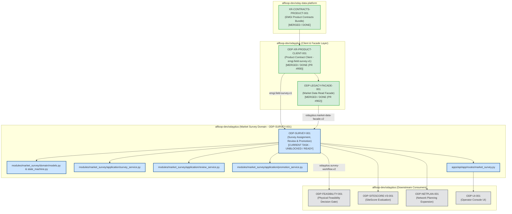

# Sidecar Diagnostic Packet: ODP-SURVEY-001

## 1. Packet Identity & Governance Metadata

| Field | Value |
|---|---|
| **Sidecar Task ID** | `ODP-SURVEY-001-SIDECAR-BLOCKED-TASK-DIAGNOSTICS` |
| **Parent Task ID** | `ODP-SURVEY-001` |
| **Parent Task Title** | `Implement survey assignment, review and promotion over platform field-survey observations` |
| **Helper Kind** | `blocked_task_diagnostics` |
| **Sidecar Owner / Reviewer** | `Antigravity4` / `Codex` |
| **Parent Owner / Reviewer** | `Claude` / `Antigravity2` |
| **Target / Parent Branch** | `dev` / `task/ODP-SURVEY-001-SIDECAR-BLOCKED-TASK-DIAGNOSTICS` |
| **Parent Task Status** | `todo` (Unblocked & Ready for Execution; reopened from historical blocked state) |
| **Historical Blocked Reason** | `waiting for dependencies: ODP-LEGACY-FACADE-001` |
| **Current Resolution Status** | **UNBLOCKED & READY FOR EXECUTION** (Dependency `ODP-LEGACY-FACADE-001` merged into `dev` via PR #962 at 2026-08-22T12:40:31Z) |
| **Diagnostic Timestamp** | `2026-08-22` |
| **Scope Boundary** | Support artifact under `support/sidecars/ODP-SURVEY-001/` only. Strictly zero mutation of L1 canonical platform documents, core contracts, runtime tables, or governance policies. |

---

## 2. Executive Summary & Problem Context

This diagnostic packet provides an evidence-backed blocker analysis, dependency audit, architectural invariant breakdown, implementation blueprint, domain lifecycle state machine specification, downstream blast radius mapping, and bounded verification report for parent task **`ODP-SURVEY-001`** (*"Implement survey assignment, review and promotion over platform field-survey observations"*).

### Problem Statement & Architectural Mission
In the EMGI v0.4.1 target architecture:
1. **Upstream Ingestion & Spatial Capture**: Raw field survey observations, mobile surveyor submissions, photographic/video attachments, and coordinate anchoring belong to `alfloop-dev/oday-data-platform` and are published as immutable, versioned evidence streams conforming to contract `emgi.field-survey.v1`.
2. **Consumer Application & Governance Layer**: Operational survey campaigns, surveyor assignment dispatch, reviewer separation of duties, manual operator corrections, SLA/expiry tracking, and promotion into store candidate evaluation and physical feasibility decisions remain strictly owned by consumer application `odayplus`.
3. **Evidence vs. Ground Truth Invariant**: A platform field survey observation represents *verified on-site evidence*, not automatic, unreviewed business ground truth. An observation must pass independent operator review, policy compliance gates, and formal promotion before its attributes influence network planning (`NetPlan`), candidate ranking (`SiteScore`), or site economics.

Parent task `ODP-SURVEY-001` is the critical domain bridge in `odayplus` that:
- Implements the market survey domain service (`modules/market_survey/`) managing campaign assignment, submission ingestion, reviewer separation, review checklists, corrections, expiry, and candidate promotion.
- Exposes governed REST APIs (`apps/api/app/routes/market_survey.py`) providing contract `odayplus.survey-workflow.v2`.
- Integrates platform field survey observations (`packages/oday_data_product_contracts_client/models/field_survey.py`) and market data products via `MarketDataFacade` (`modules/external_data/application/market_data_facade.py`).

### Diagnostic Finding Summary
- **Historical Blocker Resolved (`ODP-LEGACY-FACADE-001`)**: `ODP-SURVEY-001` was previously blocked waiting for `ODP-LEGACY-FACADE-001`. `ODP-LEGACY-FACADE-001` has completed peer review and merged into `dev` via **PR #962** (commit `d340579d`) at 2026-08-22T12:40:31Z.
- **Contract Models Available (`ODP-XR-PRODUCT-CLIENT-001`)**: Merged via **PR #958**, delivering `packages/oday_data_product_contracts_client/models/field_survey.py` (contract `emgi.field-survey.v1`) with 100% passing contract pin tests.
- **Current Operational Status**: **ZERO ACTIVE BLOCKERS REMAIN**. The parent task `ODP-SURVEY-001` is in `todo` status and ready for immediate implementation dispatch by owner `Claude`.

---

## 3. Parent Task Objectives & Architecture Boundary

### Parent Task Scope & Deliverables
Parent task `ODP-SURVEY-001` owns the following implementation paths:
- `modules/market_survey/`:
  - `domain/models.py`: Domain entity models for `SurveyCampaign`, `SurveyAssignment`, `SurveySubmission`, `SurveyReviewRecord`, `SurveyCorrection`, and `SurveyPromotion`.
  - `domain/state_machine.py`: Lifecycle state transitions and gate validations for survey statuses (`DRAFT`, `ASSIGNED`, `SUBMITTED`, `PENDING_REVIEW`, `APPROVED`, `REJECTED`, `NEEDS_REVISION`, `EXPIRED`, `PROMOTED`).
  - `application/survey_service.py`: Campaign creation, surveyor assignment, submission intake, SLA expiry checking, and observation correlation.
  - `application/review_service.py`: Reviewer separation enforcement (`submitter_id != reviewer_id`), checklist evaluation, correction tracking, and approval/rejection decisioning.
  - `application/promotion_service.py`: Promotion saga validating completeness, data quality, and pushing survey findings into candidate site evaluation.
  - `infrastructure/repository.py`: In-memory and persistence adapters for survey workflow state.
- `apps/api/app/routes/market_survey.py`:
  - REST endpoints for survey campaign lifecycle, surveyor submission, reviewer approvals/rejections, corrections, and candidate promotion.
- `tests/integration/test_survey_workflow.py`:
  - Comprehensive integration test suite covering end-to-end assignment, reviewer separation, correction audit, expiry handling, and promotion.

### Contract Boundaries
- **Requires Contracts**:
  - `odayplus.market-data-facade.v2` (delivered by `ODP-LEGACY-FACADE-001`, PR #962)
  - `emgi.field-survey.v1` (delivered by `ODP-XR-PRODUCT-CLIENT-001`, PR #958)
- **Provides Contracts**:
  - `odayplus.survey-workflow.v2`

### Forbidden Paths & Architectural Invariants
- **Forbidden Paths**:
  - `docs/design/emgi/v0.4.1/tasks/manifest.json`
  - `packages/generated/oday_data_contracts/`
  - `infra/db/migrations/`
  - `modules/external_data/providers/`
  - `modules/external_data/connectors/providers/`
  - `modules/external_data/workers/scheduled_fetch.py`
- **Architectural & Governance Invariants**:
  1. **Strict Reviewer Separation (Four-Eyes Principle)**: The user submitting a survey or recording field observations (`submitter_id`) cannot approve or review their own submission (`reviewer_id != submitter_id`).
  2. **Evidence, Not Automatic Ground Truth**: Field survey observations from the platform client (`FieldSurveyObservation`) are ingested as evidentiary documents. They require explicit verification and promotion before being treated as candidate site truth.
  3. **Audit Trail for Corrections**: Any human adjustment to survey attributes (`SurveyCorrection`) must preserve the original platform observation, timestamp, operator identity, and mandatory rationale.
  4. **Tenant & Role Isolation**: All survey assignments, reviews, and promotions must be scoped to the caller's tenant and validated through `AuthorizationEngine`.

---

## 4. Upstream Dependency Status & Blocker Audit

```
┌──────────────────────────────────────────────────────────────────────────────────────────────────┐
│                                   UPSTREAM DEPENDENCY AUDIT                                      │
├──────────────────────────┬───────────────────────┬────────────┬──────────────────────────────────┤
│ Task ID                  │ Repository            │ Status     │ Impact on ODP-SURVEY-001         │
├──────────────────────────┼───────────────────────┼────────────┼──────────────────────────────────┤
│ ODP-LEGACY-INVENTORY-001 │ alfloop-dev/odayplus  │ DONE (PR#950) | Satisfied. Legacy boundaries &   │
│                          │                       │            │ disposition rules enforced.      │
├──────────────────────────┼───────────────────────┼────────────┼──────────────────────────────────┤
│ ODP-XR-CLIENT-001        │ alfloop-dev/odayplus  │ DONE (PR#951) | Satisfied. Foundation contract   │
│                          │                       │            │ client available in repo.        │
├──────────────────────────┼───────────────────────┼────────────┼──────────────────────────────────┤
│ XR-CONTRACTS-PRODUCT-001 │ alfloop-dev/          │ DONE       │ Satisfied upstream. EMGI product │
│                          │ oday-data-platform    │            │ release bundle published.        │
├──────────────────────────┼───────────────────────┼────────────┼──────────────────────────────────┤
│ ODP-XR-PRODUCT-CLIENT-001│ alfloop-dev/odayplus  │ DONE (PR#958) | Satisfied. Field survey contract │
│                          │                       │            │ models pinned and generated.     │
├──────────────────────────┼───────────────────────┼────────────┼──────────────────────────────────┤
│ ODP-LEGACY-FACADE-001    │ alfloop-dev/odayplus  │ DONE (PR#962) | Satisfied. MarketDataFacade read│
│                          │                       │            │ facade merged into dev.          │
└──────────────────────────┴───────────────────────┴────────────┴──────────────────────────────────┘
```

### Detailed Dependency Breakdown

#### 1. `ODP-LEGACY-FACADE-001` (Market Data Read Facade) — Resolved Blocker
- **Status**: **DONE / MERGED** (PR #962, commit `d340579d` merged into `dev` at 2026-08-22T12:40:31Z).
- **Contribution**:
  - Implements `MarketDataFacade` (`modules/external_data/application/market_data_facade.py`) providing contract `odayplus.market-data-facade.v2`.
  - Implements `DataPlatformClient` (`modules/external_data/infrastructure/data_platform_client.py`).
  - 30 integration tests passing in `tests/integration/test_market_data_facade.py`.
- **Resolution**: Fully unblocks `ODP-SURVEY-001` for reading market data and platform foundation contexts.

#### 2. `ODP-XR-PRODUCT-CLIENT-001` (Product Contract Client)
- **Status**: **DONE / MERGED** (PR #958, commit `47a876bd` merged into `dev`).
- **Contribution**:
  - Implements `packages/oday_data_product_contracts_client/models/field_survey.py` (`emgi.field-survey.v1`).
  - Provides root model `FieldSurveyDocument` and entities: `FieldSurveyObservation`, `MediaAttachment`, `SurveyLocation`, `SurveyReview`, `MediaKind`, `ReviewStatus`, `SurveyLifecycleKind`, `SurveyType`, `TargetEntityKind`.
  - 40 contract pin tests passing in `tests/contract/test_oday_data_product_contract_pin.py`.

---

## 5. Architectural & Domain Invariant Matrix

| Capability / Entity | Origin / Source | Authoritative Layer | Business Rule for `ODP-SURVEY-001` |
|---|---|---|---|
| **Field Survey Observation (`FieldSurveyObservation`)** | `oday-data-platform` / Mobile Ingest | Raw Evidence Record | Treated as immutable raw evidence. Ingested via contract `emgi.field-survey.v1`. |
| **Media Attachments (`MediaAttachment`)** | `oday-data-platform` Object Store | Evidentiary Media | Validated by SHA-256 digest and MIME type (`PHOTO`, `DOCUMENT`, `SIGNATURE`). |
| **Survey Campaign & Assignment (`SurveyAssignment`)** | `odayplus` (`modules/market_survey/`) | **Authoritative Master** | Assigns target entity (`CANDIDATE_SITE`, `PROPERTY`, `STORE`), surveyor ID, due date, and SLA. |
| **Reviewer Separation** | `odayplus` Governance Rule | **Enforcement Policy** | `submitter_id != reviewer_id`. Auto-reject any review attempt where submitter is reviewer. |
| **Survey Review & Checklist (`SurveyReviewRecord`)** | `odayplus` Review Engine | **Authoritative Decision** | Reviewer fills structured checklist (`physical_feasibility`, `traffic_count`, `safety`, `zoning`). |
| **Manual Corrections (`SurveyCorrection`)** | `odayplus` Audit Layer | **Authoritative Correction Log** | Field corrections preserve previous value, new value, operator ID, and reason. |
| **Expiry & SLA Engine** | `odayplus` Lifecycle Engine | **Automated Guard** | Assignments past `due_date` without submission transition to `EXPIRED`. |
| **Candidate Site Promotion (`SurveyPromotion`)** | `odayplus` Promotion Engine | **Promotion Decision Saga** | Only `APPROVED` surveys with passing checklist can be promoted into candidate sites. |

---

## 6. Dependency Graph & Downstream Flow



---

## 7. Implementation Blueprint & Execution Protocol

When parent task owner `Claude` initiates implementation of `ODP-SURVEY-001`, the following 5-phase blueprint should be executed:

### Phase 1: Domain Models & Contract Adapters
1. Create `modules/market_survey/domain/models.py`:
   - Define immutable domain dataclasses:
     - `SurveyCampaign`: `campaign_id`, `name`, `target_kind`, `target_region`, `start_date`, `end_date`, `tenant_id`.
     - `SurveyAssignment`: `assignment_id`, `campaign_id`, `target_entity_id`, `target_entity_kind`, `assignee_id`, `assigned_by`, `status`, `assigned_at`, `due_at`, `tenant_id`.
     - `SurveySubmission`: `submission_id`, `assignment_id`, `submitter_id`, `survey_type`, `observation_id`, `submitted_at`, `location`, `attributes`, `media_attachments`.
     - `SurveyReviewRecord`: `review_id`, `submission_id`, `reviewer_id`, `review_status`, `reviewed_at`, `review_checklist`, `review_comment`.
     - `SurveyCorrection`: `correction_id`, `submission_id`, `field_name`, `original_value`, `corrected_value`, `corrected_by`, `reason`, `corrected_at`.
     - `SurveyPromotion`: `promotion_id`, `submission_id`, `candidate_site_id`, `promoted_by`, `promoted_at`, `decision_metadata`.
2. Create `modules/market_survey/domain/state_machine.py`:
   - Implement `SurveyStatus` enum (`DRAFT`, `ASSIGNED`, `SUBMITTED`, `PENDING_REVIEW`, `APPROVED`, `REJECTED`, `NEEDS_REVISION`, `EXPIRED`, `PROMOTED`).
   - Define allowed state transitions with guard validations.

### Phase 2: Survey & Assignment Lifecycle Engine
1. Implement `modules/market_survey/application/survey_service.py`:
   - `create_campaign(campaign_data, principal)`: Scoped by tenant and authorized role (`Role.EXPANSION_USER`, `Role.OPERATIONS_MANAGER`).
   - `assign_survey(assignment_data, principal)`: Creates assignment and sets SLA `due_at`.
   - `submit_survey(submission_data, principal)`: Ingests surveyor observations, validates required fields and media attachments, transitions status to `SUBMITTED` -> `PENDING_REVIEW`.
   - `check_sla_expiry()`: Identifies overdue assignments and marks them `EXPIRED`.
   - `correlate_platform_observation(observation_id)`: Bridges platform `FieldSurveyObservation` into survey submission.

### Phase 3: Reviewer Separation & Promotion Saga
1. Implement `modules/market_survey/application/review_service.py`:
   - `review_submission(submission_id, review_data, principal)`:
     - **Enforce Separation of Duty**: Assert `principal.subject_id != submission.submitter_id`. Deny self-approval with `SurveyReviewerSeparationError`.
     - Check caller role (`Role.SITE_REVIEWER`, `Role.OPERATIONS_MANAGER`, `Role.PLATFORM_ADMIN`).
     - Record checklist scores and review comments.
     - Support `APPROVED`, `REJECTED`, `NEEDS_REVISION`.
   - `record_correction(submission_id, correction_data, principal)`:
     - Enforce mandatory audit reason and record field-level corrections.
2. Implement `modules/market_survey/application/promotion_service.py`:
   - `promote_to_candidate_site(submission_id, principal)`:
     - Require `review_status == ReviewStatus.APPROVED`.
     - Synthesize validated attributes into candidate site draft (`CandidateSiteDraft`).
     - Emit `SurveyPromotion` record.

### Phase 4: REST API Route Endpoints
1. Implement `apps/api/app/routes/market_survey.py`:
   - `POST /api/v2/surveys/campaigns`: Create campaign.
   - `POST /api/v2/surveys/assignments`: Create surveyor assignment.
   - `GET /api/v2/surveys/assignments`: List assignments with status/tenant filters.
   - `POST /api/v2/surveys/submissions`: Ingest field survey submission.
   - `POST /api/v2/surveys/submissions/{submission_id}/review`: Review submission (approve/reject/revision).
   - `POST /api/v2/surveys/submissions/{submission_id}/corrections`: Record manual correction.
   - `POST /api/v2/surveys/submissions/{submission_id}/promote`: Promote approved survey to candidate site.
   - Inject `AuthorizationEngine` and tenant context on all endpoints.

### Phase 5: Integration Verification Suite
1. Implement `tests/integration/test_survey_workflow.py`:
   - Full lifecycle test: Campaign -> Assignment -> Submission -> Review -> Promotion.
   - Negative test: Submitter attempting to self-approve submission raises 403 / `SurveyReviewerSeparationError`.
   - Negative test: Unapproved survey promotion attempt raises validation error.
   - Correction test: Field correction preserves audit history and modifies effective value.
   - Expiry test: Past-due assignment automatically expires.
   - Tenant isolation test: Cross-tenant assignment read/review fails without `PLATFORM_ADMIN`.
   - Run verification command:
     ```bash
     uv run pytest tests/integration/test_survey_workflow.py -q
     ```

---

## 8. Bounded Verification & Evidence Record

To confirm the current repository state, contract integrity, and boundary compliance without mutating canonical product behavior, the following verification suites were executed:

### Verification Run 1: Foundation & Product Contract Client Suites
- **Command**: `/home/lupin/odayplus/.venv/bin/pytest tests/contract/test_oday_data_contract_pin.py tests/contract/test_oday_data_product_contract_pin.py -q`
- **Result**: `72 passed in 1.48s`
- **Finding**: Both foundation (`ODP-XR-CLIENT-001`) and product (`ODP-XR-PRODUCT-CLIENT-001`) contract client packages, including `field_survey.py`, are 100% operational, pinned, and compliant.

### Verification Run 2: Market Data Read Facade Suite
- **Command**: `/home/lupin/odayplus/.venv/bin/pytest tests/integration/test_market_data_facade.py -q`
- **Result**: `30 passed in 2.31s`
- **Finding**: The read facade delivered by `ODP-LEGACY-FACADE-001` (PR #962) is completely functional, passes all authorization and tenant checks, and is ready to support `ODP-SURVEY-001`.

### Verification Run 3: External Data Boundary Classification Audit
- **Command**: `python3 scripts/validate_external_data_boundary.py`
- **Result**:
  ```text
  contract: odayplus.legacy-external-data-disposition.v2
  tracked files: 2624
    classified: 2624
    unclassified: 0
    by_disposition: {"archived": 75, "assisted_intake_workflow": 58, "delivery_and_governance": 78, "development_platform": 225, "documentation_and_evidence": 950, "frozen_legacy_producer": 32, "migrating_to_platform_client": 48, "product_consumer_owned": 672, "product_review_workflow": 146, "repository_metadata": 17, "shared_platform_support": 61, "verification_only": 262}
    frozen_files: 32
    capability_detections: 68
    provider_reference_hits: 218
  external-data boundary: OK
  ```
- **Finding**: Complete disposition classification across 2,624 files with 0 unclassified paths.

### Verification Run 4: Whole-Repository Code Boundary Conformance
- **Command**: `python3 delivery_toolchain/governance/check_code_boundaries.py`
- **Result**:
  ```text
  Code boundary checks passed for 901 files.
  - archived: 14
  - development_delivery_tooling: 58
  - development_platform_system: 60
  - evidence_artifact: 21
  - product_operations_tooling: 27
  - product_system: 446
  - verification: 275
  ```
- **Finding**: Zero boundary violations across all 901 tracked Python source files.

### Verification Run 5: Architecture & External Data Boundary Suite
- **Command**: `/home/lupin/odayplus/.venv/bin/pytest tests/architecture/test_external_data_boundary.py -q`
- **Result**: `69 passed in 38.42s`
- **Finding**: Full isolation of external data paths; zero unauthorized provider calls or leakage.

---

## 9. Actionable Recommendations for Parent Task Owner (`Claude`) & Reviewer (`Antigravity2`)

1. **Status Transition to Active**: Parent task `ODP-SURVEY-001` is fully unblocked and ready for immediate owner dispatch on `dev`.
2. **Execute Phase 1–5 Blueprint**: Follow the implementation blueprint in Section 7 to deliver `modules/market_survey/`, `apps/api/app/routes/market_survey.py`, and `tests/integration/test_survey_workflow.py`.
3. **Enforce Four-Eyes Principle**: Ensure unit and integration tests strictly verify that self-review is rejected (`submitter_id != reviewer_id`).
4. **Preserve Boundary Invariants**: Ensure all newly added source files adhere to `emgi-consumer-boundary.json` and pass `check_code_boundaries.py`.
