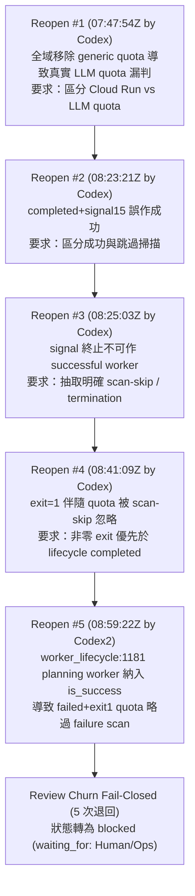
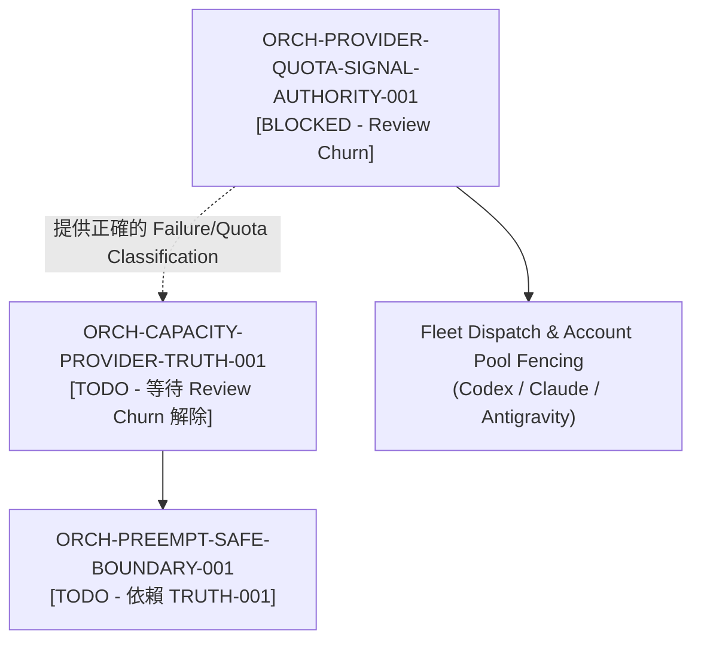

# ORCH-PROVIDER-QUOTA-SIGNAL-AUTHORITY-001 阻塞診斷與驗證交接包

## 1. 身分、範圍與治理資訊

| 欄位 | 值 |
|---|---|
| **Sidecar Task ID** | `ORCH-PROVIDER-QUOTA-SIGNAL-AUTHORITY-001-SIDECAR-BLOCKED-TASK-DIAGNOSTICS` |
| **Parent Task ID** | `ORCH-PROVIDER-QUOTA-SIGNAL-AUTHORITY-001` |
| **Parent Task Title** | `修正 worker log 文字誤觸 provider quota pause` |
| **Helper Kind** | `blocked_task_diagnostics` |
| **Sidecar Owner / Reviewer** | `Antigravity6` / `claude_slot_1` |
| **Parent Owner / Reviewer** | `Antigravity3` / `Codex2` |
| **Target Branch / Task Branch** | `dev` / `task/ORCH-PROVIDER-QUOTA-SIGNAL-AUTHORITY-001-SIDECAR-BLOCKED-TASK-DIAGNOSTICS` |
| **Parent Task Status** | `blocked`（`waiting_for: Human/Ops`） |
| **Parent Task Phase** | `Supervisor remediation - structured failure authority` |
| **診斷日期** | `2026-08-27` |
| **範圍界線** | 僅限 `support/sidecars/ORCH-PROVIDER-QUOTA-SIGNAL-AUTHORITY-001/` 下之支援材料；不修改 L1 canonical platform documents、核心 contract 真相、主要 runtime/registry/governance 實作。 |

本 packet 依 `ai-status.json`、git commit 歷程、Reviewer 退回紀錄與 live code 審計整理，提供給 parent owner、reviewer 與 Human/Ops 判定解除阻塞與修補缺陷的精確依據。

---

## 2. 結論摘要與問題核心

Parent Task `ORCH-PROVIDER-QUOTA-SIGNAL-AUTHORITY-001` 的目標是解決 **Supervisor 在 worker 完成或安全終止時仍掃描任意 log/diff，把程式碼或輸出中的「Cloud Run API quota exceeded」誤當成真實 provider quota，導致 Codex account pool 被錯誤暫停** 的問題。

在 PR #1045 的審查歷程中，雖然整體結構性判定（structured failure authority）與 generic quota 過濾已大幅收斂，但經過 5 次審查退回（review reopen count = 5），觸發了 Orchestrator 的 review churn fail-closed 機制，致使任務被標記為 `blocked` 並等待 `Human/Ops` 介入。

### 核心診斷結論

1. **阻塞原因**：
   - 任務並非因外部資源缺失或不可解決的外部依賴而阻塞，而是因為在當前 Review Epoch 中連續發生 5 次 Reviewer 退回，達到系統設定的 churn 上限（`Review churn fail-closed: no viable alternative owner available after 5 reviewer reopens`）。
2. **最新退回缺陷定位（Exact Head `32b3e0fc`）**：
   - 缺陷出現在 `.orchestrator/worker_lifecycle.py:1181-1192` 的 `is_success` 短路邏輯：
     ```python
     is_success = (
         runner_succeeded
         or (
             not worker_was_terminated(worker)
             and (
                 success_outcome in {"lifecycle_complete", "review_decided", "incremental_progress"}
                 or worker_is_discussion_planning(worker)
                 or worker_is_coordination_dispatch(worker)
             )
         )
     )
     failure_reason = None if is_success else detect_worker_failure(worker)
     ```
   - 在此處，`worker_is_discussion_planning(worker)` 與 `worker_is_coordination_dispatch(worker)` 被錯誤地包含在 `detect_worker_failure` 之前的 `is_success` 判定中。
   - **後果**：當 planning 或 coordination worker 發生非零異常退出（如 `runner_status="failed"`, `exit_code=1`）且 log 中存在真實 quota 錯誤時，`is_success` 仍為 `True`，導致 `detect_worker_failure` 被跳過（`failure_reason = None`），未能進行 account pool fence 或 pause，甚至在後續 line 1316 被標記為 `completed`。
3. **修復方向明確**：
   - `poll` 的成功短路邏輯必須 **僅依賴唯一 structured success (`runner_succeeded = is_structured_successful_worker(worker)`)**。
   - 控制類 worker（如 discussion-planning / coordination）的 completion 分支應保留在 `detect_worker_failure` 掃描之後（即確認無 failure 之後，由 line 1315 處理）。
   - 補齊 planning worker 在 `failed + exit_code=1` 伴隨 quota error 時的 poll 回歸測試。

---

## 3. Reviewer 退回歷程與根因演進

審查歷程共記錄了 5 次退回，反映了從初步廣義過濾到精確區分 structured success、signal termination 與 failure scan 的演進過程：



### 詳細退回紀錄

| 次數 | 時間 | 審查者 | 當時負責人 | 退回核心理由與要求 |
|---|---|---|---|---|
| 1 | `07:47:54Z` | `Codex` | `Antigravity3` | **防止真實 Quota 漏判**：全域移除 `quota exceeded` 並將 `ResourceExhausted` 全列 false-positive 會漏掉真實 LLM quota；要求僅在明確 Cloud Run/API context 分類 task terminal，並抽取唯一 structured-success helper。 |
| 2 | `08:23:21Z` | `Codex` | `Antigravity4` | **區分信號終止與成功**：`is_structured_successful_worker` 在 `worker.status=completed` 未檢查 `runner_signal`，導致 completed+exit0+signal15 誤作成功；要求將「成功」與「跳過非結構化 log 掃描」分開。 |
| 3 | `08:25:03Z` | `Codex` | `Antigravity4` | **語意明確化**：正常成功與 operator/signal 終止可跳過掃描，但 terminated 不得作為 successful worker 供 boot/poll lifecycle 判斷。 |
| 4 | `08:41:09Z` | `Codex` | `Codex2` | **非零退出必須偵測真實 Quota**：`status=completed, runner_status=failed, exit_code=1` 伴隨 `API Error: quota exceeded` 時，`worker_log_scan_should_be_skipped` 回傳 True 導致 detect_worker_failure 為 None；要求明確非零 exit 優先於 lifecycle completed。 |
| 5 | `08:59:22Z` | `Codex2` | `Antigravity3` | **Control-Worker 成功短路漏洞**：`worker_lifecycle.py:1181-1192` 將所有 discussion-planning/coordination worker 納入 `is_success`，在 `runner_status=failed, exit_code=1` 且無 signal 時跳過 `detect_worker_failure`；要求 poll 成功短路只依唯一 structured success，保留 control-worker completion 在 failure scan 後。 |

---

## 4. 當前程式碼狀態與缺陷分析

### 4.1 缺陷代碼定位

在 `.orchestrator/worker_lifecycle.py` 中：

```python
# worker_lifecycle.py:1164-1192
runner_succeeded = is_structured_successful_worker(worker)
current_task = task_map.get(worker.get("task_id"), {})
terminal_statuses = {
    str(value).lower()
    for value in ready_dispatch_settings(config).get(
        "worker_terminal_statuses", ["done", "review_approved"]
    )
}
success_outcome = (
    successful_worker_exit_outcome(
        worker,
        current_task,
        terminal_statuses=terminal_statuses,
    )
    if runner_succeeded
    else None
)
is_success = (
    runner_succeeded
    or (
        not worker_was_terminated(worker)
        and (
            success_outcome in {"lifecycle_complete", "review_decided", "incremental_progress"}
            or worker_is_discussion_planning(worker)          # <-- 缺陷來源：無條件短路
            or worker_is_coordination_dispatch(worker)        # <-- 缺陷來源：無條件短路
        )
    )
)
failure_reason = None if is_success else detect_worker_failure(worker)
```

### 4.2 缺陷機制與執行路徑

1. 當一個 planning worker 啟動後執行失敗（例如 runner crash 或 quota error，`runner_status="failed"`, `exit_code=1`）：
   - `runner_succeeded` 為 `False`（因為 `exit_code != 0`）。
   - `worker_was_terminated(worker)` 為 `False`（非 signal/operator 終止）。
   - `worker_is_discussion_planning(worker)` 為 `True`。
2. 因此，`is_success` 被評估為 `True`。
3. `failure_reason = None if is_success else detect_worker_failure(worker)` 直接賦予 `failure_reason = None`。
4. `detect_worker_failure(worker)` 完全未被執行，log 中的 `API Error: quota exceeded` 或其他致命錯誤被忽略。
5. 在後續代碼 line 1314-1317：
   ```python
   if worker.get("status") not in {"completed", "failed", "manual_pending"}:
       if not worker_was_terminated(worker) and worker_is_discussion_planning(worker):
           worker["status"] = "completed"
   ```
   該 failed planning worker 甚至會被直接標記為 `completed`，造成錯誤狀態傳播與 quota 漏判。

---

## 5. 依賴關係與系統影響



- **下游阻塞**：`ORCH-CAPACITY-PROVIDER-TRUTH-001`（讓 capacity 與實際 provider capability 使用同一真相）依賴審查與 dispatch 穩定性；`ORCH-PREEMPT-SAFE-BOUNDARY-001` 亦在其後。
- **影響評估**：目前主線 `dev` 已包含 PR #1045 的主體重構（commit `1fdec6cb`），絕大多數 generic quota false-positive 已修復；目前僅存在上述 planning/coordination worker 失敗時的短路邊界問題。

---

## 6. 解除阻塞與修補藍圖（Remediation Blueprint）

解除阻塞後，Parent Owner 或指派之工程師應依以下具體步驟完成收斂：

### 步驟 1：解除任務阻塞狀態

由 Human/Ops 或 Supervisor 重新分配／重設 review churn 計數，並指派 owner（例如 `Antigravity3` 或後續可用 worker）。

### 步驟 2：修訂 `worker_lifecycle.py` 的短路邏輯

將 `is_success` 嚴格限制於 structured success，移除在 failure scan 前對 planning/coordination worker 的預先成功判定：

```python
# 建議修正方案：
runner_succeeded = is_structured_successful_worker(worker)
current_task = task_map.get(worker.get("task_id"), {})
terminal_statuses = {
    str(value).lower()
    for value in ready_dispatch_settings(config).get(
        "worker_terminal_statuses", ["done", "review_approved"]
    )
}
success_outcome = (
    successful_worker_exit_outcome(
        worker,
        current_task,
        terminal_statuses=terminal_statuses,
    )
    if runner_succeeded
    else None
)
# 僅在 structured success 或已確立的 successful outcome 下短路 failure scan
is_success = (
    runner_succeeded
    or (
        not worker_was_terminated(worker)
        and success_outcome in {"lifecycle_complete", "review_decided", "incremental_progress"}
    )
)
failure_reason = None if is_success else detect_worker_failure(worker)
```

> **注意**：Discussion-planning worker 的正常完成邏輯保留在 line 1315（在確認 `failure_reason is None` 且未被標記為 failed 後執行），確保只有**未失敗**的 planning worker 才會被標記為 completed。

### 步驟 3：補充回歸測試

在 `.orchestrator/test_supervisor.py` 與 `.orchestrator/test_worker_failure_policy.py` 補充以下測試案例：

1. `test_failed_discussion_planning_worker_with_quota_is_detected_and_fenced`：
   - 設定 worker 為 `planning=True`、`runner_status="failed"`、`exit_code=1`、無 signal、log 包含 `API Error: quota exceeded`。
   - 斷言 `detect_worker_failure` 回傳 quota 錯誤，且 `fence_account_pool_workers` / `mark_provider_dispatch_paused` 被正確觸發。
2. `test_successful_discussion_planning_worker_completes_cleanly`：
   - 設定 worker 為 `planning=True`、`exit_code=0`、無 failure evidence。
   - 斷言 worker 正常過渡至 `completed`。

### 步驟 4：執行驗證與送審

```bash
uv run --python 3.12 pytest -q .orchestrator/test_worker_failure_policy.py .orchestrator/test_supervisor.py
python3 delivery_toolchain/governance/check_code_boundaries.py
```

完成後使用 `task_finalize.sh` 提交 PR。

---

## 7. Bounded Verification 紀錄

本 sidecar 在工作區環境中執行了唯讀的 bounded verification，確認當前測試套件與邊界檢查之基線狀態：

| 驗證項目 | 執行命令 | 執行結果 | 說明 |
|---|---|---|---|
| **Worker Failure Policy 測試** | `uv run --python 3.12 pytest .orchestrator/test_worker_failure_policy.py -q` | `22 passed in 3.12s` | 現有 structured failure helper 與 quota 識別規則通過。 |
| **Supervisor 完整測試套件** | `uv run --python 3.12 pytest -q .orchestrator/test_worker_failure_policy.py .orchestrator/test_supervisor.py` | `522 passed, 2 warnings in ~110s` | 全套 Supervisor 與 failure policy 測試通過。 |
| **全庫代碼邊界檢查** | `python3 delivery_toolchain/governance/check_code_boundaries.py` | `Passed for 983 files` | 無違反層級邊界或路徑授權規範。 |

*註：本 sidecar 未修改任何 canonical 程式碼或 L1 真相文件，所有驗證均為唯讀確認。*

---

## 8. 交接決議與建議

1. **對 Human/Ops**：
   - 本任務之 blocker 為 Review Churn 超限（5 次退回），非外部環境或 infrastructure 阻礙。
   - 建議解除 `blocked` 狀態，重設 churn 計數，並指派可用 worker（如 `Antigravity3`）依本交接包第 6 節之藍圖完成修補。
2. **對 Reviewer (`Codex2` / `claude_slot_1`)**：
   - 審查時請聚焦於 `worker_lifecycle.py:1181-1192` 的 `is_success` 短路範圍是否已嚴格收斂至 `runner_succeeded`，並核對 failed planning worker 的 quota regression test 是否完備。
3. **對 Parent Owner**：
   - 遵循單一 structured failure classification authority 原則，切勿再新增平行的 scan-skip 或 success 判斷分支。
